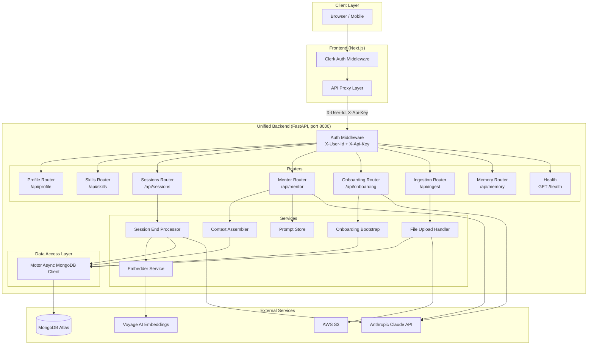
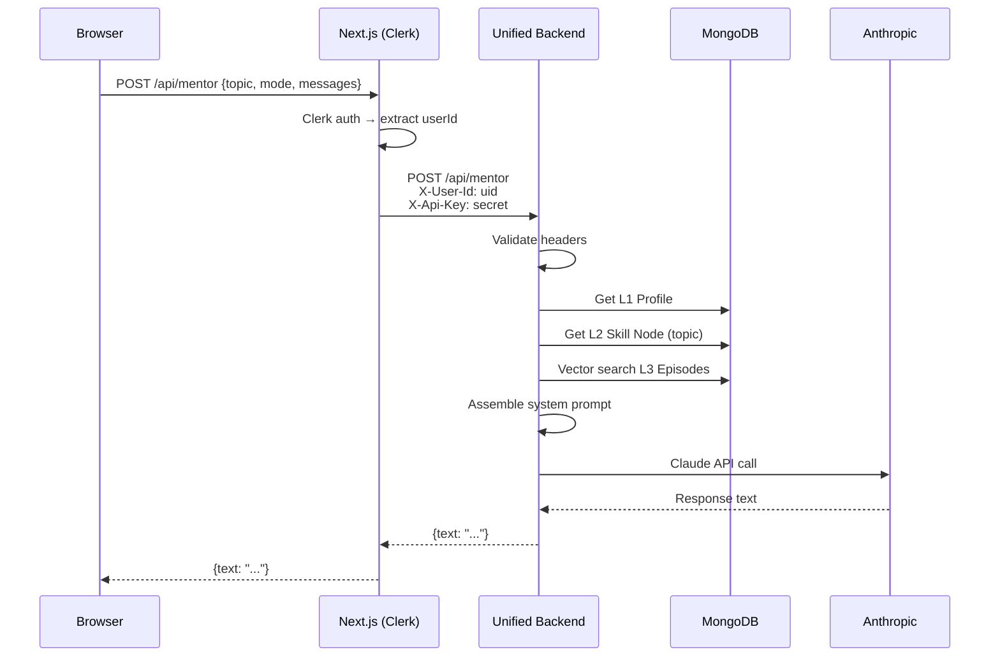

# Design Document: Backend Consolidation

## Overview

This design consolidates three separate MentorMan backend codebases — `layered-memory-service` (FastAPI/Python, synchronous PyMongo), `ingestion-pipeline` (FastAPI/Python, async Motor), and `mentorman-app` API routes (Next.js/TypeScript) — into a single unified FastAPI application (`unified-backend`).

The unified backend runs on port 8000, uses async Motor for all MongoDB operations, and exposes all API endpoints through a single process. The Next.js application becomes a thin authenticated proxy that extracts the userId from Clerk, attaches it as an `X-User-Id` header, and forwards requests to the backend.

### Key Design Decisions

| Decision | Rationale |
|---|---|
| Async Motor (not sync PyMongo) | All DB operations become async, eliminating thread-pool overhead. Motor is already proven in the ingestion-pipeline. |
| Single Settings class (pydantic-settings) | Unified configuration from env vars or AWS SSM, fail-fast on missing values. |
| FastAPI lifespan for connection management | Clean startup/shutdown. Matches existing layered-memory-service pattern. |
| Preserve existing API contracts | Frontend code requires zero changes. Response shapes remain identical. |
| Router-per-domain organization | Each domain (profile, skills, sessions, mentor, onboarding, ingestion, memory) gets its own router module. |
| Background tasks for ingestion extraction | Non-blocking file processing. Matches existing ingestion-pipeline pattern. |

## Architecture



### Request Flow



## Components and Interfaces

### Project Structure

```
unified-backend/
├── app/
│   ├── main.py                    # FastAPI app + lifespan
│   ├── config/
│   │   ├── settings.py            # Unified Settings class
│   │   └── database.py            # Motor client + collection accessors
│   ├── core/
│   │   ├── security.py            # X-Api-Key + X-User-Id validation
│   │   └── dependencies.py        # Common FastAPI dependencies
│   ├── routers/
│   │   ├── profile.py             # /api/profile CRUD
│   │   ├── skills.py              # /api/skills CRUD
│   │   ├── sessions.py            # /api/sessions CRUD + end
│   │   ├── mentor.py              # /api/mentor chat
│   │   ├── onboarding.py          # /api/onboarding/chat + /complete
│   │   ├── ingest.py              # /api/ingest upload + status
│   │   └── memory.py              # /api/memory/episodes search + list
│   ├── services/
│   │   ├── context_assembler.py   # L1+L2+L3 context assembly
│   │   ├── session_end.py         # LLM summarization + skill update
│   │   ├── onboarding_bootstrap.py # Goal→skills derivation
│   │   ├── embedder.py            # Voyage AI embedding
│   │   ├── file_upload.py         # Upload validation, S3/local storage
│   │   ├── extraction.py          # PDF/CSV extraction + chunking
│   │   └── prompt_store.py        # Mode→template mapping
│   ├── models/
│   │   ├── profile.py             # L1 Profile Pydantic models
│   │   ├── skill.py               # L2 Skill Graph models
│   │   ├── session.py             # Session models
│   │   ├── episodic.py            # L3 Episodic models
│   │   ├── ingestion.py           # Ingestion job models
│   │   └── chat.py                # Chat request/response models
│   └── prompts/
│       ├── mentor_v1.md           # Mentor system prompt template
│       └── onboarding.md          # Onboarding system prompt
├── tests/
│   ├── unit/
│   ├── property/
│   └── integration/
├── requirements.txt
├── .env.example
└── Dockerfile
```

### Component Interfaces

#### `app/main.py` — Application Entry Point

```python
from contextlib import asynccontextmanager
from fastapi import FastAPI
from app.config.database import connect_db, disconnect_db

@asynccontextmanager
async def lifespan(app: FastAPI):
    await connect_db()
    yield
    await disconnect_db()

app = FastAPI(title="MentorMan Unified Backend", lifespan=lifespan)

# Register all routers
app.include_router(profile_router)
app.include_router(skills_router)
app.include_router(sessions_router)
app.include_router(mentor_router)
app.include_router(onboarding_router)
app.include_router(ingest_router)
app.include_router(memory_router)

@app.get("/health")
async def health():
    return {"status": "ok"}
```

#### `app/config/settings.py` — Unified Configuration

```python
from pydantic_settings import BaseSettings
from typing import Literal, Optional

class Settings(BaseSettings):
    # MongoDB
    MONGODB_URI: str
    DATABASE_NAME: str = "mentorman"

    # Auth
    MENTORMAN_API_KEY: str

    # LLM
    ANTHROPIC_API_KEY: str

    # Embeddings
    VOYAGE_API_KEY: str

    # Storage
    STORAGE_BACKEND: Literal["local", "s3"] = "local"
    S3_BUCKET_NAME: Optional[str] = None
    S3_REGION: str = "ap-south-1"
    AWS_ACCESS_KEY_ID: Optional[str] = None
    AWS_SECRET_ACCESS_KEY: Optional[str] = None

    # Server
    PORT: int = 8000
    LOG_LEVEL: str = "INFO"

    model_config = {"env_file": ".env", "extra": "ignore"}
```

#### `app/config/database.py` — Async MongoDB Client

```python
from motor.motor_asyncio import AsyncIOMotorClient, AsyncIOMotorDatabase
from app.config.settings import get_settings

_client: AsyncIOMotorClient | None = None
_db: AsyncIOMotorDatabase | None = None

async def connect_db() -> None:
    global _client, _db
    settings = get_settings()
    _client = AsyncIOMotorClient(settings.MONGODB_URI)
    _db = _client[settings.DATABASE_NAME]
    await _ensure_indexes()

async def disconnect_db() -> None:
    global _client, _db
    if _client:
        _client.close()
        _client = None
        _db = None

def get_db() -> AsyncIOMotorDatabase:
    if _db is None:
        raise RuntimeError("Database not connected")
    return _db

# Collection accessors
def profiles_col():    return get_db()["profiles"]
def skill_graph_col(): return get_db()["skill_graph"]
def sessions_col():    return get_db()["sessions"]
def ingestion_jobs_col(): return get_db()["ingestion_jobs"]
def embeddings_col():  return get_db()["embeddings"]
def immediate_contexts_col(): return get_db()["immediate_contexts"]
```

#### `app/core/security.py` — Auth Middleware

```python
from fastapi import Header, HTTPException, status
from app.config.settings import get_settings

async def require_auth(
    x_user_id: str | None = Header(None, alias="X-User-Id"),
    x_api_key: str | None = Header(None, alias="X-Api-Key"),
) -> str:
    """Validate headers and return the authenticated user_id."""
    settings = get_settings()
    if not x_api_key or x_api_key != settings.MENTORMAN_API_KEY:
        raise HTTPException(status_code=status.HTTP_401_UNAUTHORIZED, detail="Invalid API key")
    if not x_user_id:
        raise HTTPException(status_code=status.HTTP_401_UNAUTHORIZED, detail="Missing user ID")
    return x_user_id
```

#### `app/routers/profile.py` — Profile CRUD

```python
from fastapi import APIRouter, Depends, HTTPException, status
from app.core.security import require_auth
from app.config.database import profiles_col
from app.models.profile import ProfileCreate, ProfileUpdate, ProfileResponse

router = APIRouter(prefix="/api/profile", tags=["Profile"])

@router.get("")
async def get_profile(user_id: str = Depends(require_auth)) -> ProfileResponse | None:
    doc = await profiles_col().find_one({"user_id": user_id}, {"_id": 0})
    if not doc:
        raise HTTPException(status_code=404, detail="Profile not found")
    return doc

@router.post("", status_code=status.HTTP_201_CREATED)
async def create_profile(data: ProfileCreate, user_id: str = Depends(require_auth)):
    doc = data.model_dump()
    doc["user_id"] = user_id
    await profiles_col().insert_one(doc)
    doc.pop("_id", None)
    return doc

@router.put("")
async def update_profile(data: ProfileUpdate, user_id: str = Depends(require_auth)):
    update_data = data.model_dump(exclude_none=True)
    result = await profiles_col().find_one_and_update(
        {"user_id": user_id},
        {"$set": update_data},
        return_document=True,
    )
    if not result:
        raise HTTPException(status_code=404, detail="Profile not found")
    result.pop("_id", None)
    return result

@router.delete("")
async def delete_profile(user_id: str = Depends(require_auth)):
    await profiles_col().delete_one({"user_id": user_id})
    return {"ok": True}
```

#### `app/services/context_assembler.py` — Context Assembly

```python
import voyageai
from app.config.database import profiles_col, skill_graph_col, sessions_col
from app.config.settings import get_settings

async def assemble(user_id: str, topic: str, query: str) -> dict:
    """Gather L1 profile, L2 skill, and L3 episodes for the given user/topic."""
    profile = await profiles_col().find_one({"user_id": user_id}, {"_id": 0})
    skill = await skill_graph_col().find_one(
        {"user_id": user_id, "topic": topic}, {"_id": 0}
    )
    episodes = await _vector_search(user_id, query, topic, limit=3)
    return {"profile": profile or {}, "skill": skill or {}, "episodes": episodes}

async def _vector_search(user_id: str, query: str, topic: str | None, limit: int) -> list:
    settings = get_settings()
    client = voyageai.AsyncClient(api_key=settings.VOYAGE_API_KEY)
    response = await client.embed(texts=[query], model="voyage-3")
    vector = response.embeddings[0]
    
    vector_filter = {"user_id": {"$eq": user_id}}
    if topic:
        vector_filter["topic"] = {"$eq": topic}

    pipeline = [
        {"$vectorSearch": {
            "index": "session_embedding_index",
            "path": "embedding",
            "queryVector": vector,
            "numCandidates": max(20, limit * 10),
            "limit": limit,
            "filter": vector_filter,
        }},
        {"$project": {
            "_id": 0, "embedding": 0,
            "session_id": 1, "title": 1, "summary": 1,
            "topic": 1, "date": 1, "skill_update": 1,
            "score": {"$meta": "vectorSearchScore"},
        }},
    ]
    return list(await sessions_col().aggregate(pipeline).to_list(limit))
```

#### `app/services/session_end.py` — Session End Processing

```python
import anthropic
from datetime import datetime, timezone
from uuid import uuid4
from app.config.database import sessions_col, skill_graph_col
from app.services.embedder import embed_text
from app.config.settings import get_settings

SUMMARISE_TOOL = {
    "name": "save_session_summary",
    "description": "Produce a structured summary of the learning session.",
    "input_schema": { ... }  # Same as existing layered-memory-service
}

async def process_session_end(user_id: str, topic: str, messages: list[dict]) -> dict:
    """Generate summary via LLM, persist as episodic entry, update skill graph."""
    settings = get_settings()
    client = anthropic.AsyncAnthropic(api_key=settings.ANTHROPIC_API_KEY)
    
    transcript = "\n".join(f"{m['role'].upper()}: {m['content']}" for m in messages)
    
    response = await client.messages.create(
        model="claude-haiku-4-5-20251001",
        max_tokens=1024,
        tools=[SUMMARISE_TOOL],
        tool_choice={"type": "tool", "name": "save_session_summary"},
        messages=[{"role": "user", "content": f"Summarise this session on '{topic}'.\n\n<transcript>\n{transcript}\n</transcript>"}],
    )
    
    summary_data = _extract_tool_use(response, "save_session_summary")
    title = summary_data.get("title", f"Session on {topic}")
    narrative = summary_data.get("narrative_summary", "")
    skill_update = summary_data.get("skill_update", {})
    
    # Persist episodic entry with embedding
    session_id = str(uuid4())
    vector = await embed_text(narrative)
    await sessions_col().insert_one({
        "user_id": user_id, "session_id": session_id,
        "topic": topic, "title": title, "summary": narrative,
        "skill_update": skill_update, "embedding": vector,
        "type": "session", "date": datetime.now(timezone.utc).strftime("%Y-%m-%d"),
        "created_at": datetime.now(timezone.utc).isoformat(),
    })
    
    # Upsert skill graph
    if skill_update.get("current_level"):
        await skill_graph_col().update_one(
            {"user_id": user_id, "topic": topic},
            {"$set": {"current_level": skill_update["current_level"],
                      "signals": skill_update}},
            upsert=True,
        )
    
    return {"session_id": session_id, "title": title, "summary": narrative, "skill_update": skill_update}
```

#### Next.js Proxy Layer (Frontend)

```typescript
// lib/api-proxy.ts
const API_BASE = process.env.MENTORMAN_API_BASE ?? 'http://localhost:8000';
const API_KEY = process.env.MENTORMAN_API_KEY!;

export async function proxyToBackend(
  path: string,
  userId: string,
  init: RequestInit = {}
): Promise<Response> {
  const url = `${API_BASE}${path}`;
  const headers = new Headers(init.headers);
  headers.set('X-User-Id', userId);
  headers.set('X-Api-Key', API_KEY);
  
  return fetch(url, { ...init, headers });
}
```

## Data Models

### L1 Profile

```python
from pydantic import BaseModel
from typing import Optional

class ProfileCreate(BaseModel):
    goal: str
    deadline: str
    overall_level: str = "beginner"
    daily_availability: str = "2 hrs/day"
    email: Optional[str] = None

class ProfileUpdate(BaseModel):
    goal: Optional[str] = None
    deadline: Optional[str] = None
    overall_level: Optional[str] = None
    daily_availability: Optional[str] = None
    email: Optional[str] = None

class ProfileResponse(BaseModel):
    user_id: str
    goal: str
    deadline: str
    overall_level: str
    daily_availability: str
    email: Optional[str] = None
```

### L2 Skill Graph

```python
from pydantic import BaseModel
from typing import Optional

class SkillNode(BaseModel):
    topic: str
    required_level: str = "intermediate"
    current_level: str = "beginner"
    gap: str = "medium"
    signals: Optional[dict] = None

class SkillUpdate(BaseModel):
    required_level: Optional[str] = None
    current_level: Optional[str] = None
    gap: Optional[str] = None
    signals: Optional[dict] = None
```

### Session

```python
from pydantic import BaseModel
from typing import Optional, Literal
from datetime import datetime

class Message(BaseModel):
    role: Literal["user", "assistant"]
    content: str

class SessionCreate(BaseModel):
    title: str = "Untitled session"
    mode: str = "topic"
    topic: Optional[str] = None
    topic_category: Optional[str] = None

class SessionDoc(BaseModel):
    session_id: str
    user_id: str
    title: str
    mode: str
    topic: Optional[str] = None
    status: str = "active"
    messages: list[Message] = []
    tags: list[str] = []
    summary: Optional[str] = None
    created_at: str
    updated_at: str
```

### L3 Episodic Memory

```python
class EpisodicEntry(BaseModel):
    topic: str
    topic_category: Optional[str] = None
    type: str = "session"
    date: str
    title: str
    summary: str
    skill_update: Optional[dict] = None

class SearchQuery(BaseModel):
    query: str
    limit: int = 3
    topic: Optional[str] = None
```

### Ingestion Job

```python
class IngestionJobResponse(BaseModel):
    job_id: str
    status: str
    message: str
    completed_at: Optional[str] = None
```

### MongoDB Collections

| Collection | Key Fields | Indexes |
|---|---|---|
| `profiles` | user_id, goal, deadline, overall_level, daily_availability | `user_id` (unique) |
| `skill_graph` | user_id, topic, required_level, current_level, gap, signals | `(user_id, topic)` (unique) |
| `sessions` | session_id, user_id, title, mode, topic, messages, embedding | `session_id` (unique), `user_id`, vector index on `embedding` |
| `ingestion_jobs` | job_id, user_id, status, files, error, completed_at | `job_id` (unique), `user_id` |
| `embeddings` | user_id, text, embedding, metadata | vector index on `embedding` |
| `immediate_contexts` | session_id, user_id, blocks | `session_id` |

## Correctness Properties

*A property is a characteristic or behavior that should hold true across all valid executions of a system — essentially, a formal statement about what the system should do. Properties serve as the bridge between human-readable specifications and machine-verifiable correctness guarantees.*

### Property 1: Auth Enforcement

*For any* protected endpoint in the unified backend, a request that is missing the X-User-Id header OR has an invalid/missing X-Api-Key header SHALL receive an HTTP 401 response, regardless of the request body or other headers.

**Validates: Requirements 2.1, 2.2, 2.3, 2.4**

### Property 2: User Data Isolation

*For any* two distinct user IDs (user_A, user_B), when user_A creates a resource (profile, skill, session, or ingestion job), user_B SHALL NOT be able to read, update, or delete that resource — the system SHALL return HTTP 403 or HTTP 404.

**Validates: Requirements 2.5, 5.4, 11.8**

### Property 3: Profile Round-Trip

*For any* valid profile data (goal, deadline, overall_level, daily_availability), creating or updating a profile via POST/PUT and then reading it via GET SHALL return a profile containing all the same field values that were written.

**Validates: Requirements 3.3, 3.5, 10.1**

### Property 4: Skill Graph Round-Trip

*For any* valid skill node data (topic, required_level, current_level, gap), upserting via POST and then reading via GET /api/skills/{topic} SHALL return a node with matching field values.

**Validates: Requirements 4.4, 4.5, 6.3**

### Property 5: Session Ordering Invariant

*For any* set of sessions belonging to a user, GET /api/sessions SHALL return them in strictly non-increasing order of creation date (newest first).

**Validates: Requirements 5.1**

### Property 6: Pagination Bounds

*For any* valid limit (1–100) and offset (≥ 0), GET /api/memory/episodes SHALL return at most `limit` results, and applying offset SHALL shift the result window without duplicating or omitting entries.

**Validates: Requirements 8.4**

### Property 7: Onboarding Response Parsing

*For any* LLM response string containing a ` ```json suggestions` block, the parser SHALL extract a valid JSON array of strings. *For any* response containing a ` ```json onboarding_complete` block, the parser SHALL extract a valid JSON object with goal, deadline, overall_level, and daily_availability fields.

**Validates: Requirements 9.2, 9.3**

### Property 8: Bootstrap Skill Creation

*For any* goal that matches the goal knowledge base, after calling the onboarding bootstrap, the user's skill graph SHALL contain a node for each topic defined in the KB, with valid required_level, current_level, and computed gap.

**Validates: Requirements 10.3**

### Property 9: File Validation Rejection

*For any* uploaded file with an unsupported MIME type or a size exceeding the configured maximum, the ingestion endpoint SHALL reject the request with HTTP 400 and include per-file error details in the response.

**Validates: Requirements 11.1, 11.2**

### Property 10: Backward-Compatible Response Shapes

*For any* endpoint that existed in the previous Next.js API routes, the unified backend's response JSON shape SHALL match the documented contract — using the same field names (camelCase where applicable) and the same value types.

**Validates: Requirements 14.1, 14.2, 14.3**

### Property 11: Dual Level Format Acceptance

*For any* valid skill level string (beginner, intermediate, advanced, expert) AND *for any* valid numeric gap value, the skill graph update endpoint SHALL accept both formats and persist them correctly.

**Validates: Requirements 14.4**

## Error Handling

### Error Response Format

All error responses follow a consistent JSON structure:

```json
{
  "detail": "Human-readable error message"
}
```

For validation errors (422), FastAPI's default Pydantic validation error format is used:

```json
{
  "detail": [
    {"loc": ["body", "field"], "msg": "field required", "type": "value_error.missing"}
  ]
}
```

### Error Categories

| HTTP Status | Scenario | Behavior |
|---|---|---|
| 401 | Missing/invalid X-Api-Key or X-User-Id | Reject before any processing |
| 400 | Invalid request body, missing required fields, no profile for mentor chat | Return descriptive detail message |
| 403 | User accessing another user's resource | Return generic "Not authorized" |
| 404 | Resource not found (profile, skill topic, session, job) | Return "X not found" |
| 409 | Duplicate resource creation (profile already exists) | Return conflict detail |
| 500 | LLM API failure, embedding failure, unexpected errors | Log internally, return generic error |

### Partial Failure Strategy

For operations with multiple steps (session end processing):

1. **LLM summarization fails** → Return 500, no side effects persisted
2. **Embedding fails but LLM succeeds** → Persist session without embedding, mark as `partial: true`
3. **Skill update fails but embedding succeeds** → Log warning, return success with empty skill_update
4. **Ingestion extraction fails** → Mark job as `failed` with error message, return status via polling

### Graceful Degradation in Context Assembly

When assembling mentor chat context:
- L1 Profile fetch fails → Return 400 (profile required for mentoring)
- L2 Skill fetch fails → Continue with empty skill context
- L3 Episodic search fails → Continue with empty episodes (log warning)

## Testing Strategy

### Testing Approach

The unified backend uses a dual testing strategy:

1. **Property-based tests** (Hypothesis) — verify universal properties across generated inputs
2. **Unit tests** (pytest) — verify specific examples, edge cases, and error conditions
3. **Integration tests** (pytest + httpx AsyncClient) — verify end-to-end flows with real MongoDB

### Property-Based Testing

**Library:** [Hypothesis](https://hypothesis.readthedocs.io/) for Python

**Configuration:** Minimum 100 iterations per property test.

**Tag format:** Each test is annotated with:
```python
# Feature: backend-consolidation, Property {N}: {property_text}
```

Properties to implement:
- Property 1 (Auth): Generate random endpoints × header combinations → verify 401
- Property 2 (Isolation): Generate random user pairs × CRUD operations → verify isolation
- Property 3 (Profile): Generate random valid profile data → verify write/read round-trip
- Property 4 (Skill): Generate random valid skill data → verify upsert/read round-trip
- Property 5 (Ordering): Generate random session creation times → verify sort order
- Property 6 (Pagination): Generate random limit/offset × data sizes → verify bounds
- Property 7 (Parsing): Generate random LLM response strings with JSON blocks → verify extraction
- Property 8 (Bootstrap): Generate goals from KB keys → verify skill nodes created
- Property 9 (Validation): Generate files with random invalid types/sizes → verify rejection
- Property 10 (Compat): Verify response shapes against documented contracts
- Property 11 (Levels): Generate all level strings + numeric gaps → verify acceptance

### Unit Tests

Focus areas:
- Auth dependency (valid/invalid header combinations)
- Settings validation (missing env vars → failure)
- Prompt template selection per mode
- Gap calculation logic
- Session summary LLM response parsing
- File type/size validation rules
- Response shape serialization (camelCase)

### Integration Tests

Focus areas:
- Full request lifecycle through FastAPI TestClient
- MongoDB operations (create/read/update/delete)
- Background task execution for ingestion
- LLM integration with mocked Anthropic (using respx or unittest.mock)
- Vector search pipeline with seeded embeddings

### Test Infrastructure

```
tests/
├── conftest.py             # Shared fixtures (test DB, auth headers, app client)
├── unit/
│   ├── test_security.py
│   ├── test_settings.py
│   ├── test_parsing.py
│   ├── test_gap_calc.py
│   └── test_validation.py
├── property/
│   ├── test_auth_props.py
│   ├── test_isolation_props.py
│   ├── test_roundtrip_props.py
│   ├── test_ordering_props.py
│   ├── test_pagination_props.py
│   ├── test_parsing_props.py
│   ├── test_bootstrap_props.py
│   ├── test_validation_props.py
│   └── test_compat_props.py
└── integration/
    ├── test_profile_flow.py
    ├── test_skills_flow.py
    ├── test_sessions_flow.py
    ├── test_mentor_flow.py
    ├── test_onboarding_flow.py
    ├── test_ingestion_flow.py
    └── test_memory_flow.py
```
