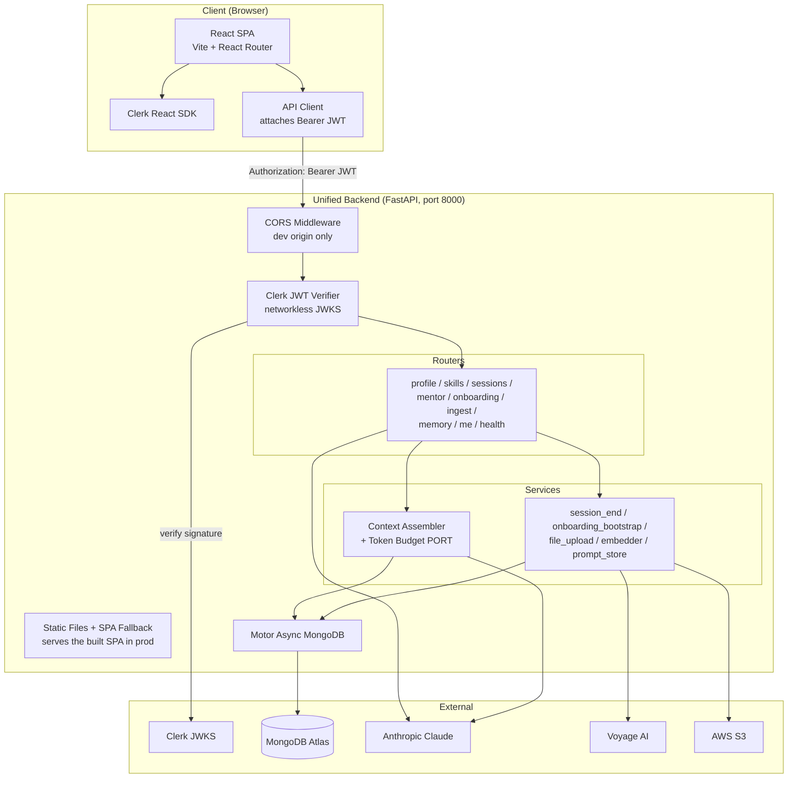
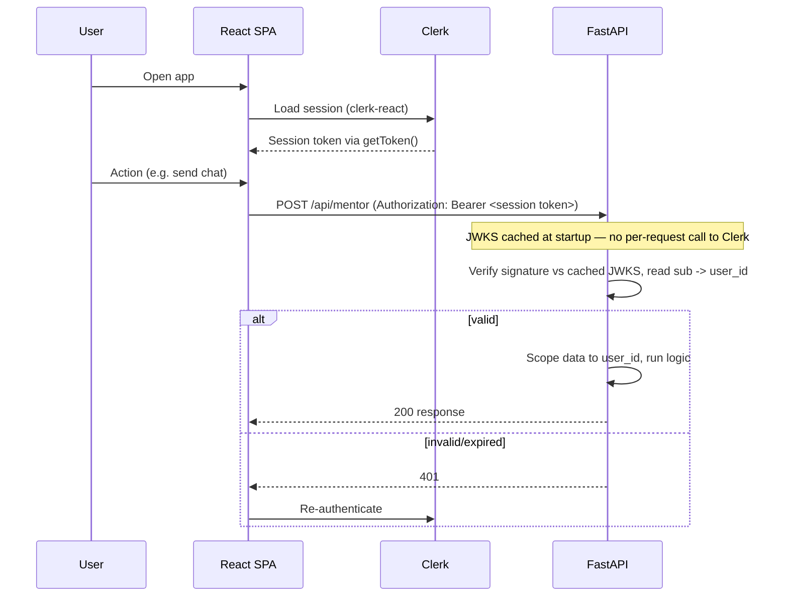

# Design Document: Frontend React Migration (React + FastAPI)

## Overview

This design replaces the Next.js `mentorman-app` with a standalone **Vite + React + React Router** SPA that calls the existing **`unified-backend` FastAPI** service directly. The Node/Next server tier is eliminated. Authentication moves from a service-to-service shared secret (`X-Api-Key` + trusted `X-User-Id`) to **direct verification of Clerk session JWTs inside FastAPI** (Direct_Auth).

The presentational layer is already React, so it is reused verbatim. The substance of the migration is (a) standing up the SPA shell, routing, and auth; (b) teaching FastAPI to verify Clerk tokens and accept cross-origin requests; and (c) **restoring behavioral parity** in the backend for logic that currently lives only in the Next.js app.

### Current State (as built)

Despite the `backend-consolidation` spec, the Next.js app still implements most logic itself and largely bypasses the FastAPI backend:

_Verified directly in the code during requirements review:_

| Concern | Where it actually runs today |
|---|---|
| Profile / Skills / Sessions CRUD | Next.js routes via **direct MongoDB repos** (`lib/db/repositories/*`) |
| Mentor chat | Next.js route: direct repos + **own context assembler** + `tiktoken` Token_Budget + **direct Anthropic** (`model: claude-sonnet-4-6`, `max_tokens: 1024`) |
| Onboarding | Next.js routes via direct repos + Anthropic |
| File upload | **Only route that proxies** to FastAPI (`proxyToBackend`) |
| FastAPI mentor router | Parallel, **drifted** impl: `context_assembler.assemble` + Anthropic (`model: claude-sonnet-4-20250514` — older, `max_tokens: 4096`), **no Token_Budget** |
| `/api/me` | Exists **only** as a Next route — absent from FastAPI |
| Auth identity | `requireUserId()` → real Clerk `auth().userId`; `DEMO_USER_ID` is **unused** |
| Auth middleware | `mentorman-app/proxy.ts` (Clerk middleware); public routes `/sign-in`,`/sign-up`; `DISABLE_AUTH=true` bypass exists |
| CORS on FastAPI | **Absent** |

**Canonical target for mentor parity (confirmed):** `claude-sonnet-4-6` / `max_tokens: 1024` (the Next.js values), plus the ported Token_Budget. The FastAPI side's older model and 4096 limit are treated as drift to be corrected, not the target.

### Design-Doc Reconciliation (context only — not scope)

The `design docs/` and `design_decisions/` folders informed this design but do **not** expand its scope. Reconciliation:

| Design doc says | Reality / decision for this migration |
|---|---|
| UI = **shadcn/ui** ("own the code") | Plain React + Radix; ports to Vite **verbatim**, no rewrite. UI is human-authored and frozen. |
| `streaming-hld.md`: SSE chat (`token`/`nudge`/`skill_update`/`done`/`error`), `useStream()`, `opus-4-6` | **Designed, not built.** Live chat is plain request/response. Streaming is **out of scope**; only stay streaming-ready (fetch + ReadableStream client). |
| `08_context_assembly.md`: lazy L3 + Haiku intent pre-check, mid-session compression | Port **only what the live code does** under mentor parity (Req 9). Do not add designed-but-unbuilt steps. |
| `14_tech_stack.md`: FE on **EC2 + nginx + PM2** (port 3001), Cloudflare → mentorman.co.in | "FastAPI serves static" sits **behind nginx**. nginx proxies the public host to FastAPI; or alternatively nginx serves static + proxies `/api`. Either works same-origin. |
| Prod Mongo via **IAM role** (no URI); local via password URI | Unchanged — a backend concern already handled by `MONGODB_URI`/IAM; not affected by the frontend migration. |

**Implication:** deleting the Next.js server without first closing these gaps would change mentor behavior and break the routes that never went through FastAPI. Parity work is therefore a first-class part of this migration, not an afterthought.

### Key Design Decisions

| Decision | Rationale |
|---|---|
| Vite + React + React Router + TS, in new `mentorman-web/` | Confirmed. Authenticated app, no SEO need; SSR adds no value. New dir keeps the Next app runnable until parity is verified, enabling safe rollback. |
| Browser → FastAPI directly (no proxy) | Removes the Node tier and the double hop. One backend to deploy and maintain — finishes the consolidation. |
| Direct_Auth via Clerk JWT verification in FastAPI | The shared-secret model only worked because a trusted server added the secret. A browser can't hold a secret, so FastAPI must verify per-user Clerk tokens instead. |
| Networkless JWKS verification, user from `sub` | Confirmed. Verify the Clerk session token's signature against cached JWKS — no per-request call to Clerk. Issuer/JWKS from config. |
| FastAPI serves the SPA static build (same origin) | Confirmed. Single deployment; production is same-origin so CORS is only needed for the local Vite dev server. |
| Mentor canonical = `claude-sonnet-4-6` / 1024 | Confirmed. Match current Next.js behavior exactly; correct the drifted FastAPI config. |
| Reuse components & `globals.css` unchanged | Guarantees visual parity and minimizes risk; the UI is already React. |
| Port Token_Budget to Python before cutover | Keeps mentor responses identical; prevents silent quality regression. |
| Parity-verify each endpoint before deletion | No working functionality is removed until its FastAPI equivalent is confirmed equivalent. |
| `VITE_`-prefixed client env only | Vite only exposes `VITE_*` to the bundle, structurally preventing secret leakage. |

## Architecture

### Target Architecture

### Direct_Auth Flow (replaces shared-secret proxy)

## Route & Endpoint Mapping

Every Next.js artifact maps to a React route or a FastAPI endpoint. Nothing is dropped.

| Next.js artifact | New home | Notes |
|---|---|---|
| `app/page.tsx` (root) | React route `/` | Reuse component tree |
| `app/(auth)/sign-in/*` | React route `/sign-in` | `@clerk/clerk-react` `<SignIn>` |
| `app/(auth)/sign-up/*` | React route `/sign-up` | `@clerk/clerk-react` `<SignUp>` |
| `app/api/health` | FastAPI `GET /health` | Already exists |
| `app/api/me` | FastAPI `GET /api/me` | **Add** (identity/profile bootstrap) |
| `app/api/profile` | FastAPI `GET/POST/PUT/DELETE /api/profile` | Verify parity vs `CoreProfileRepo` |
| `app/api/skills` (+ `[topic]`) | FastAPI `/api/skills`, `/api/skills/{topic}` | Verify parity vs `SkillGraphRepo` |
| `app/api/sessions` (+ `[sessionId]`) | FastAPI `/api/sessions`, `/api/sessions/{id}` | Verify parity |
| `app/api/mentor` | FastAPI `POST /api/mentor` | **Port Token_Budget + align `max_tokens`** |
| `app/api/onboarding/chat` | FastAPI `POST /api/onboarding/chat` | Verify parity |
| `app/api/onboarding/complete` | FastAPI `POST /api/onboarding/complete` | Verify parity |
| `app/api/session/[id]/upload` | FastAPI upload endpoint | Already proxied; now called directly |
| `app/api/session/[id]/upload/[jobId]/status` | FastAPI job-status endpoint | Poll directly |
| `lib/api-proxy.ts` | **Deleted** → `API_Client` | Bearer JWT instead of X-Api-Key |
| `lib/db/*`, `lib/context-assembler/*` | **Deleted** after parity port | Logic lives in FastAPI |
| `proxy.ts`, `instrumentation*.ts`, `next.config.ts` | **Deleted** | Next-only |

## Parity Findings (discovered during implementation)

| Finding | Resolution |
|---|---|
| **Field casing mismatch.** DB is snake_case; FastAPI returns **camelCase** (`to_camel` alias, asserted by its tests); frozen UI reads **snake_case** (`current_level`, `daily_availability`, `overall_level`). | **API_Client normalizes responses camelCase→snake_case.** Requests stay snake_case (FastAPI accepts via `populate_by_name`). Backend contract + its tests untouched. |
| **`/api/me` returns name+email from Clerk, not the DB.** The default Clerk session JWT carries neither, so a networkless backend `/api/me` cannot produce them. | **Resolved client-side** via Clerk `useUser()` in the API_Client's `me()`. No backend `/api/me` endpoint added (keeps the networkless-JWKS decision intact). |
| FastAPI mentor already assembles uploaded-file ImmediateContext, but without a budget. | Token_Budget now trims those blocks oldest-first (Task 3). |

## Environment Variable Mapping

| Today (Next.js) | New (React_SPA, client) | New (FastAPI, server) |
|---|---|---|
| `NEXT_PUBLIC_CLERK_PUBLISHABLE_KEY` | `VITE_CLERK_PUBLISHABLE_KEY` | — |
| `MENTORMAN_API_BASE` | `VITE_API_BASE` (relative `''` in same-origin prod; `http://localhost:8000` in dev) | — |
| `MENTORMAN_API_KEY` | **removed** | **removed** (replaced by JWT verify) |
| `CLERK_SECRET_KEY` | — | `CLERK_SECRET_KEY` |
| — | — | `CLERK_ISSUER` / `CLERK_JWKS_URL` (new — for networkless verify) |
| `ANTHROPIC_API_KEY` | — | `ANTHROPIC_API_KEY` |
| `VOYAGE_API_KEY` | — | `VOYAGE_API_KEY` |
| `MONGODB_URI` | — | `MONGODB_URI` |
| — | — | `CORS_ORIGINS` (new — dev origin only) |

## Components and Reuse

- **Presentational (reuse as-is):** `components/mentorman/*` (app, screens, ui, icons, chat, dashboard), `globals.css`, `public/*`.
- **New shell:** `main.tsx` (Vite entry), `App.tsx` (router + `<ClerkProvider>`), route components, `<ProtectedRoute>` wrapper.
- **New data layer:** `src/api/client.ts` (API_Client) with a `getToken()`-aware **`fetch` + `ReadableStream`** wrapper (not `EventSource`, so the Bearer JWT can be sent and SSE can be added later without rework); typed modules per domain (profile, skills, sessions, mentor, onboarding, upload).
- **Removed:** all `app/api/*`, `lib/db`, `lib/api-proxy`, server `lib/auth`, `lib/context-assembler` (after port), Next config/instrumentation.

## Backend Changes (FastAPI)

1. **Clerk JWT verifier** — new dependency in `app/core/security.py`: fetch/cache Clerk JWKS at startup, verify the `Authorization: Bearer` session token networklessly, decode `sub` → `user_id`. Keep the old `X-Api-Key`/`X-User-Id` path behind a transition flag if needed.
2. **CORS middleware** — `app/main.py` adds `CORSMiddleware` reading `CORS_ORIGINS` (dev origin only; prod is same-origin).
3. **Static serving + SPA fallback** — `app/main.py` mounts the built SPA as static files and serves `index.html` for unmatched non-API GET paths, with `/api/*` and `/health` taking precedence.
4. **Token_Budget port** — implement budget enforcement in `app/services/context_assembler.py` mirroring `token-budget.ts` (priority order, ceiling, truncation); set mentor to `claude-sonnet-4-6` / `max_tokens: 1024` to match Next.
5. **`/api/me`** — add endpoint returning identity + profile bootstrap the SPA expects.
6. **Settings** — add `CORS_ORIGINS`, `CLERK_ISSUER`/`CLERK_JWKS_URL`; `MENTORMAN_API_KEY` becomes optional/legacy.

## Testing Strategy

- **Backend (strict TDD per project convention):** unit/property tests for JWT verification (valid/expired/tampered → 401), Token_Budget (priority preserved, ceiling respected), and each newly-relied-upon Parity_Set endpoint.
- **Parity harness:** for each Parity_Set endpoint, capture the Next.js response for representative inputs and assert the FastAPI response is equivalent before deletion.
- **Frontend (manual verification per project convention):** run each user flow (onboarding, chat, session review, upload) against FastAPI and visually confirm parity.
- **Bundle scan:** grep the production build for forbidden secret patterns (Requirement 12).

## Risks and Mitigations

| Risk | Mitigation |
|---|---|
| Mentor answers drift (token budget / `max_tokens` mismatch) | Port Token_Budget and align `max_tokens` before cutover; parity-test context assembly |
| Routes that never went through FastAPI lack true parity | Verify each Parity_Set endpoint against the Next.js impl before deleting the route |
| Clerk JWT verification misconfig → all 401s | Test verifier in isolation against real Clerk JWKS; keep legacy header path behind a flag during transition |
| CORS misconfig blocks the SPA | Drive `CORS_ORIGINS` from config; test preflight for each method |
| Secret leaks into client bundle | `VITE_`-only client env + build-time bundle scan |
| Big-bang cutover regressions | Migrate per-domain (profile → skills → sessions → onboarding → mentor → upload), verifying each before removing its Next route |
