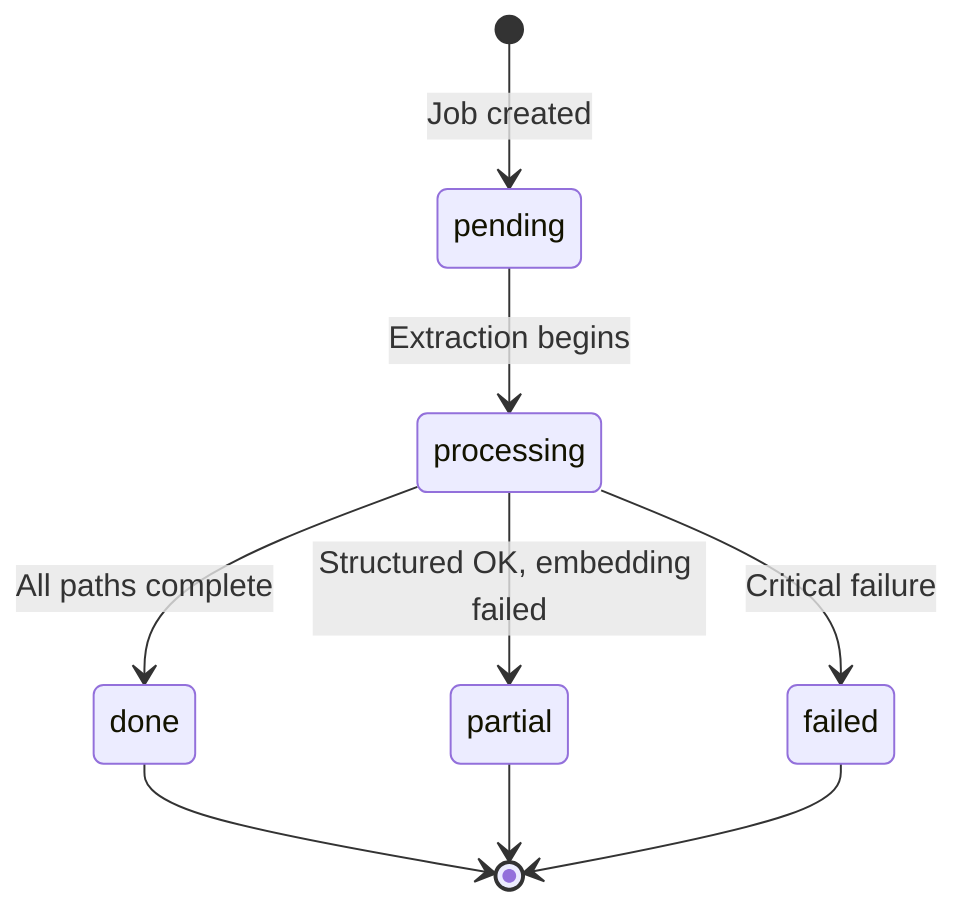
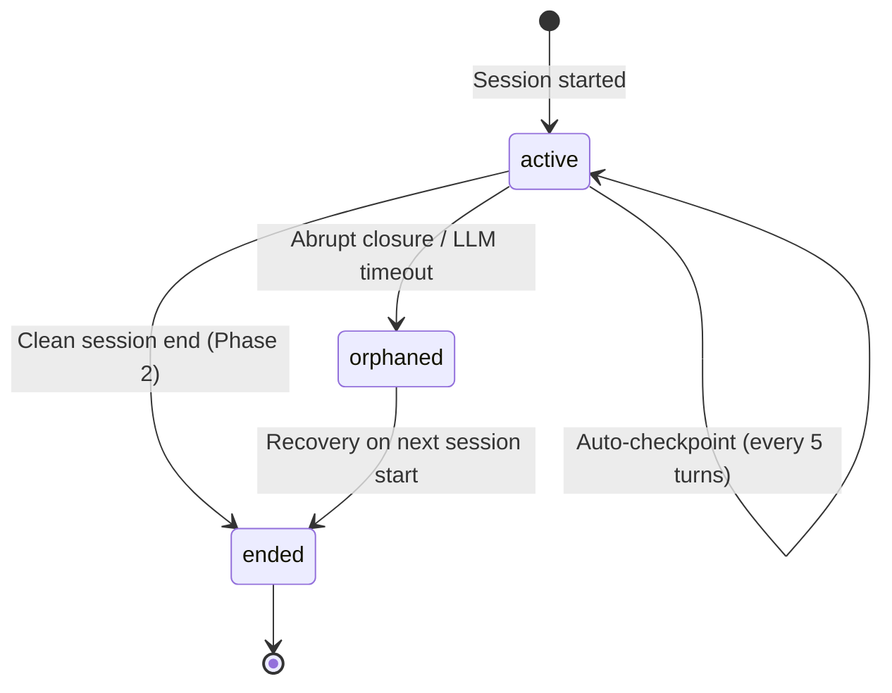

# Design Document: Ingestion Pipeline

## Overview

The Ingestion Pipeline is a FastAPI-based backend service that transforms raw user data into MentorMan's three-layer memory system. It handles two trigger points:

1. **Onboarding uploads** — Resume PDFs and LeetCode CSV exports uploaded by the user
2. **Session-end processing** — LLM-generated narrative summaries and skill updates produced after each mentoring session

Additionally, it implements a two-phase checkpoint mechanism (auto-checkpoint + clean session-end) to prevent data loss on abrupt session closure, with orphaned session recovery on the next session start.

The pipeline splits all extracted content into two parallel paths:
- **Structured path** → Typed facts (Core Profile, Skill Graph signals) → MongoDB
- **Narrative path** → Section-aware chunks → Voyage AI embeddings → Atlas Vector Search

### Key Design Goals

- Async processing: uploads return immediately with a `jobId`; UI polls for status
- Fault tolerance: structured path succeeds even if embedding fails (`partial` state)
- Atomicity: structured writes within a MongoDB transaction
- Re-ingestion: full replace semantics with rollback on failure
- Idempotent checkpoints: overwrites the same document field on each save

## Architecture

```mermaid
flowchart TD
    subgraph Client ["Client (Next.js)"]
        UI[Onboarding UI / Session UI]
    end

    subgraph FastAPI ["FastAPI Backend"]
        FUH[FileUploadHandler]
        ES[ExtractorService]
        IR[IngestionRouter]
        SP[StructuredParser]
        CS[ChunkerService]
        EMS[EmbedderService]
        SEP[SessionEndProcessor]
        CKP[CheckpointService]
    end

    subgraph Storage ["Storage Layer"]
        S3[AWS S3 - Raw Files<br/>24h TTL]
        MDB[(MongoDB Atlas)]
        AVS[(Atlas Vector Search)]
    end

    subgraph External ["External APIs"]
        VAI[Voyage AI<br/>voyage-4-lite]
        LLM[Claude Sonnet 4.6<br/>Session Summarization]
    end

    UI -->|POST /api/ingest| FUH
    FUH -->|store raw file| S3
    FUH -->|create Job_Record| MDB
    FUH -->|enqueue| ES

    ES -->|PDF| PDFEx[PDFExtractor<br/>PyMuPDF]
    ES -->|CSV| CSVEx[CSVExtractor<br/>pandas]
    PDFEx --> IR
    CSVEx --> IR

    IR -->|structured content| SP
    IR -->|narrative content| CS

    SP -->|Core Profile + Skill Graph| MDB
    CS --> EMS
    EMS -->|embeddings| AVS
    EMS -->|API call| VAI

    UI -->|POST /session/end| CKP
    CKP -->|summarization| LLM
    CKP -->|narrative + skill_update| SEP
    SEP -->|embedding| EMS
    SEP -->|skill upsert| MDB

    UI -->|GET /api/ingest/{jobId}/status| MDB
```

### Deployment Topology

| Component | Hosting | Notes |
|-----------|---------|-------|
| FastAPI Backend | Railway | Handles ingestion + LLM orchestration |
| Next.js Frontend | EC2 (nginx + PM2) | Thin API routes for session management |
| MongoDB Atlas | Cloud (M0 free tier) | Structured + vector in one DB |
| AWS S3 | Standard bucket | Raw file storage with 24h lifecycle policy |
| Voyage AI | External API | 200M tokens/month free tier |

## Components and Interfaces

### FileUploadHandler

**Responsibility:** Validate uploads, store to S3, create job records, return immediately.

```python
# POST /api/ingest
class FileUploadHandler:
    async def handle_upload(
        self,
        user_id: str,
        files: list[UploadFile],  # max 2 files
    ) -> IngestionJobResponse:
        """
        1. Validate file count (max 2), types (pdf/csv), sizes (0 < size <= 10MB)
        2. Generate jobId (UUID)
        3. Upload raw files to S3: uploads/{userId}/{jobId}/{filename}
        4. Create Job_Record in MongoDB with status='pending'
        5. Enqueue extraction job (background task)
        6. Return { jobId } immediately
        """
        ...
```

**Interface:**
```python
@dataclass
class IngestionJobResponse:
    job_id: str

@dataclass
class FileValidationError:
    field: str
    message: str
    supported_types: list[str] | None = None
    max_size_mb: int | None = None
```

### ExtractorService

**Responsibility:** Route files to the correct extractor based on MIME type.

```python
class ExtractorService:
    async def extract(self, job: IngestionJob) -> ExtractionResult:
        """
        For each file in job.files:
          - application/pdf → PDFExtractor
          - text/csv → CSVExtractor
        Returns combined extraction results.
        """
        ...
```

### PDFExtractor

**Responsibility:** Extract section-aware text from resume PDFs using PyMuPDF.

```python
class PDFExtractor:
    def extract(self, file_bytes: bytes) -> list[ResumeSection]:
        """
        1. Extract raw text via PyMuPDF (fitz)
        2. Detect section headings using regex patterns and heuristics
        3. Return array of ResumeSection objects
        4. If no sections detected → single "Unstructured" section
        5. If <10 chars extracted → raise ExtractionError
        """
        ...

@dataclass
class ResumeSection:
    section: str       # work_experience, education, skills, projects, other
    text: str
    order: int         # position in original document
    sub_entries: list[str]  # preserved sub-headings (job titles, project names)
```

### CSVExtractor

**Responsibility:** Parse LeetCode CSV exports into per-topic difficulty aggregates.

```python
class CSVExtractor:
    def extract(self, file_bytes: bytes) -> list[LeetCodeTopicStats]:
        """
        1. Parse CSV with pandas, typed columns
        2. Validate required columns: title, difficulty, status, topic
        3. Filter rows: status in ('Accepted', 'Solved') case-insensitive
        4. Discard rows with unrecognized difficulty (not Easy/Medium/Hard)
        5. Skip rows with empty topic (log warning)
        6. Aggregate by (topic, difficulty) → count
        7. Return array of { topic, easy, medium, hard }
        """
        ...

@dataclass
class LeetCodeTopicStats:
    topic: str
    easy: int
    medium: int
    hard: int
```

### IngestionRouter

**Responsibility:** Split extracted content into structured and narrative paths based on content type and section.

```python
class IngestionRouter:
    async def route(self, extraction_result: ExtractionResult, job: IngestionJob):
        """
        Routing rules:
          - LeetCode aggregates → structured path only
          - Resume work_experience → both paths (role/YOE extraction + embedding)
          - Resume skills → structured path only (Skill Graph tags)
          - Resume projects → narrative path only (embedding)
          - Resume education → structured path only (Core Profile)
          - Unrecognized sections → discard + log warning

        Execution:
          - Run structured and narrative paths in parallel (asyncio.gather)
          - If structured fails → mark job 'failed', skip narrative
          - If narrative fails after structured succeeds → mark job 'partial'
        """
        ...
```

### StructuredParser

**Responsibility:** Transform extracted content into typed facts and write to MongoDB with Zod validation.

```python
class StructuredParser:
    async def process(
        self,
        leetcode_stats: list[LeetCodeTopicStats] | None,
        resume_sections: list[ResumeSection] | None,
        user_id: str,
        job_id: str,
    ):
        """
        From LeetCode:
          - Upsert per-topic signal docs to skill_graph collection
          - Format: { topic, signals: { leetcode_solved: { easy, medium, hard } } }

        From Resume:
          - Extract currentRole, yearsOfExperience, education, skills
          - Write to core_profile document
          - Set null for unrecognizable fields (log warning)

        Constraints:
          - Validate all writes against Zod schemas before persisting
          - Execute Core_Profile + Skill_Graph writes within MongoDB transaction
          - On Zod validation failure → reject write, mark job 'failed'
        """
        ...
```

### ChunkerService

**Responsibility:** Split narrative text into section-aware chunks suitable for embedding.

```python
class ChunkerService:
    MAX_CHUNK_TOKENS = 512
    OVERLAP_TOKENS = 50

    def chunk(self, sections: list[ResumeSection], user_id: str, source: str) -> list[Chunk]:
        """
        1. Split by section headings
        2. Keep each work entry / project / education entry as a single chunk
        3. If a chunk exceeds 512 tokens → split at sentence boundaries with 50-token overlap
        4. Attach metadata: userId, source, section, chunkIndex, topic (if mappable)
        5. If no sections detected → treat as single unnamed section, apply splitting rules
        """
        ...

@dataclass
class Chunk:
    text: str
    metadata: ChunkMetadata

@dataclass
class ChunkMetadata:
    user_id: str
    source: str          # 'resume' or 'session'
    section: str | None
    chunk_index: int
    topic: str | None    # mapped from section name or text matching
    job_id: str | None
```

### EmbedderService

**Responsibility:** Generate vector embeddings and store in Atlas Vector Search.

```python
class EmbedderService:
    BATCH_SIZE = 20
    MAX_RETRIES = 3
    BACKOFF_BASE = 1  # seconds
    BACKOFF_CAP = 8   # seconds

    async def embed_and_store(self, chunks: list[Chunk]) -> None:
        """
        1. Process chunks in batches of 20
        2. Call Voyage AI voyage-4-lite → 1536-dimension vectors
        3. Store each (vector, text, metadata) in Atlas Vector Search
        4. On API failure → retry up to 3x with exponential backoff (1s, 2s, 4s, cap 8s)
        5. On storage failure → retry up to 2x
        6. On final failure → raise EmbeddingError (caller marks job 'partial')
        """
        ...
```

### SessionEndProcessor

**Responsibility:** Process LLM session-end output (narrative_summary + skill_update).

```python
class SessionEndProcessor:
    async def process(
        self,
        user_id: str,
        session_id: str,
        llm_output: SessionEndOutput,
    ):
        """
        1. Validate llm_output has narrative_summary and skill_update fields
        2. If malformed → mark session 'orphaned', preserve raw transcript
        3. Embed narrative_summary via EmbedderService with session metadata
        4. Validate skill_update against Skill_Graph Zod schema
        5. If skill_update validation fails → log error, skip write (don't affect embedding)
        6. Upsert skill_update into Skill_Graph, merging new signals
        7. Preserve existing field values for omitted fields
        8. If embedding fails → still attempt skill_update write, mark 'partial'
        """
        ...

@dataclass
class SessionEndOutput:
    narrative_summary: str
    skill_update: dict  # validated against SkillGraphUpdateSchema
```

### CheckpointService

**Responsibility:** Two-phase checkpoint mechanism for session data preservation.

```python
class CheckpointService:
    CHECKPOINT_INTERVAL = 5    # every 5 turns
    SESSION_END_TIMEOUT = 30   # seconds
    ORPHAN_LOOKBACK_DAYS = 7

    async def auto_checkpoint(self, session_id: str, messages: list[Message]):
        """
        Phase 1: Auto-checkpoint
        - Triggered every 5th turn (user msg + assistant response = 1 turn)
        - Overwrite session.transcript with full message list
        - Update last_checkpoint_turn field
        - No LLM call, must complete within 2 seconds
        - On failure → retry once after 1s delay, don't interrupt conversation
        """
        ...

    async def end_session(self, session_id: str, user_id: str):
        """
        Phase 2: Clean session end
        - Triggered by POST /session/end (via beforeunload)
        - Invoke session summarization LLM (30s timeout)
        - Route narrative_summary → EmbedderService → Atlas Vector Search
        - Route skill_update → MongoDB via SessionEndProcessor
        - Mark session 'ended' with ended_at timestamp
        - On LLM failure/timeout → mark 'orphaned', preserve transcript
        """
        ...

    async def recover_orphaned_sessions(self, user_id: str):
        """
        Orphaned session recovery:
        - Query orphaned sessions (no ended_at, no summary, <7 days old)
        - Process sequentially: run summarization LLM → route outputs
        - On success → mark 'ended' with recovered=True flag
        - On failure → skip, log, retain for next retry
        - Complete all recoveries before new session becomes active
        """
        ...
```

### Re-Ingestion Handler

**Responsibility:** Handle re-uploads by replacing old data with new.

```python
class ReIngestionHandler:
    async def handle(self, user_id: str, source_category: str, job: IngestionJob):
        """
        1. Delete all existing vector chunks tagged with source_category
        2. Delete all structured facts originating from source_category
        3. Preserve all 'session'-tagged data (embeddings + skill updates)
        4. Run normal ingestion pipeline for new files
        5. If new ingestion fails → restore deleted data from S3 raw file
        6. Update job record with last_reingested_at timestamp
        7. Complete within 30 seconds of final write
        """
        ...
```

## Data Models

### Job Record (MongoDB: `ingestion_jobs` collection)

```python
class JobRecord(BaseModel):
    job_id: str                    # UUID
    user_id: str                   # Clerk user ID
    status: IngestionStatus        # pending | processing | done | partial | failed
    files: list[IngestionFile]     # uploaded file metadata
    error: str | None = None       # user-facing error message
    structured_done: bool = False
    embedding_done: bool = False
    source_category: str | None    # 'resume' or 'leetcode' — for re-ingestion tracking
    last_reingested_at: str | None # ISO timestamp of last re-ingestion
    created_at: datetime
    updated_at: datetime
    completed_at: datetime | None = None
```

### Core Profile (MongoDB: `users` collection)

```python
# Extended fields written by StructuredParser from resume
class CoreProfileIngestion(BaseModel):
    current_role: str | None       # extracted from work_experience section
    years_of_experience: int | None  # extracted from work_experience dates
    education: str | None          # degree + field from education section
    skills: list[str]              # tags from skills section
```

### Skill Graph Node (MongoDB: `skill_graph` collection)

```python
# Existing schema — StructuredParser upserts signals
class SkillGraphSignals(BaseModel):
    leetcode_solved: LeetCodeCounts | None
    mentor_eval_score: str | None
    mentor_eval_count: int = 0

class LeetCodeCounts(BaseModel):
    easy: int = 0
    medium: int = 0
    hard: int = 0
```

### Vector Chunk (Atlas Vector Search: `embeddings` collection)

```python
class VectorChunk(BaseModel):
    vector: list[float]            # 1536 dimensions (Voyage AI voyage-4-lite)
    text: str                      # original chunk text
    metadata: ChunkMetadata

class ChunkMetadata(BaseModel):
    user_id: str
    source: str                    # 'resume' | 'session_summary' | 'doubt'
    section: str | None            # resume section or session topic
    topic: str | None              # topic tag for filtered retrieval
    topic_category: str | None     # 'DSA', 'Cloud', etc.
    session_id: str | None
    job_id: str | None
    chunk_index: int
    date: str | None               # ISO date for session chunks
    type: str | None               # session type for session chunks
    created_at: datetime
```

### Session Document (MongoDB: `sessions` collection)

```python
# Checkpoint-related fields added to existing SessionSchema
class SessionCheckpoint(BaseModel):
    transcript: list[Message]       # full ordered message list
    last_checkpoint_turn: int       # turn number of last persisted checkpoint
    orphaned: bool = False          # True if session closed without clean end
    recovered: bool = False         # True if orphaned session was later recovered
    ended_at: datetime | None       # set on clean end or recovery
    summary: str | None             # narrative summary from LLM
```

### State Machine: Job Status Transitions



### State Machine: Session Lifecycle



## Correctness Properties

*A property is a characteristic or behavior that should hold true across all valid executions of a system — essentially, a formal statement about what the system should do. Properties serve as the bridge between human-readable specifications and machine-verifiable correctness guarantees.*

### Property 1: File upload validation

*For any* file upload request, the validation function SHALL accept the file if and only if its MIME type is in `{'application/pdf', 'text/csv'}` AND its size in bytes satisfies `0 < size <= 10,485,760`.

**Validates: Requirements 1.1, 1.2, 1.3, 1.4**

### Property 2: S3 path construction

*For any* valid userId, jobId, and filename strings, the constructed S3 key SHALL equal `uploads/{userId}/{jobId}/{filename}`.

**Validates: Requirements 1.5**

### Property 3: PDF section detection

*For any* text block containing one or more recognized section headings (Work Experience, Education, Skills, Projects), the PDF extractor SHALL return an array of section objects where each object has a non-empty `section` name matching a recognized heading and non-empty `text` content, and the union of all section texts covers the entire input text (minus heading lines).

**Validates: Requirements 2.2, 2.3**

### Property 4: CSV aggregation correctness

*For any* CSV with valid required columns, the aggregated output for each topic SHALL equal the count of rows where `status` is "Accepted" or "Solved" (case-insensitive), `difficulty` is "Easy", "Medium", or "Hard" (case-insensitive), and `topic` is non-empty — grouped by topic and difficulty.

**Validates: Requirements 3.4, 3.5, 3.6, 3.7, 3.8**

### Property 5: CSV required column validation

*For any* CSV file, the validator SHALL accept it if and only if columns `title`, `difficulty`, `status`, and `topic` are all present in the header row, and the error message for rejected CSVs SHALL list exactly the missing column names.

**Validates: Requirements 3.2, 3.3**

### Property 6: Content routing correctness

*For any* extraction result, the ingestion router SHALL route content such that: (a) LeetCode aggregates appear only in the structured path, (b) resume work_experience appears in both structured and narrative paths with unmodified text, (c) resume skills appears only in the structured path, (d) resume projects appears only in the narrative path, (e) resume education appears only in the structured path, and (f) sections not matching any defined rule appear in neither path.

**Validates: Requirements 4.1, 4.2, 4.3, 4.4, 4.5, 4.7**

### Property 7: LeetCode to Skill Graph format

*For any* LeetCode topic aggregate `{ topic, easy, medium, hard }`, the resulting Skill Graph upsert document SHALL have the format `{ topic, signals: { leetcode_solved: { easy, medium, hard } } }` with matching values.

**Validates: Requirements 5.1**

### Property 8: Zod validation gates all writes

*For any* data object passed to a write operation (Core Profile, Skill Graph, or session embedding metadata), the write SHALL succeed if and only if the object passes Zod schema validation. Invalid objects SHALL be rejected without persisting.

**Validates: Requirements 5.4, 5.5, 9.5**

### Property 9: Chunk size invariant

*For any* input text processed by the ChunkerService, every output chunk SHALL have a token count less than or equal to 512 tokens as measured by the configured embedding model's tokenizer.

**Validates: Requirements 6.2**

### Property 10: Section-aware chunking preserves entries

*For any* multi-section input text where individual entries (work experience entries, project descriptions, education entries) are each ≤512 tokens, each such entry SHALL appear as a single chunk without being split across multiple chunks.

**Validates: Requirements 6.1**

### Property 11: Sentence boundary splitting with overlap

*For any* section text exceeding 512 tokens, consecutive chunks produced by the splitter SHALL overlap by approximately 50 tokens, and split points SHALL occur at sentence boundaries (period, question mark, or exclamation mark followed by whitespace).

**Validates: Requirements 6.3**

### Property 12: Chunk metadata completeness

*For any* chunk produced by the ChunkerService, the metadata SHALL contain non-null values for `userId`, `source` (either 'resume' or 'session'), `section` name (or unnamed if no sections detected), and `chunkIndex` (zero-based integer incremented per section).

**Validates: Requirements 6.4**

### Property 13: Embedding batch size invariant

*For any* set of N chunks submitted to the EmbedderService, the chunks SHALL be partitioned into ⌈N/20⌉ batches where each batch contains at most 20 chunks, and the union of all batches equals the original set.

**Validates: Requirements 7.2**

### Property 14: Exponential backoff calculation

*For any* retry attempt number `n` (where n ∈ {0, 1, 2}), the delay before that retry SHALL equal `min(2^n * 1, 8)` seconds — producing delays of 1s, 2s, 4s (all under the 8s cap).

**Validates: Requirements 7.4**

### Property 15: Job status valid transitions

*For any* job status transition, the transition SHALL be accepted if and only if it follows a valid path in the state machine: `pending → processing`, `processing → done`, `processing → partial`, `processing → failed`. All other transitions SHALL be rejected.

**Validates: Requirements 8.2, 8.5**

### Property 16: Malformed session output detection

*For any* JSON object that is missing either the `narrative_summary` field or the `skill_update` field (or both), the Session_End_Processor SHALL mark the session as `orphaned` and preserve the raw transcript.

**Validates: Requirements 9.2**

### Property 17: Session embedding metadata completeness

*For any* session-end embedding stored in Atlas Vector Search, the metadata SHALL contain non-null values for `userId`, `sessionId`, `date`, `type`, `topic`, and `topic_category`.

**Validates: Requirements 9.4**

### Property 18: Skill update merge preserves existing fields

*For any* existing Skill Graph node and any incoming skill_update that omits some fields, the merged result SHALL retain the existing values for all omitted fields while updating only the fields present in the skill_update.

**Validates: Requirements 9.7, 9.8**

### Property 19: Checkpoint trigger interval

*For any* conversation turn number N, the auto-checkpoint SHALL be triggered if and only if N is a positive multiple of 5 (N > 0 and N mod 5 == 0).

**Validates: Requirements 10.1**

### Property 20: Checkpoint correctness

*For any* checkpoint operation at turn N with a message list M, after the checkpoint completes the session document's `transcript` field SHALL exactly equal M (the complete ordered message list) and `last_checkpoint_turn` SHALL equal N.

**Validates: Requirements 10.3, 10.4**

### Property 21: Orphaned session query correctness

*For any* set of session documents belonging to a user, the orphaned session query SHALL return exactly those sessions where: (a) `ended_at` is null, (b) `summary` is null, (c) checkpoint data exists, and (d) `created_at` is within the last 7 days.

**Validates: Requirements 12.1**

### Property 22: Re-ingestion deletes only source-category data

*For any* re-ingestion operation for source category C, the deletion step SHALL remove all vector chunks where `metadata.source` matches C and SHALL not remove any chunks where `metadata.source` does not match C.

**Validates: Requirements 13.1**

### Property 23: Re-ingestion full replace semantics

*For any* re-ingestion of structured facts for source category C, the resulting structured data SHALL contain only the newly parsed values from the current ingestion — no residual values from the prior ingestion for that source category SHALL remain.

**Validates: Requirements 13.2**

### Property 24: Re-ingestion preserves session-tagged data

*For any* re-ingestion operation, all embeddings and skill graph updates where the source is tagged as "session" SHALL remain completely unmodified — their count, content, and metadata SHALL be identical before and after re-ingestion.

**Validates: Requirements 13.3**

## Error Handling

### Error Classification

| Error Type | HTTP Code | Recovery Strategy | User Impact |
|-----------|-----------|-------------------|-------------|
| Invalid file type | 400 | Immediate rejection | User re-uploads correct file |
| File too large / empty | 400 | Immediate rejection | User re-uploads smaller file |
| S3 upload failure | 500 | No job created | User retries upload |
| PDF parse failure | — | Job marked `failed` | User re-uploads readable PDF |
| CSV missing columns | — | Job marked `failed` | User exports correct CSV |
| Zod validation failure | — | Job marked `failed` | Internal error, logged for debugging |
| Voyage AI unavailable | — | 3x retry → `partial` | Structured data saved, RAG missing resume context |
| Atlas Vector Search write failure | — | 2x retry → `partial` | Same as above |
| MongoDB transaction failure | — | Job marked `failed` | User retries upload |
| LLM timeout (session-end) | — | Session marked `orphaned` | Recovery on next session start |
| LLM malformed output | — | Session marked `orphaned` | Recovery on next session start |
| Re-ingestion failure after deletion | — | Restore from S3 | User sees error, data restored |

### Error Propagation Rules

1. **Structured path failure is fatal:** If the structured path fails, the entire job fails. Narrative path is not attempted.
2. **Narrative path failure is non-fatal:** If embedding fails but structured succeeds, job is `partial`. App still functions — RAG just lacks resume context.
3. **Skill update failure is isolated:** During session-end, if skill_update Zod validation fails, the embedding still proceeds. Only the skill write is skipped.
4. **Checkpoint failures are silent:** Auto-checkpoint failures retry once but never interrupt the active conversation.
5. **Recovery failures are non-blocking:** If orphaned session recovery fails, it's skipped and retried next time. The new session starts normally.

### Retry Policies

| Operation | Max Retries | Backoff | Cap |
|-----------|-------------|---------|-----|
| Voyage AI embedding | 3 | Exponential (1s base) | 8s |
| Atlas Vector Search write | 2 | Fixed 1s | — |
| Checkpoint MongoDB write | 1 | Fixed 1s | — |
| Re-ingestion restore | 1 | Immediate | — |

## Testing Strategy

### Property-Based Testing (PBT)

This feature has substantial pure logic suitable for property-based testing: file validation, CSV parsing/aggregation, content routing, chunking, state machine transitions, merge semantics, and re-ingestion correctness.

**Library:** [Hypothesis](https://hypothesis.readthedocs.io/) (Python PBT framework)

**Configuration:**
- Minimum 100 iterations per property test (`@settings(max_examples=100)`)
- Each property test tagged with a comment referencing its design property
- Tag format: `# Feature: ingestion-pipeline, Property {N}: {title}`

**Properties to implement as PBT:**
- Properties 1–24 as listed in the Correctness Properties section above
- Focus on pure functions: validation logic, CSV parsing, routing rules, chunking, merge logic, state machine, query predicates

### Unit Tests (Example-Based)

Unit tests cover specific scenarios, integration points, and error conditions that aren't universal properties:

- S3 failure prevents Job_Record creation (Req 1.6)
- PDF with sub-headings preserves structure (Req 2.4)
- Corrupted PDF marks job as failed (Req 2.5)
- Narrative path failure → partial status (Req 4.8)
- Structured path failure → failed, no narrative (Req 4.9)
- Resume field extraction (currentRole, YOE) (Req 5.2)
- Missing role/YOE → null fields (Req 5.3)
- Job status endpoint response format (Req 8.1)
- Non-existent jobId → 404 (Req 8.6)
- Another user's jobId → 403 (Req 8.7)
- Embedding failure during session-end → still writes skill (Req 9.9)
- Checkpoint retry on failure (Req 10.5)
- LLM timeout → orphaned session (Req 11.3)
- Successful session end → ended status (Req 11.5)
- Recovered session has recovered=true flag (Req 12.4)
- Recovery failure → skip, retain data (Req 12.5)
- Re-ingestion failure → restore old data (Req 13.4)

### Integration Tests

Integration tests verify end-to-end flows with real (or emulated) services:

- Full upload → extraction → storage flow with test PDF/CSV files
- Session-end flow: LLM call → embedding → skill write
- Orphaned session recovery full cycle
- Re-ingestion with actual S3 and MongoDB operations
- Job status polling during async processing
- MongoDB transaction atomicity for structured writes

### Test File Structure

```
tests/
  unit/
    test_file_validation.py        # Properties 1-2
    test_pdf_extractor.py          # Property 3
    test_csv_extractor.py          # Properties 4-5
    test_ingestion_router.py       # Property 6
    test_structured_parser.py      # Properties 7-8
    test_chunker_service.py        # Properties 9-12
    test_embedder_service.py       # Properties 13-14
    test_job_status.py             # Property 15
    test_session_end_processor.py  # Properties 16-18
    test_checkpoint_service.py     # Properties 19-21
    test_reingestion.py            # Properties 22-24
  integration/
    test_upload_flow.py
    test_session_end_flow.py
    test_orphan_recovery.py
    test_reingestion_flow.py
```

