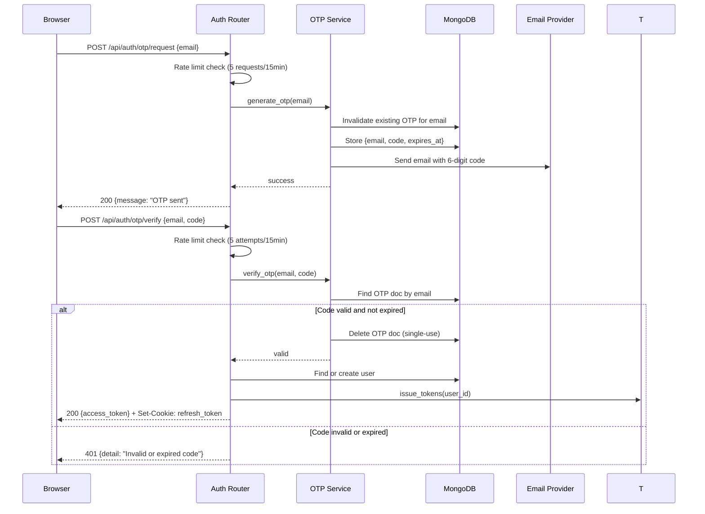
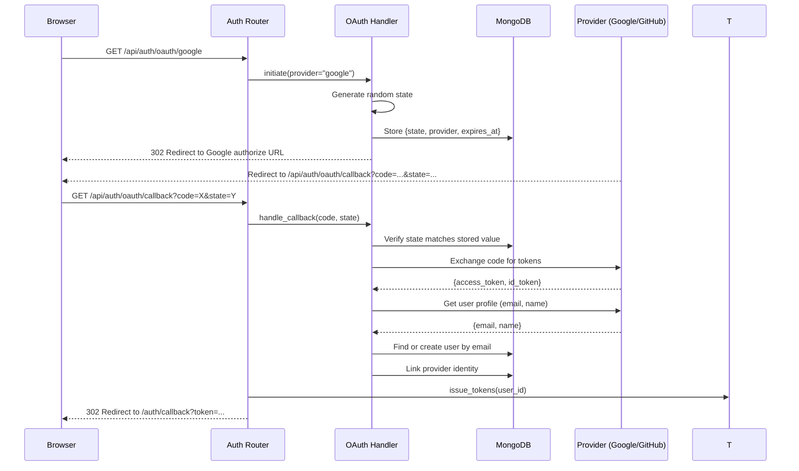
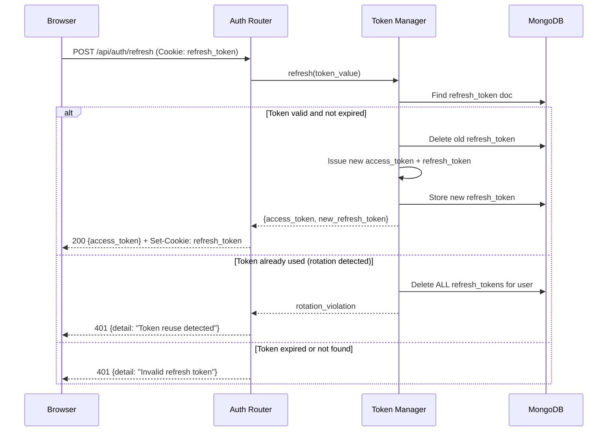

# Design Document: Self-Hosted Authentication

## Overview

This design replaces the third-party Clerk authentication provider with a fully self-hosted auth system built on the existing FastAPI + MongoDB stack. The current Clerk integration causes production issues (Cloudflare proxy misconfiguration → 403s/525s) and is over-engineered for a single-developer app with a small user base.

The self-hosted system implements four authentication methods (email+password, passwordless OTP, Google OAuth, GitHub OAuth), JWT-based session management with refresh token rotation, rate limiting, and admin user management. The backend auth module lives within the existing `unified-backend/app/` structure, and the React frontend replaces Clerk components with custom login/register pages and an in-memory token management strategy.

### Key Design Decisions

| Decision | Rationale |
|---|---|
| HS256 JWT (not RS256) | Single-service architecture — no need for public key distribution. Simpler, faster verification. Secret rotation via env var. |
| Opaque refresh tokens (not JWT) | Server-side revocation without token introspection. Enables rotation detection (replay attack mitigation). |
| bcrypt work factor 12 | Good balance of security vs. latency (~250ms hash time). Industry standard for password storage. |
| In-memory access token (not localStorage) | XSS-safe. Token lives only in JS memory; refresh token in HTTP-only cookie handles persistence across page reloads. |
| HTTP-only cookie for refresh token | Immune to XSS. Sent automatically on refresh requests. SameSite=Lax prevents CSRF on cross-origin. |
| MongoDB TTL index for OTP/rate-limit docs | Auto-cleanup without cron jobs. Native MongoDB feature, zero operational overhead. |
| Sliding window rate limiting in MongoDB | No Redis dependency. Acceptable for current scale (~100 users). Upgrade path to Redis exists if needed. |
| OAuth state in short-lived MongoDB doc | Stateless backend (no server sessions). TTL auto-expires stale OAuth flows. |
| LEGACY_AUTH_ENABLED flag preserved | Zero-downtime migration. Existing service-to-service integrations continue working. |

## Architecture

```mermaid
graph TB
    subgraph "Client Layer"
        Browser[React 19 SPA]
    end

    subgraph "Unified Backend (FastAPI)"
        AuthRouter[Auth Router<br/>/api/auth/*]
        AdminRouter[Admin Router<br/>/api/admin/*]
        AppRouters[App Routers<br/>/api/profile, /api/sessions, etc.]

        subgraph "Auth Module"
            TokenMgr[Token Manager<br/>JWT + Refresh]
            PasswordSvc[Password Service<br/>bcrypt]
            OTPSvc[OTP Service<br/>Generate + Verify + Email]
            OAuthSvc[OAuth Handler<br/>Google + GitHub]
            RateLimiter[Rate Limiter<br/>Sliding Window]
        end

        SecurityDep[require_auth() Dependency<br/>JWT verify → user_id]
        AdminDep[require_admin() Dependency<br/>JWT verify + is_admin check]
    end

    subgraph "Data Layer"
        MongoDB[(MongoDB)]
        UsersCol[users collection]
        RefreshCol[refresh_tokens collection]
        OTPCol[otp_codes collection<br/>TTL: 10min]
        RateCol[rate_limits collection<br/>TTL: 15min]
        OAuthStateCol[oauth_states collection<br/>TTL: 5min]
    end

    subgraph "External Services"
        SMTP[SMTP / Email Provider]
        Google[Google OAuth]
        GitHub[GitHub OAuth]
    end

    Browser -->|POST /api/auth/register, /login, /otp/*| AuthRouter
    Browser -->|GET /api/auth/oauth/{provider}| AuthRouter
    Browser -->|POST /api/auth/refresh| AuthRouter
    Browser -->|Bearer JWT| AppRouters
    Browser -->|Bearer JWT + is_admin| AdminRouter

    AuthRouter --> TokenMgr
    AuthRouter --> PasswordSvc
    AuthRouter --> OTPSvc
    AuthRouter --> OAuthSvc
    AuthRouter --> RateLimiter

    SecurityDep --> TokenMgr
    AdminDep --> SecurityDep

    AppRouters --> SecurityDep
    AdminRouter --> AdminDep

    TokenMgr --> RefreshCol
    OTPSvc --> OTPCol
    OTPSvc --> SMTP
    OAuthSvc --> Google
    OAuthSvc --> GitHub
    OAuthSvc --> OAuthStateCol
    RateLimiter --> RateCol
    PasswordSvc --> UsersCol

### Authentication Flow: Email + Password

```mermaid
sequenceDiagram
    participant B as Browser
    participant A as Auth Router
    participant P as Password Service
    participant T as Token Manager
    participant DB as MongoDB (users)

    B->>A: POST /api/auth/login {email, password}
    A->>A: Rate limit check
    A->>DB: Find user by email
    DB-->>A: user doc (hashed_password)
    A->>P: verify(password, hashed_password)
    P-->>A: true/false
    alt Password valid
        A->>T: issue_tokens(user_id)
        T->>DB: Store refresh_token doc
        T-->>A: {access_token, refresh_token}
        A-->>B: 200 {access_token} + Set-Cookie: refresh_token
    else Password invalid
        A->>DB: Increment failed_attempts
        A-->>B: 401 {detail: "Invalid credentials"}
    end
```

### Authentication Flow: OTP



### Authentication Flow: OAuth



### Token Refresh Flow



## Components and Interfaces

### Backend Project Structure (additions to unified-backend/)

```
unified-backend/app/
├── auth/
│   ├── __init__.py
│   ├── router.py              # /api/auth/* endpoints
│   ├── admin_router.py        # /api/admin/* endpoints
│   ├── token_manager.py       # JWT issuance + refresh token lifecycle
│   ├── password_service.py    # bcrypt hash + verify
│   ├── otp_service.py         # OTP generation, storage, verification, email
│   ├── oauth_handler.py       # Google/GitHub authorization code flow
│   ├── rate_limiter.py        # Sliding-window rate limiting
│   ├── dependencies.py        # require_auth(), require_admin() FastAPI deps
│   ├── email_sender.py        # SMTP/API email delivery abstraction
│   └── schemas.py             # Pydantic request/response models
├── config/
│   └── settings.py            # Extended with auth settings (JWT_SECRET, etc.)
└── models/
    └── user.py                # User document model
```

### Frontend Project Structure (additions to mentorman-web/src/)

```
mentorman-web/src/
├── auth/
│   ├── AuthProvider.tsx       # React context: token state, login/logout/refresh
│   ├── LoginPage.tsx          # Email+password form, OTP toggle, OAuth buttons
│   ├── RegisterPage.tsx       # Registration form
│   ├── OTPForm.tsx            # OTP request + verification
│   ├── OAuthCallback.tsx      # Handles OAuth redirect, extracts token
│   ├── ProtectedRoute.tsx     # Route guard: redirects unauthenticated to /login
│   ├── useAuth.ts             # Hook: exposes user, login, logout, isAuthenticated
│   └── api-client.ts          # Fetch wrapper: attach token, auto-refresh on 401
├── App.tsx                    # Rewritten: no Clerk, uses AuthProvider + ProtectedRoute
└── ...
```

### Component Interfaces

#### `app/auth/router.py` — Auth Endpoints

```python
from fastapi import APIRouter, Response, Request, HTTPException, status
from app.auth.schemas import (
    RegisterRequest, LoginRequest, OTPRequestBody, OTPVerifyBody,
    TokenResponse, MessageResponse
)
from app.auth.token_manager import TokenManager
from app.auth.password_service import PasswordService
from app.auth.otp_service import OTPService
from app.auth.oauth_handler import OAuthHandler
from app.auth.rate_limiter import RateLimiter

router = APIRouter(prefix="/api/auth", tags=["Auth"])

@router.post("/register", response_model=TokenResponse, status_code=201)
async def register(body: RegisterRequest, response: Response):
    """Create a new user with email+password, return tokens."""
    ...

@router.post("/login", response_model=TokenResponse)
async def login(body: LoginRequest, response: Response):
    """Authenticate with email+password, return tokens."""
    ...

@router.post("/otp/request", response_model=MessageResponse)
async def request_otp(body: OTPRequestBody):
    """Generate and send a 6-digit OTP to the email."""
    ...

@router.post("/otp/verify", response_model=TokenResponse)
async def verify_otp(body: OTPVerifyBody, response: Response):
    """Verify OTP code and return tokens."""
    ...

@router.get("/oauth/{provider}")
async def oauth_initiate(provider: str):
    """Redirect to OAuth provider authorization URL."""
    ...

@router.get("/oauth/callback")
async def oauth_callback(code: str, state: str, response: Response):
    """Handle OAuth provider callback, return tokens via redirect."""
    ...

@router.post("/refresh", response_model=TokenResponse)
async def refresh_token(request: Request, response: Response):
    """Exchange valid refresh token for new token pair."""
    ...

@router.post("/logout")
async def logout(request: Request, response: Response):
    """Invalidate refresh token and clear cookie."""
    ...
```

#### `app/auth/token_manager.py` — JWT + Refresh Token Lifecycle

```python
from datetime import datetime, timedelta, timezone
from secrets import token_urlsafe
import jwt
from app.config.settings import get_settings
from app.config.database import get_db

ACCESS_TOKEN_EXPIRE = timedelta(minutes=15)
REFRESH_TOKEN_EXPIRE = timedelta(days=7)
REFRESH_TOKEN_BYTES = 32  # 32 bytes = 43 chars base64url

class TokenManager:
    def __init__(self):
        self.settings = get_settings()

    def create_access_token(self, user_id: str) -> str:
        """Issue a HS256 JWT with sub, iat, exp claims."""
        now = datetime.now(timezone.utc)
        payload = {
            "sub": user_id,
            "iat": now,
            "exp": now + ACCESS_TOKEN_EXPIRE,
        }
        return jwt.encode(payload, self.settings.JWT_SECRET, algorithm="HS256")

    def verify_access_token(self, token: str) -> str:
        """Verify JWT signature + expiration, return user_id (sub).
        Raises jwt.PyJWTError on failure."""
        claims = jwt.decode(
            token, self.settings.JWT_SECRET,
            algorithms=["HS256"],
            options={"require": ["exp", "iat", "sub"]}
        )
        return claims["sub"]

    async def create_refresh_token(self, user_id: str) -> str:
        """Generate opaque refresh token, store in MongoDB, return value."""
        token_value = token_urlsafe(REFRESH_TOKEN_BYTES)
        doc = {
            "token": token_value,
            "user_id": user_id,
            "created_at": datetime.now(timezone.utc),
            "expires_at": datetime.now(timezone.utc) + REFRESH_TOKEN_EXPIRE,
            "is_used": False,
        }
        db = get_db()
        await db["refresh_tokens"].insert_one(doc)
        return token_value

    async def rotate_refresh_token(self, old_token: str) -> tuple[str, str, str]:
        """Validate old refresh token, issue new pair.
        Returns (access_token, new_refresh_token, user_id).
        Raises HTTPException on invalid/expired/reused token."""
        ...

    async def revoke_refresh_token(self, token_value: str) -> None:
        """Mark a single refresh token as used/revoked."""
        ...

    async def revoke_all_user_tokens(self, user_id: str) -> None:
        """Revoke all refresh tokens for a user (rotation violation or admin action)."""
        ...
```

#### `app/auth/password_service.py` — bcrypt Hashing

```python
import bcrypt

WORK_FACTOR = 12

class PasswordService:
    def hash_password(self, password: str) -> str:
        """Hash password with bcrypt, work factor 12. Returns encoded string."""
        salt = bcrypt.gensalt(rounds=WORK_FACTOR)
        return bcrypt.hashpw(password.encode("utf-8"), salt).decode("utf-8")

    def verify_password(self, password: str, hashed: str) -> bool:
        """Verify plaintext password against stored bcrypt hash."""
        return bcrypt.checkpw(password.encode("utf-8"), hashed.encode("utf-8"))
```

#### `app/auth/otp_service.py` — OTP Generation and Verification

```python
from datetime import datetime, timedelta, timezone
from secrets import randbelow
from app.config.database import get_db
from app.auth.email_sender import send_otp_email

OTP_EXPIRY = timedelta(minutes=10)
OTP_LENGTH = 6

class OTPService:
    async def generate_and_send(self, email: str) -> None:
        """Generate 6-digit code, store with expiry, email to user.
        Invalidates any existing unexpired code for this email."""
        db = get_db()
        # Invalidate previous codes
        await db["otp_codes"].delete_many({"email": email})
        # Generate cryptographically random 6-digit code
        code = str(randbelow(10**OTP_LENGTH)).zfill(OTP_LENGTH)
        doc = {
            "email": email,
            "code": code,
            "created_at": datetime.now(timezone.utc),
            "expires_at": datetime.now(timezone.utc) + OTP_EXPIRY,
        }
        await db["otp_codes"].insert_one(doc)
        await send_otp_email(email, code)

    async def verify(self, email: str, code: str) -> bool:
        """Verify code matches stored OTP and is not expired.
        Deletes the code on successful verification (single-use)."""
        db = get_db()
        now = datetime.now(timezone.utc)
        doc = await db["otp_codes"].find_one_and_delete({
            "email": email,
            "code": code,
            "expires_at": {"$gt": now},
        })
        return doc is not None
```

#### `app/auth/oauth_handler.py` — OAuth Authorization Code Flow

```python
from secrets import token_urlsafe
from datetime import datetime, timedelta, timezone
from urllib.parse import urlencode
import httpx
from app.config.settings import get_settings
from app.config.database import get_db

OAUTH_STATE_EXPIRY = timedelta(minutes=5)

PROVIDER_CONFIG = {
    "google": {
        "authorize_url": "https://accounts.google.com/o/oauth2/v2/auth",
        "token_url": "https://oauth2.googleapis.com/token",
        "userinfo_url": "https://www.googleapis.com/oauth2/v3/userinfo",
        "scopes": ["openid", "email", "profile"],
    },
    "github": {
        "authorize_url": "https://github.com/login/oauth/authorize",
        "token_url": "https://github.com/login/oauth/access_token",
        "userinfo_url": "https://api.github.com/user",
        "emails_url": "https://api.github.com/user/emails",
        "scopes": ["user:email"],
    },
}

class OAuthHandler:
    def __init__(self):
        self.settings = get_settings()

    async def get_authorization_url(self, provider: str) -> str:
        """Generate OAuth authorize URL with random state parameter."""
        config = PROVIDER_CONFIG[provider]
        state = token_urlsafe(32)
        # Store state for CSRF verification
        db = get_db()
        await db["oauth_states"].insert_one({
            "state": state,
            "provider": provider,
            "expires_at": datetime.now(timezone.utc) + OAUTH_STATE_EXPIRY,
        })
        params = {
            "client_id": self._get_client_id(provider),
            "redirect_uri": self.settings.OAUTH_REDIRECT_URI,
            "scope": " ".join(config["scopes"]),
            "state": state,
            "response_type": "code",
        }
        return f"{config['authorize_url']}?{urlencode(params)}"

    async def handle_callback(self, code: str, state: str) -> dict:
        """Validate state, exchange code for tokens, fetch user profile.
        Returns {email, name, provider, provider_user_id}."""
        db = get_db()
        # Verify state
        state_doc = await db["oauth_states"].find_one_and_delete({
            "state": state,
            "expires_at": {"$gt": datetime.now(timezone.utc)},
        })
        if not state_doc:
            raise ValueError("Invalid or expired OAuth state")
        provider = state_doc["provider"]
        # Exchange code for access token
        token_data = await self._exchange_code(provider, code)
        # Fetch user profile
        user_info = await self._fetch_user_info(provider, token_data["access_token"])
        return user_info

    async def _exchange_code(self, provider: str, code: str) -> dict:
        """Exchange authorization code for provider access token."""
        ...

    async def _fetch_user_info(self, provider: str, access_token: str) -> dict:
        """Fetch email and display name from provider API."""
        ...

    def _get_client_id(self, provider: str) -> str:
        if provider == "google":
            return self.settings.GOOGLE_CLIENT_ID
        return self.settings.GITHUB_CLIENT_ID
```

#### `app/auth/rate_limiter.py` — Sliding Window Rate Limiting

```python
from datetime import datetime, timedelta, timezone
from fastapi import HTTPException, status
from app.config.database import get_db

class RateLimiter:
    def __init__(self, max_attempts: int = 5, window_minutes: int = 15):
        self.max_attempts = max_attempts
        self.window = timedelta(minutes=window_minutes)

    async def check_and_increment(self, key: str, action: str) -> None:
        """Check if rate limit exceeded for key+action. Increment counter.
        Raises HTTP 429 if limit exceeded."""
        db = get_db()
        now = datetime.now(timezone.utc)
        window_start = now - self.window

        # Count attempts in current window
        count = await db["rate_limits"].count_documents({
            "key": key,
            "action": action,
            "timestamp": {"$gte": window_start},
        })

        if count >= self.max_attempts:
            raise HTTPException(
                status_code=status.HTTP_429_TOO_MANY_REQUESTS,
                detail=f"Too many attempts. Try again in {self.window.seconds // 60} minutes.",
            )

        # Record this attempt
        await db["rate_limits"].insert_one({
            "key": key,
            "action": action,
            "timestamp": now,
            "expires_at": now + self.window,  # TTL index auto-deletes
        })

    async def reset(self, key: str, action: str) -> None:
        """Reset rate limit counter on successful action (e.g., successful login)."""
        db = get_db()
        await db["rate_limits"].delete_many({"key": key, "action": action})
```

#### `app/auth/dependencies.py` — FastAPI Auth Dependencies

```python
from fastapi import Header, HTTPException, Cookie, status
from app.auth.token_manager import TokenManager
from app.config.settings import get_settings
from app.config.database import get_db

_token_manager = TokenManager()

async def require_auth(
    authorization: str | None = Header(None),
    x_user_id: str | None = Header(None, alias="X-User-Id"),
    x_api_key: str | None = Header(None, alias="X-Api-Key"),
) -> str:
    """Authenticate request. Priority: Bearer JWT > Legacy headers.
    Returns authenticated user_id string."""
    # 1. Primary: Self-issued JWT bearer token
    if authorization and authorization.lower().startswith("bearer "):
        token = authorization[7:].strip()
        try:
            user_id = _token_manager.verify_access_token(token)
        except Exception:
            raise HTTPException(status_code=status.HTTP_401_UNAUTHORIZED, detail="Invalid token")
        # Check user is active
        db = get_db()
        user = await db["users"].find_one({"user_id": user_id}, {"is_active": 1})
        if user and not user.get("is_active", True):
            raise HTTPException(status_code=status.HTTP_403_FORBIDDEN, detail="Account deactivated")
        return user_id

    # 2. Legacy: X-Api-Key + X-User-Id (while flag enabled)
    settings = get_settings()
    if settings.LEGACY_AUTH_ENABLED:
        if not x_api_key or x_api_key != settings.MENTORMAN_API_KEY:
            raise HTTPException(status_code=status.HTTP_401_UNAUTHORIZED, detail="Invalid API key")
        if not x_user_id:
            raise HTTPException(status_code=status.HTTP_401_UNAUTHORIZED, detail="Missing user ID")
        return x_user_id

    raise HTTPException(status_code=status.HTTP_401_UNAUTHORIZED, detail="Missing bearer token")


async def require_admin(
    user_id: str = Depends(require_auth),
) -> str:
    """Verify the authenticated user has admin privileges."""
    db = get_db()
    user = await db["users"].find_one({"user_id": user_id}, {"is_admin": 1})
    if not user or not user.get("is_admin", False):
        raise HTTPException(status_code=status.HTTP_403_FORBIDDEN, detail="Admin access required")
    return user_id
```

#### `app/auth/admin_router.py` — Admin User Management

```python
from fastapi import APIRouter, Depends, HTTPException, Query, status
from app.auth.dependencies import require_admin
from app.auth.token_manager import TokenManager
from app.config.database import get_db

router = APIRouter(prefix="/api/admin", tags=["Admin"])

@router.get("/users")
async def list_users(
    page: int = Query(1, ge=1),
    page_size: int = Query(20, ge=1, le=100),
    admin_id: str = Depends(require_admin),
):
    """Return paginated user list. Default 20, max 100 per page."""
    db = get_db()
    skip = (page - 1) * page_size
    cursor = db["users"].find(
        {}, {"_id": 0, "hashed_password": 0}
    ).sort("created_at", -1).skip(skip).limit(page_size)
    users = await cursor.to_list(page_size)
    total = await db["users"].count_documents({})
    return {"users": users, "total": total, "page": page, "page_size": page_size}

@router.post("/users/{user_id}/deactivate")
async def deactivate_user(user_id: str, admin_id: str = Depends(require_admin)):
    """Mark user inactive, revoke all their refresh tokens."""
    db = get_db()
    result = await db["users"].update_one(
        {"user_id": user_id}, {"$set": {"is_active": False}}
    )
    if result.matched_count == 0:
        raise HTTPException(status_code=404, detail="User not found")
    # Revoke all refresh tokens
    token_mgr = TokenManager()
    await token_mgr.revoke_all_user_tokens(user_id)
    return {"detail": "User deactivated"}

@router.post("/users/{user_id}/activate")
async def activate_user(user_id: str, admin_id: str = Depends(require_admin)):
    """Mark user active, allowing future authentication."""
    db = get_db()
    result = await db["users"].update_one(
        {"user_id": user_id}, {"$set": {"is_active": True}}
    )
    if result.matched_count == 0:
        raise HTTPException(status_code=404, detail="User not found")
    return {"detail": "User activated"}
```

#### `app/auth/schemas.py` — Request/Response Models

```python
from pydantic import BaseModel, EmailStr, Field

class RegisterRequest(BaseModel):
    email: EmailStr
    password: str = Field(..., min_length=8, max_length=128)

class LoginRequest(BaseModel):
    email: EmailStr
    password: str = Field(..., min_length=1)

class OTPRequestBody(BaseModel):
    email: EmailStr

class OTPVerifyBody(BaseModel):
    email: EmailStr
    code: str = Field(..., min_length=6, max_length=6, pattern=r"^\d{6}$")

class TokenResponse(BaseModel):
    access_token: str
    token_type: str = "bearer"

class MessageResponse(BaseModel):
    message: str
```

#### `app/auth/email_sender.py` — Email Delivery Abstraction

```python
import httpx
from app.config.settings import get_settings

async def send_otp_email(to_email: str, code: str) -> None:
    """Send OTP code via configured email provider.
    Uses SMTP or transactional email API (e.g., Resend, SendGrid).
    In development, logs to console instead of sending."""
    settings = get_settings()
    if settings.EMAIL_BACKEND == "console":
        print(f"[OTP] {to_email}: {code}")
        return
    # Production: send via configured provider
    async with httpx.AsyncClient() as client:
        await client.post(
            settings.EMAIL_API_URL,
            headers={"Authorization": f"Bearer {settings.EMAIL_API_KEY}"},
            json={
                "from": settings.EMAIL_FROM,
                "to": to_email,
                "subject": "Your MentorMan login code",
                "text": f"Your verification code is: {code}\n\nThis code expires in 10 minutes.",
            },
        )
```

#### Frontend: `auth/AuthProvider.tsx` — Token State Management

```typescript
import { createContext, useContext, useState, useCallback, useEffect, ReactNode } from 'react';

interface AuthContextType {
  accessToken: string | null;
  isAuthenticated: boolean;
  login: (token: string) => void;
  logout: () => void;
  refresh: () => Promise<string | null>;
}

const AuthContext = createContext<AuthContextType | null>(null);

export function AuthProvider({ children }: { children: ReactNode }) {
  const [accessToken, setAccessToken] = useState<string | null>(null);
  const [loading, setLoading] = useState(true);

  // On mount, attempt silent refresh (refresh token in cookie)
  useEffect(() => {
    refresh().finally(() => setLoading(false));
  }, []);

  const login = useCallback((token: string) => {
    setAccessToken(token);
  }, []);

  const logout = useCallback(async () => {
    setAccessToken(null);
    await fetch('/api/auth/logout', { method: 'POST', credentials: 'include' });
  }, []);

  const refresh = useCallback(async (): Promise<string | null> => {
    try {
      const res = await fetch('/api/auth/refresh', {
        method: 'POST',
        credentials: 'include', // sends HTTP-only cookie
      });
      if (!res.ok) {
        setAccessToken(null);
        return null;
      }
      const data = await res.json();
      setAccessToken(data.access_token);
      return data.access_token;
    } catch {
      setAccessToken(null);
      return null;
    }
  }, []);

  if (loading) return <LoadingSpinner />;

  return (
    <AuthContext.Provider value={{ accessToken, isAuthenticated: !!accessToken, login, logout, refresh }}>
      {children}
    </AuthContext.Provider>
  );
}

export function useAuth() {
  const ctx = useContext(AuthContext);
  if (!ctx) throw new Error('useAuth must be used within AuthProvider');
  return ctx;
}
```

#### Frontend: `auth/api-client.ts` — Authenticated Fetch with Auto-Refresh

```typescript
import { useAuth } from './AuthProvider';

let _getToken: () => string | null = () => null;
let _refresh: () => Promise<string | null> = async () => null;
let _logout: () => void = () => {};

/** Called once by AuthProvider to wire up token access */
export function configureApiClient(
  getToken: () => string | null,
  refresh: () => Promise<string | null>,
  logout: () => void,
) {
  _getToken = getToken;
  _refresh = refresh;
  _logout = logout;
}

const BASE: string = (import.meta.env.VITE_API_BASE as string | undefined) ?? '';

export async function apiFetch(path: string, init: RequestInit = {}): Promise<Response> {
  const headers = new Headers(init.headers);
  const token = _getToken();
  if (token) headers.set('Authorization', `Bearer ${token}`);

  let res = await fetch(`${BASE}${path}`, { ...init, headers, credentials: 'include' });

  // If 401, attempt exactly one refresh and retry
  if (res.status === 401) {
    const newToken = await _refresh();
    if (newToken) {
      headers.set('Authorization', `Bearer ${newToken}`);
      res = await fetch(`${BASE}${path}`, { ...init, headers, credentials: 'include' });
    } else {
      _logout();
    }
  }

  return res;
}
```

#### Frontend: `auth/ProtectedRoute.tsx` — Route Guard

```typescript
import { Navigate, useLocation } from 'react-router-dom';
import { useAuth } from './AuthProvider';

export function ProtectedRoute({ children }: { children: React.ReactNode }) {
  const { isAuthenticated } = useAuth();
  const location = useLocation();

  if (!isAuthenticated) {
    return <Navigate to="/login" state={{ from: location.pathname }} replace />;
  }

  return <>{children}</>;
}
```

## Data Models

### User Document (MongoDB `users` collection)

```python
from pydantic import BaseModel, EmailStr, Field
from typing import Optional, Literal
from datetime import datetime

class UserDocument(BaseModel):
    """Schema for documents in the 'users' MongoDB collection."""
    user_id: str                          # UUID4 string, unique identifier
    email: EmailStr                       # Unique, indexed
    hashed_password: Optional[str] = None # bcrypt hash; None for OAuth-only users
    auth_method: Literal["email", "otp", "google", "github"]  # Primary auth method
    is_active: bool = True                # False = deactivated by admin
    is_admin: bool = False                # True = can access /api/admin/*
    display_name: Optional[str] = None    # From OAuth or registration
    created_at: datetime                  # UTC timestamp
    updated_at: datetime                  # UTC timestamp

    # OAuth fields (populated when auth_method is google/github)
    oauth_providers: list[dict] = []      # [{provider, provider_user_id}]
```

### Refresh Token Document (MongoDB `refresh_tokens` collection)

```python
class RefreshTokenDocument(BaseModel):
    """Schema for documents in the 'refresh_tokens' collection."""
    token: str              # Opaque token_urlsafe(32), indexed unique
    user_id: str            # References users.user_id
    created_at: datetime    # UTC timestamp
    expires_at: datetime    # created_at + 7 days; TTL index candidate
    is_used: bool = False   # Set true on rotation; detect replay attacks
```

### OTP Document (MongoDB `otp_codes` collection)

```python
class OTPDocument(BaseModel):
    """Schema for documents in the 'otp_codes' collection. TTL-indexed."""
    email: str              # Target email address
    code: str               # 6-digit numeric string
    created_at: datetime    # UTC timestamp
    expires_at: datetime    # created_at + 10 minutes; TTL index auto-deletes
```

### OAuth State Document (MongoDB `oauth_states` collection)

```python
class OAuthStateDocument(BaseModel):
    """Schema for documents in the 'oauth_states' collection. TTL-indexed."""
    state: str              # Random token for CSRF protection
    provider: str           # "google" or "github"
    expires_at: datetime    # created_at + 5 minutes; TTL index auto-deletes
```

### Rate Limit Document (MongoDB `rate_limits` collection)

```python
class RateLimitDocument(BaseModel):
    """Schema for rate limit tracking. TTL-indexed on expires_at."""
    key: str                # email address or IP
    action: str             # "login", "otp_request", "otp_verify"
    timestamp: datetime     # When this attempt occurred
    expires_at: datetime    # timestamp + 15 minutes; TTL index auto-deletes
```

### MongoDB Collections and Indexes

| Collection | Key Fields | Indexes |
|---|---|---|
| `users` | user_id, email, hashed_password, auth_method, is_active, is_admin, oauth_providers, created_at | `user_id` (unique), `email` (unique) |
| `refresh_tokens` | token, user_id, created_at, expires_at, is_used | `token` (unique), `user_id`, TTL on `expires_at` |
| `otp_codes` | email, code, created_at, expires_at | `email`, TTL on `expires_at` |
| `oauth_states` | state, provider, expires_at | `state` (unique), TTL on `expires_at` |
| `rate_limits` | key, action, timestamp, expires_at | `(key, action, timestamp)`, TTL on `expires_at` |

### Configuration Settings (additions to `app/config/settings.py`)

```python
class Settings(BaseSettings):
    # ... existing fields ...

    # Self-hosted Auth
    JWT_SECRET: str                          # HS256 signing key (min 32 chars)
    JWT_ACCESS_TOKEN_EXPIRE_MINUTES: int = 15
    REFRESH_TOKEN_EXPIRE_DAYS: int = 7

    # OAuth — Google
    GOOGLE_CLIENT_ID: Optional[str] = None
    GOOGLE_CLIENT_SECRET: Optional[str] = None

    # OAuth — GitHub
    GITHUB_CLIENT_ID: Optional[str] = None
    GITHUB_CLIENT_SECRET: Optional[str] = None

    # OAuth — General
    OAUTH_REDIRECT_URI: str = "http://localhost:8000/api/auth/oauth/callback"

    # Email
    EMAIL_BACKEND: Literal["console", "api"] = "console"  # "console" for dev
    EMAIL_API_URL: Optional[str] = None
    EMAIL_API_KEY: Optional[str] = None
    EMAIL_FROM: str = "noreply@mentorman.app"

    # Legacy (preserved from existing)
    LEGACY_AUTH_ENABLED: bool = True
    MENTORMAN_API_KEY: Optional[str] = None
```

## Migration Path and Clerk Removal

### Phase 1: Deploy Self-Hosted Auth (Parallel)

1. Deploy new auth module alongside existing Clerk verification
2. `require_auth()` accepts BOTH self-issued JWTs (HS256) AND Clerk JWTs (RS256 via JWKS)
3. Frontend ships both login options: Clerk (existing) and self-hosted (new)
4. Users gradually migrate by re-logging in

### Phase 2: Clerk Removal

Once all users have active self-hosted sessions:

**Backend removal:**
- Delete `verify_clerk_jwt()` function and `_jwk_client()` from security.py
- Remove `CLERK_ISSUER`, `CLERK_JWKS_URL` from Settings
- Remove `PyJWKClient` usage (pyjwt[crypto] stays for HS256)
- Remove any Clerk-specific environment variables from .env

**Frontend removal:**
- Uninstall `@clerk/clerk-react` from package.json
- Delete `ClerkProvider`, `SignedIn`, `SignedOut`, `RedirectToSignIn`, `SignIn`, `SignUp` imports from App.tsx
- Delete `window.Clerk` usage from api/client.ts
- Remove `VITE_CLERK_PUBLISHABLE_KEY` from env
- Remove any HTML preconnect/dns-prefetch to `clerk.accounts.dev`
- Replace client.ts fetch shim with new `api-client.ts`

**Verification:** Run case-insensitive grep for "clerk" across all source files — zero matches expected (excluding git history and lock files).

### Backward Compatibility Strategy

The `LEGACY_AUTH_ENABLED` flag continues to work identically:
- Legacy headers (`X-Api-Key` + `X-User-Id`) accepted when flag is `true`
- Bearer JWT takes priority over legacy headers when both present
- Invalid Bearer token → 401 (no fallback to legacy, even if legacy headers present)
- Flag defaults to `true` if not explicitly set

## Error Handling

### Error Response Format

All auth error responses follow the existing FastAPI pattern:

```json
{"detail": "Human-readable error message"}
```

Validation errors (422) use FastAPI's default Pydantic format:

```json
{
  "detail": [
    {"loc": ["body", "password"], "msg": "String should have at least 8 characters", "type": "string_too_short"}
  ]
}
```

### Auth Error Categories

| HTTP Status | Scenario | Behavior |
|---|---|---|
| 401 | Invalid/expired JWT, wrong password, invalid OTP, expired refresh token | Generic "Invalid credentials" (no enumeration) |
| 403 | Deactivated account, non-admin accessing admin route | Descriptive message |
| 409 | Registration with existing email | "Email already registered" |
| 422 | Invalid email format, password too short/long, missing fields | Pydantic validation detail |
| 429 | Rate limit exceeded (login, OTP request, OTP verify) | "Too many attempts. Try again in 15 minutes." |
| 500 | Email delivery failure, database error | Log internally, return generic error |

### Security-Sensitive Error Handling

- **User enumeration prevention**: Login with wrong email vs. wrong password returns the same 401 response body and similar response timing
- **OAuth failures**: Always redirect to `/login?error=...` — never expose provider tokens or internal state to the browser
- **Rate limit timing**: Rate limit responses don't reveal whether the email exists (same 429 whether account exists or not)
- **Token rotation violation**: On refresh token reuse detection, revoke ALL tokens for the user (assumes compromise)

## Testing Strategy

### Testing Approach

The auth module uses a dual testing strategy matching the existing codebase:

1. **Property-based tests** (Hypothesis) — verify universal auth properties across generated inputs
2. **Unit tests** (pytest) — verify specific auth scenarios, edge cases, error conditions
3. **Integration tests** (pytest + httpx AsyncClient) — verify end-to-end auth flows

### Property-Based Testing

**Library:** [Hypothesis](https://hypothesis.readthedocs.io/) for Python

**Configuration:** Minimum 100 iterations per property test.

**Tag format:** Each test annotated with:
```python
# Feature: self-hosted-auth, Property {N}: {property_text}
```

### Unit Tests

Focus areas:
- Password hashing (bcrypt verify round-trip)
- JWT creation and verification (valid tokens, expired, tampered)
- OTP generation (6-digit, randomness)
- Rate limiter (window boundaries, reset behavior)
- Email validation (RFC 5322 edge cases)
- OAuth state verification
- Legacy auth fallback logic

### Integration Tests

Focus areas:
- Full registration → login → access protected resource flow
- OTP request → verify → access flow
- Refresh token rotation (normal + violation detection)
- Admin user management (deactivate → re-auth fails → activate → re-auth works)
- OAuth mock flows
- Rate limiting across multiple requests
- Legacy header compatibility

### Test Infrastructure

```
unified-backend/tests/
├── auth/
│   ├── conftest.py                # Auth test fixtures (test users, tokens, mock DB)
│   ├── unit/
│   │   ├── test_password_service.py
│   │   ├── test_token_manager.py
│   │   ├── test_otp_service.py
│   │   ├── test_rate_limiter.py
│   │   ├── test_oauth_handler.py
│   │   └── test_dependencies.py
│   ├── property/
│   │   ├── test_password_props.py
│   │   ├── test_token_props.py
│   │   ├── test_registration_props.py
│   │   ├── test_rate_limit_props.py
│   │   └── test_otp_props.py
│   └── integration/
│       ├── test_register_login_flow.py
│       ├── test_otp_flow.py
│       ├── test_oauth_flow.py
│       ├── test_refresh_flow.py
│       ├── test_admin_flow.py
│       └── test_legacy_compat.py
```

## Performance Considerations

- **bcrypt latency**: ~250ms per hash at work factor 12. Acceptable for auth endpoints (not called in hot paths)
- **Rate limit queries**: Single MongoDB query per request. TTL index keeps collection small
- **JWT verification**: In-memory HS256 verification (~0.1ms). No network call needed (unlike Clerk JWKS)
- **Refresh token rotation**: Single atomic `find_one_and_delete` + `insert_one`. Fast at current scale
- **Connection pooling**: Motor client shared across all requests (existing pattern)

## Security Considerations

- **Password storage**: bcrypt with work factor 12 — resistant to brute-force even if database compromised
- **Token in memory only**: Access token never touches localStorage/sessionStorage — immune to XSS exfiltration
- **HTTP-only cookie**: Refresh token inaccessible to JavaScript — immune to XSS
- **SameSite=Lax**: Refresh cookie not sent on cross-origin POST — prevents CSRF on token refresh
- **Refresh token rotation**: Single-use tokens detect replay attacks. Violation revokes all sessions
- **Rate limiting**: Prevents brute-force on passwords and OTP codes (5 attempts / 15 min)
- **OAuth state parameter**: Cryptographically random, short-lived (5 min TTL) — prevents CSRF on OAuth flow
- **User enumeration prevention**: Same error response for "email not found" and "wrong password"
- **OTP single-use**: Code deleted from DB immediately on successful verification
- **Admin privilege check**: Separate dependency, verified on every admin request from DB (not just from JWT claims)

## Dependencies

### Backend (new packages to add to requirements.txt)

```
bcrypt>=4.0.0        # Password hashing
python-multipart     # Already present (form data for OAuth)
email-validator      # Pydantic EmailStr validation
```

**Existing packages reused:**
- `pyjwt[crypto]` — HS256 JWT creation/verification (already installed for Clerk)
- `httpx` — OAuth token exchange + user profile fetch (already installed)
- `motor` — MongoDB async operations (already installed)
- `pydantic-settings` — Configuration (already installed)

### Frontend (new packages)

```
react-hook-form      # Form state management for login/register
```

**Packages to remove:**
- `@clerk/clerk-react` — All Clerk functionality replaced by self-hosted auth

### Environment Variables (new)

```env
# Required
JWT_SECRET=<min-32-char-random-string>

# OAuth (optional — disable buttons if not configured)
GOOGLE_CLIENT_ID=
GOOGLE_CLIENT_SECRET=
GITHUB_CLIENT_ID=
GITHUB_CLIENT_SECRET=
OAUTH_REDIRECT_URI=http://localhost:8000/api/auth/oauth/callback

# Email (optional — defaults to console logging in dev)
EMAIL_BACKEND=console
EMAIL_API_URL=
EMAIL_API_KEY=
EMAIL_FROM=noreply@mentorman.app
```

## Correctness Properties

*A property is a characteristic or behavior that should hold true across all valid executions of a system — essentially, a formal statement about what the system should do. Properties serve as the bridge between human-readable specifications and machine-verifiable correctness guarantees.*

### Property 1: Password Hash Round-Trip

*For any* valid password string (8–128 characters), hashing with bcrypt and then verifying the original password against the hash SHALL return true, and verifying any different password against the hash SHALL return false.

**Validates: Requirements 1.4, 2.1, 2.2**

### Property 2: JWT Token Round-Trip

*For any* valid user_id string, creating an access token and then immediately verifying it SHALL return the same user_id. A token verified after its expiration time SHALL raise an error.

**Validates: Requirements 5.1, 5.2, 5.4, 5.5**

### Property 3: Registration Uniqueness

*For any* email address, if a user is registered with that email, a second registration attempt with the same email SHALL be rejected with 409, regardless of the password provided.

**Validates: Requirements 1.2**

### Property 4: Rate Limit Enforcement

*For any* email address and rate-limited action, after exactly 5 attempts within 15 minutes, the next attempt SHALL be rejected with 429. After the window expires, attempts SHALL succeed again.

**Validates: Requirements 2.6, 3.6, 3.9**

### Property 5: OTP Single-Use

*For any* valid OTP code, successful verification SHALL invalidate the code such that a second verification attempt with the same code SHALL fail.

**Validates: Requirements 3.5**

### Property 6: Refresh Token Rotation

*For any* valid refresh token, using it to obtain a new token pair SHALL invalidate the original token. Attempting to use the invalidated token a second time SHALL revoke all tokens for that user.

**Validates: Requirements 5.7, 5.8, 5.9**

### Property 7: Deactivated User Rejection

*For any* user marked as inactive, authentication attempts (login, OTP verify, token refresh, or API access with valid JWT) SHALL be rejected with 403.

**Validates: Requirements 9.2, 9.3**

### Property 8: Admin Access Control

*For any* non-admin user with a valid access token, requests to any /api/admin/* endpoint SHALL be rejected with 403. *For any* admin user, the same requests SHALL succeed with 200.

**Validates: Requirements 9.4, 9.5**

### Property 9: Legacy Auth Priority

*For any* request containing both a Bearer token and legacy headers, authentication SHALL use ONLY the Bearer token. If the Bearer token is invalid, the request SHALL fail with 401 even if legacy headers are valid.

**Validates: Requirements 6.2, 6.3**

### Property 10: User Enumeration Prevention

*For any* login attempt, the error response body for a non-existent email SHALL be identical to the error response body for an existing email with a wrong password.

**Validates: Requirements 2.4**

### Property 11: OAuth State CSRF Protection

*For any* OAuth callback, if the state parameter does not match a stored state value, the callback SHALL be rejected regardless of whether the authorization code is valid.

**Validates: Requirements 4.1, 4.5**

### Property 12: Input Validation Enforcement

*For any* registration request with a password shorter than 8 characters or longer than 128 characters, the request SHALL be rejected with 422 without creating a user record or hashing the password.

**Validates: Requirements 1.3, 1.5, 1.7**
