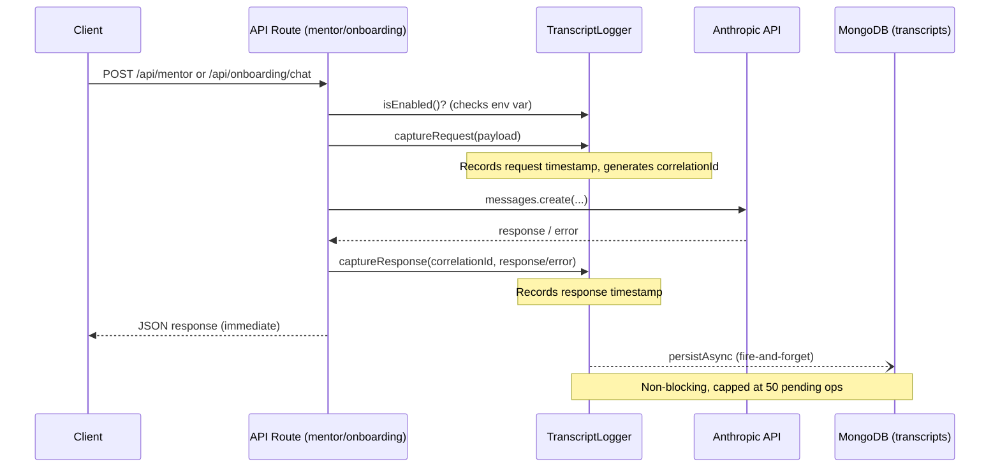

# Design Document: Session Transcript Logging

## Overview

Session Transcript Logging adds a non-blocking capture layer that records the full raw request/response data for every Anthropic API call made through the app's API routes. This gives the development team complete visibility into system prompts, user messages, model responses, token usage, and error conditions — data that the existing `messages` array on the Session model doesn't carry.

The system operates as a "fire-and-forget" sidecar to the existing API routes. It introduces no user-facing changes and is controlled by an environment flag so it can be disabled in production.

### Design Decisions

1. **Dedicated collection over embedded data** — Transcripts go into their own `transcripts` collection rather than being added to the `sessions` collection. This avoids bloating session documents (which are loaded for the sidebar) and allows independent querying/TTL management.

2. **Append-to-document model** — Each session gets one transcript document. Entries are appended as an array within that document using `$push`. This keeps related exchanges together and avoids per-message document overhead.

3. **Non-blocking with backpressure** — The logger fires persistence asynchronously and never blocks the response path. A simple in-memory counter caps pending operations at 50 to prevent unbounded memory growth under load.

4. **Per-request env check** — The feature flag is read from `process.env` on each request (not cached at startup) so it can be toggled without restarting the server.

5. **TTL via MongoDB native index** — Leverages MongoDB's `expireAfterSeconds` index for automatic cleanup, avoiding the need for a cron job or background worker.

## Architecture



### Component Placement

```
lib/
├── transcript/
│   ├── transcript-logger.ts      # Core logger service (capture + async persist)
│   ├── transcript.schema.ts      # Zod schemas for transcript types
│   └── types.ts                  # TypeScript types
├── db/
│   ├── models/
│   │   └── transcript.model.ts   # Mongoose model + TTL index
│   └── repositories/
│       └── transcript.repo.ts    # Data access layer (CRUD + queries)
```

## Components and Interfaces

### TranscriptLogger (Service)

The core service that API routes call. Stateless except for a pending-operations counter.

```typescript
interface TranscriptLogger {
  /** Check if logging is enabled for this request */
  isEnabled(): boolean;

  /** Capture request data, returns a correlationId */
  captureRequest(params: CaptureRequestParams): string;

  /** Capture response or error, triggers async persistence */
  captureResponse(correlationId: string, result: CaptureResponseParams): void;
}

interface CaptureRequestParams {
  userId: string;
  sessionId: string;
  sessionType: SessionType;
  routeIdentifier: 'onboarding_chat' | 'mentor';
  systemPrompt: string;
  messages: unknown[];
  model: string;
  maxTokens: number;
  metadata: TranscriptMetadata;
}

interface CaptureResponseParams {
  success: true;
  rawResponse: AnthropicRawResponse;
} | {
  success: false;
  errorMessage: string;
  httpStatusCode?: number;
  errorType?: string;
}

interface TranscriptMetadata {
  // Mentor session context
  sessionMode?: 'planning' | 'topic' | 'doubt' | 'evaluation';
  topic?: string | null;
  // Onboarding context
  onboardingFieldsCollected?: string[];
  // User profile snapshot
  profileSnapshot?: ProfileSnapshot;
}

interface ProfileSnapshot {
  goal: string;
  deadline: string;
  overall_level: string;
  daily_availability: string;
}
```

### TranscriptRepo (Repository)

Data access layer following the existing repository pattern (`SessionRepo`, `CoreProfileRepo`).

```typescript
interface TranscriptRepo {
  /** Create or append entries to a transcript document */
  upsertEntry(params: UpsertEntryParams): Promise<void>;

  /** Get full transcript by sessionId */
  getBySessionId(sessionId: string): Promise<TranscriptDocument | null>;

  /** List transcripts with filtering */
  list(params: ListParams): Promise<TranscriptDocument[]>;
}

interface UpsertEntryParams {
  userId: string;
  sessionId: string;
  sessionType: SessionType;
  entry: TranscriptEntry;
  profileSnapshot?: ProfileSnapshot;
}

interface ListParams {
  userId?: string;
  sessionType?: SessionType;
  startDate?: string;  // ISO-8601
  endDate?: string;    // ISO-8601
  limit?: number;      // 1-100, default 50
}
```

### Integration Points

The logger is invoked in two API routes:
- `app/api/mentor/route.ts` — wraps the `client.messages.create()` call
- `app/api/onboarding/chat/route.ts` — wraps the `anthropic.messages.create()` call

Integration is minimal: ~10 lines added to each route (check enabled, capture request, capture response).

## Data Models

### TranscriptEntry

A single request/response exchange:

```typescript
const TranscriptEntrySchema = z.object({
  correlationId: z.string().uuid(),
  routeIdentifier: z.enum(['onboarding_chat', 'mentor']),
  request: z.object({
    systemPrompt: z.string(),
    messages: z.array(z.unknown()),
    model: z.string(),
    maxTokens: z.number().int().positive(),
  }),
  response: z.union([
    z.object({
      success: z.literal(true),
      content: z.array(z.unknown()),  // Anthropic content blocks
      stopReason: z.string().nullable(),
      model: z.string(),
      usage: z.object({
        inputTokens: z.number().int().min(0),
        outputTokens: z.number().int().min(0),
      }),
    }),
    z.object({
      success: z.literal(false),
      errorMessage: z.string(),
      httpStatusCode: z.number().int().optional(),
      errorType: z.string().optional(),
    }),
  ]),
  requestTimestamp: z.string().datetime(),
  responseTimestamp: z.string().datetime(),
});
```

### TranscriptDocument

The top-level document stored in the `transcripts` collection:

```typescript
const TranscriptDocumentSchema = z.object({
  sessionId: z.string(),        // unique
  userId: z.string(),
  sessionType: z.enum(['onboarding', 'mentor']),
  metadata: z.object({
    sessionMode: z.enum(['planning', 'topic', 'doubt', 'evaluation']).optional(),
    topic: z.string().nullable().optional(),
    onboardingFieldsCollected: z.array(z.string()).optional(),
    profileSnapshot: z.object({
      goal: z.string(),
      deadline: z.string(),
      overall_level: z.string(),
      daily_availability: z.string(),
    }).optional(),
  }),
  entries: z.array(TranscriptEntrySchema),
  createdAt: z.string().datetime(),
});
```

### Mongoose Schema

```typescript
// Collection: 'transcripts'
// Indexes: userId (1), sessionId (1, unique), createdAt (1, TTL)
const TranscriptMongoSchema = new Schema({
  sessionId: { type: String, required: true, unique: true, index: true },
  userId:    { type: String, required: true, index: true },
  sessionType: { type: String, required: true, enum: ['onboarding', 'mentor'] },
  metadata: {
    sessionMode: { type: String, enum: ['planning', 'topic', 'doubt', 'evaluation'] },
    topic: { type: Schema.Types.Mixed },  // string | null
    onboardingFieldsCollected: [String],
    profileSnapshot: {
      goal: String,
      deadline: String,
      overall_level: String,
      daily_availability: String,
    },
  },
  entries: [{
    correlationId: { type: String, required: true },
    routeIdentifier: { type: String, required: true },
    request: { type: Schema.Types.Mixed, required: true },
    response: { type: Schema.Types.Mixed, required: true },
    requestTimestamp: { type: String, required: true },
    responseTimestamp: { type: String, required: true },
  }],
}, {
  timestamps: { createdAt: true, updatedAt: false },
  collection: 'transcripts',
});

// TTL index — MongoDB auto-deletes documents after expiry
const ttlDays = parseTTLDays(process.env.TRANSCRIPT_TTL_DAYS);
TranscriptMongoSchema.index({ createdAt: 1 }, { expireAfterSeconds: ttlDays * 86400 });
```

## Correctness Properties

*A property is a characteristic or behavior that should hold true across all valid executions of a system — essentially, a formal statement about what the system should do. Properties serve as the bridge between human-readable specifications and machine-verifiable correctness guarantees.*

### Property 1: Request capture completeness

*For any* valid API request with a system prompt, messages array, model name, max_tokens value, and route identifier, the resulting TranscriptEntry SHALL contain all of those fields with values identical to the input.

**Validates: Requirements 1.1, 3.4**

### Property 2: Response capture with correlation

*For any* Anthropic API response (containing content blocks, stop_reason, model, and usage), the logger SHALL record the full response and associate it with the request entry via a matching correlationId.

**Validates: Requirements 1.2**

### Property 3: Timestamp ordering invariant

*For any* TranscriptEntry, the responseTimestamp SHALL be a valid ISO-8601 string that is greater than or equal to the requestTimestamp, and both SHALL be valid ISO-8601 datetime strings.

**Validates: Requirements 1.3**

### Property 4: Error capture on failure

*For any* API error with a message string and optional HTTP status code, the logger SHALL record both the error message and status code (or error type) in the response payload of the corresponding TranscriptEntry.

**Validates: Requirements 1.4**

### Property 5: Document structure validation

*For any* persisted transcript document, it SHALL contain a non-empty userId, a non-empty sessionId, a createdAt timestamp, and a sessionType that is one of the valid enum values ('onboarding' or 'mentor').

**Validates: Requirements 2.2, 2.3**

### Property 6: Chronological entry ordering

*For any* transcript document containing multiple entries, the entries array SHALL be ordered by requestTimestamp in ascending (chronological) order.

**Validates: Requirements 2.4**

### Property 7: Append without duplication

*For any* sequence of persist operations targeting the same sessionId, the final document SHALL contain exactly the union of all entries (no duplicates, no losses), and the document count for that sessionId SHALL remain 1.

**Validates: Requirements 2.5**

### Property 8: Validation rejection for missing fields

*For any* persist operation where userId, sessionId, or sessionType is missing or empty, the operation SHALL be rejected with a validation error and the collection SHALL remain unchanged.

**Validates: Requirements 2.6**

### Property 9: Onboarding context capture

*For any* onboarding session transcript, the metadata SHALL contain exactly the subset of field names from {goal, deadline, current_level, daily_availability} that were collected at the time of the request.

**Validates: Requirements 3.3**

### Property 10: Profile snapshot fidelity

*For any* transcript created with a user profile, the stored profileSnapshot SHALL contain goal, deadline, overall_level, and daily_availability values identical to the source profile at creation time.

**Validates: Requirements 3.5**

### Property 11: Retrieval round-trip

*For any* transcript document that has been persisted, retrieving it by its sessionId SHALL return a document with all fields matching the original persisted data.

**Validates: Requirements 4.1**

### Property 12: Filter correctness

*For any* combination of filter parameters (userId, sessionType, startDate, endDate), the list query SHALL return only transcripts that match ALL specified filters, and SHALL NOT return any transcript that fails any active filter.

**Validates: Requirements 4.3**

### Property 13: List ordering and limit enforcement

*For any* list query result, the transcripts SHALL be ordered by createdAt descending, and the result count SHALL NOT exceed min(limit, 100) where limit defaults to 50.

**Validates: Requirements 4.4, 4.5**

### Property 14: Feature flag skip behavior

*For any* value of `ENABLE_TRANSCRIPT_LOGGING` that is not the exact case-sensitive string `"true"` (including undefined, "false", "TRUE", "1", "yes"), the logger SHALL perform zero persistence operations.

**Validates: Requirements 5.2**

### Property 15: Backpressure drop threshold

*For any* state where pending persistence operations exceed 50, new transcript entries SHALL be dropped (not queued), and for any state where pending operations are at or below 50, entries SHALL be accepted.

**Validates: Requirements 6.4**

### Property 16: TTL configuration parsing

*For any* value of `TRANSCRIPT_TTL_DAYS` that is a valid integer between 1 and 365, the TTL SHALL be set to that number of days. *For any* value that is non-integer, zero, negative, or > 365, the TTL SHALL fall back to 30 days.

**Validates: Requirements 7.2, 7.3**

## Error Handling

| Scenario | Behavior |
|----------|----------|
| Anthropic API returns error | Logger captures error message + status code in entry's response field |
| MongoDB write fails (network, timeout) | Logger logs error to console with sessionId; API response unaffected |
| Invalid input to logger (missing userId/sessionId) | Validation error logged; no write attempted |
| Pending operations > 50 | New entries dropped; warning logged to console |
| `TRANSCRIPT_TTL_DAYS` invalid | Default 30 days applied; warning logged |
| `ENABLE_TRANSCRIPT_LOGGING` not "true" | All logging skipped silently — no connections opened |
| Transcript document already exists for sessionId | New entry appended to existing array (upsert) |

### Error Logging Format

All logger errors use `console.error` with a consistent structure:
```
[TranscriptLogger] <error_type>: <message> | sessionId=<id>
```

## Testing Strategy

### Property-Based Tests (fast-check)

The project already has `fast-check` ^4.8.0 installed. Each correctness property above maps to a property-based test with minimum 100 iterations.

**Test file:** `lib/transcript/__tests__/transcript.property.test.ts`

Configuration:
- Library: `fast-check` (already in devDependencies)
- Runner: `vitest` (already configured)
- Iterations: 100+ per property
- Each test tagged: `// Feature: session-transcript-logging, Property N: <title>`

**Generators needed:**
- `arbitraryTranscriptEntry()` — random request/response pairs with valid timestamps
- `arbitraryTranscriptDocument()` — full documents with random entries
- `arbitraryFilterParams()` — random combinations of userId/sessionType/dates/limit
- `arbitraryCoreProfile()` — random profile snapshots
- `arbitraryEnvFlag()` — random non-"true" strings for feature flag testing

### Unit Tests (example-based)

**Test file:** `lib/transcript/__tests__/transcript.unit.test.ts`

| Test | Validates |
|------|-----------|
| Logger continues when persistence fails | Req 1.5, 6.2 |
| Returns null for non-existent sessionId | Req 4.2 |
| Returns empty set when startDate > endDate | Req 4.6 |
| Env flag checked per-request (not cached) | Req 5.3 |
| Logs confirmation after successful persistence | Req 5.4 |
| Response returns before persistence completes | Req 6.1 |

### Integration Tests

**Test file:** `lib/transcript/__tests__/transcript.integration.test.ts`

- Verify TTL index exists on the collection with correct `expireAfterSeconds`
- Verify unique index on `sessionId`
- Verify compound index on `userId` + `createdAt`
- End-to-end: call API route with mocked Anthropic, verify transcript is persisted

### Smoke Tests

- Mongoose model uses `transcripts` collection (Req 2.1)
- Indexes are defined on userId, sessionId, createdAt (Req 4.7)
- TTL index present with default 30-day expiry (Req 7.1)
