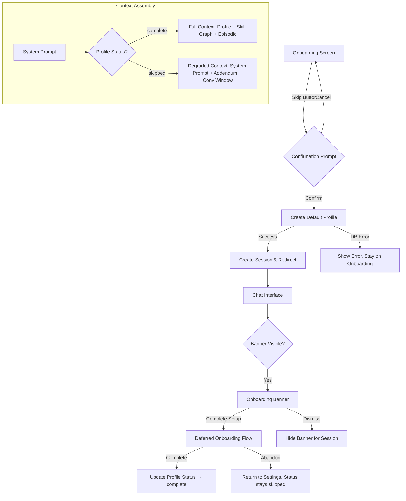

# Design Document: Skip Onboarding

## Overview

This feature adds the ability for users to bypass MentorMan's conversational onboarding flow and proceed directly to the mentor chat interface. The design introduces a skip mechanism within the existing onboarding screen, creates a minimal default profile for skipped users, adapts the LLM context assembly to work without full profile data, and provides pathways to complete onboarding later.

The system must handle three new states gracefully:
1. **Full skip** — user clicks "Skip" before providing any information
2. **Partial skip** — user provides some responses (e.g., a goal) before skipping
3. **Deferred completion** — user returns later to finish onboarding

Key design decisions:
- The skip flow reuses existing `CoreProfileRepo.upsert()` with a new `profile_status` field rather than creating a separate "incomplete profiles" collection
- The context assembler degrades gracefully by omitting missing layers rather than failing
- Banner dismissal uses `sessionStorage` (browser session scope) rather than a server-side flag, keeping the feature lightweight
- Partial responses are preserved by extracting already-collected fields from the onboarding conversation before discarding the session

## Architecture



The skip feature touches three layers:
- **UI Layer**: Skip button component, confirmation dialog, banner component, Settings "Complete Setup" section
- **Service Layer**: Profile creation with `profile_status`, context assembler addendum logic
- **Data Layer**: Schema update to CoreProfile (add `profile_status` field, make `deadline` nullable)

## Components and Interfaces

### Frontend Components

#### `SkipButton`
A text/outline-style button rendered in the onboarding top navigation bar, alongside the progress indicator.

```typescript
interface SkipButtonProps {
  onSkip: () => void;
  disabled?: boolean;
}
```

- Rendered inside the `.onb-top` container in the `Onboarding` component
- Uses `outline` variant styling from the existing button system
- Keyboard-focusable with `aria-label="Skip"`
- Enabled whenever the onboarding flow is active and not in a loading state

#### `SkipConfirmationDialog`
A modal overlay that prevents interaction with the onboarding below.

```typescript
interface SkipConfirmationDialogProps {
  open: boolean;
  onConfirm: () => void;
  onCancel: () => void;
  loading?: boolean;
}
```

- Uses a backdrop/overlay to block pointer events on the onboarding conversation
- Two actions: "Skip Setup" (confirm) and "Go Back" (cancel)
- Shows a loading state while the default profile is being created
- Traps keyboard focus while open

#### `OnboardingBanner`
A non-overlapping banner displayed above the chat message area.

```typescript
interface OnboardingBannerProps {
  onComplete: () => void;
  onDismiss: () => void;
}
```

- Message text (≤120 characters): "Complete your profile to get personalized study plans and skill tracking."
- "Complete Setup" link navigates to deferred onboarding
- Dismiss button hides banner for the browser session (stored in `sessionStorage`)
- Removed from DOM when `profile_status` is `"complete"`

#### `CompleteSetupSection`
A section on the Settings page visible only when `profile_status` is `"skipped"`.

```typescript
interface CompleteSetupSectionProps {
  onStartSetup: () => void;
}
```

### API Routes

#### `POST /api/onboarding/skip`
New route that handles the skip action.

```typescript
// Request body
interface SkipRequest {
  partialProfile?: {
    goal?: string;
    deadline?: string;
    daily_availability?: string;
    overall_level?: string;
  };
}

// Response
interface SkipResponse {
  ok: boolean;
  sessionId?: string;  // new session ID for redirect
  error?: string;
}
```

**Flow:**
1. Validate Clerk JWT via `requireUserId()`
2. Merge partial profile data with defaults
3. Create/upsert CoreProfile with `profile_status: "skipped"`
4. Create a new chat session for the user
5. Return session ID for client-side redirect

#### `GET /api/profile` (existing, extended)
Returns the profile including the new `profile_status` field. No breaking changes — the field is additive.

#### `PUT /api/profile` (existing, extended)
Accepts `profile_status` updates. Used when deferred onboarding completes.

### Service Layer Changes

#### Context Assembler — Degraded Mode
When `profile_status === "skipped"`:
- Core Profile injection: include only fields that have non-placeholder values
- Skill Graph: skip entirely (no nodes exist)
- Episodic Memory: skip entirely (no past sessions)
- System prompt: append a `skipped-onboarding` addendum

```typescript
const SKIPPED_ONBOARDING_ADDENDUM = `
IMPORTANT: This user has NOT completed onboarding. No specific goal, skill data, 
or study plan is available. You must:
- Keep all advice general and topic-focused
- Never reference specific deadlines, skill gaps, or personalized study plans
- Respond helpfully to whatever they ask
- If they ask about personalized features, suggest completing their profile setup
`;
```

## Data Models

### CoreProfile Schema Changes

```typescript
// Updated Zod schema
export const CoreProfileSchema = z.object({
  userId: z.string(),
  goal: z.string().min(1),
  deadline: z.string().nullable(),           // Now nullable for skipped users
  overall_level: z.string(),
  daily_availability: z.string(),
  email: z.string().default(''),
  profile_status: z.enum(['complete', 'skipped']).default('complete'),
});
```

### MongoDB Schema Changes

```typescript
// Updated Mongoose schema
const CoreProfileMongoSchema = new Schema<CoreProfileDocument>(
  {
    userId:             { type: String, required: true, unique: true, index: true },
    goal:               { type: String, required: true },
    deadline:           { type: String, default: null },  // nullable
    overall_level:      { type: String, required: true, default: 'beginner' },
    daily_availability: { type: String, required: true },
    email:              { type: String, default: '' },
    profile_status:     { type: String, enum: ['complete', 'skipped'], default: 'complete' },
  },
  { timestamps: true, collection: 'core_profiles' }
);
```

### Default Profile Values

| Field | Default (full skip) | Override (partial skip) |
|-------|-------------------|----------------------|
| `goal` | `"exploring"` | User-provided value |
| `deadline` | `null` | User-provided value |
| `overall_level` | `"beginner"` | `"beginner"` (always default) |
| `daily_availability` | `"1 hour"` | User-provided value |
| `profile_status` | `"skipped"` | `"skipped"` |

### Session Storage (Banner Dismissal)

```typescript
// Key: 'mentorman_banner_dismissed'
// Value: 'true'
// Storage: sessionStorage (cleared when all app tabs close)
```


## Correctness Properties

*A property is a characteristic or behavior that should hold true across all valid executions of a system — essentially, a formal statement about what the system should do. Properties serve as the bridge between human-readable specifications and machine-verifiable correctness guarantees.*

### Property 1: Skip button present across all onboarding phases

*For any* onboarding phase (Goal & Timeline, Current State, File Upload, Availability), the rendered onboarding screen SHALL contain an enabled, keyboard-focusable skip button with accessible name "Skip".

**Validates: Requirements 1.1, 1.4, 1.5**

### Property 2: Cancel skip preserves conversation state

*For any* conversation state (any number of messages 0–N in the thread and any text in the input field), opening the skip confirmation dialog and then cancelling SHALL result in the conversation thread, input field content, and scroll position being identical to the state before the dialog was opened.

**Validates: Requirements 2.5**

### Property 3: Skip creates correct data state

*For any* valid user ID, confirming the skip action SHALL result in a CoreProfile document with `profile_status` set to `"skipped"` AND zero Skill Graph documents for that user in the database.

**Validates: Requirements 3.1, 3.5**

### Property 4: Context assembly degrades gracefully for skipped profiles

*For any* CoreProfile with `profile_status === "skipped"` and *for any* subset of missing profile fields (goal, deadline, availability), the context assembler SHALL: (a) include the skipped-onboarding system prompt addendum, (b) omit skill graph and episodic memory layers entirely, (c) include the conversation window, and (d) succeed without throwing an error regardless of which fields are missing.

**Validates: Requirements 4.2, 4.3, 4.4, 4.5**

### Property 5: Deferred completion transitions status to "complete"

*For any* valid onboarding completion payload (goal, deadline, availability, overall_level), completing the deferred onboarding flow SHALL update `profile_status` from `"skipped"` to `"complete"` in the database.

**Validates: Requirements 5.3**

### Property 6: Abandoning deferred onboarding preserves skipped status

*For any* point during the deferred onboarding flow where the user navigates away without triggering the completion action, the `profile_status` SHALL remain `"skipped"` and no Skill Graph documents shall be created.

**Validates: Requirements 5.5**

### Property 7: Partial responses override defaults

*For any* combination of user-provided profile fields (goal, deadline, availability) collected before skipping, the resulting Default Profile SHALL contain the user-provided values for those fields and the placeholder defaults (`"exploring"`, `null`, `"1 hour"`) only for fields the user did NOT provide.

**Validates: Requirements 7.1, 7.3, 7.4, 7.5**

### Property 8: Deferred onboarding skips completed phases

*For any* Default Profile where a subset of fields already contain user-provided (non-placeholder) values, the deferred onboarding flow SHALL skip the phases corresponding to those fields and begin at the first phase whose field still contains a placeholder or null value.

**Validates: Requirements 7.2**

## Error Handling

| Scenario | Behavior | User Experience |
|----------|----------|-----------------|
| DB error during default profile creation | Return 500 from `/api/onboarding/skip`, do NOT redirect | Error message with retry button; user stays on onboarding screen |
| Session creation fails after profile save | Return error with `sessionId: undefined` | Error message: "Couldn't start your session — retry or go back to setup" with retry/return options |
| Network failure on skip request | Fetch throws, caught in frontend | Generic connection error, retry button, user stays on onboarding |
| Context assembly with fully empty profile | Assemble with system prompt + addendum + conversation only | User gets generic (non-personalized) responses — no visible error |
| Profile update fails during deferred completion | Return 500 from `/api/onboarding/complete` | Error message with retry, user stays on onboarding screen |
| sessionStorage unavailable (private browsing edge case) | Catch error, banner always shown (no persistence) | Minor UX degradation — banner reappears on refresh in private mode |

**Error handling principles:**
- Never redirect the user unless the data is persisted successfully
- Always provide a retry action for network/DB failures
- Degrade gracefully rather than error out — a skipped user should always be able to chat
- Log errors server-side for monitoring but keep user-facing messages simple

## Testing Strategy

### Unit Tests (Vitest + React Testing Library)

Focused on specific examples and edge cases identified in prework:
- Skip button rendering and styling (1.2, 1.3)
- Confirmation dialog behavior (2.1, 2.2, 2.6)
- Default profile values when no partial data exists (3.2, 3.3, 3.4)
- Settings page conditional rendering (5.1, 5.6)
- Banner content and structure (6.1–6.5)
- Error scenarios (2.4, 3.6)

### Property-Based Tests (fast-check + Vitest)

Each correctness property is implemented as a property-based test with minimum 100 iterations:

| Property | Test Target | Generator Strategy |
|----------|-------------|-------------------|
| 1: Skip button across phases | `Onboarding` component render | Generate random phase index (0–3) |
| 2: Cancel preserves state | `Onboarding` state management | Generate random message arrays + input strings |
| 3: Skip data state | `/api/onboarding/skip` handler | Generate random user IDs |
| 4: Context assembly degradation | Context assembler function | Generate random subsets of profile fields (2^3 combinations × random conversation histories) |
| 5: Deferred completion | `/api/onboarding/complete` handler | Generate random valid profile payloads |
| 6: Abandon preserves status | Profile status logic | Generate random abandon points (phases 1–4) |
| 7: Partial responses | Skip handler with partials | Generate all 2^3 subsets of {goal, deadline, availability} × random values |
| 8: Skip completed phases | Deferred onboarding routing | Generate random existing profile states |

**Configuration:**
- Library: `fast-check` (already installed in the project)
- Minimum iterations: 100 per property
- Each test tagged with: `Feature: skip-onboarding, Property {N}: {description}`

### Integration Tests

For requirements that involve external services or timing:
- 2.3: Redirect timing after successful skip (mock API, verify router.push called)
- 4.1: End-to-end chat with skipped profile (mock LLM, verify streaming works)
- 5.4: Redirect timing after deferred completion

### Test File Structure

```
test/
  skip-onboarding/
    skip-button.test.tsx          # Unit tests for skip button UI
    skip-confirmation.test.tsx    # Confirmation dialog unit tests
    skip-api.test.ts              # API route unit tests
    context-degradation.test.ts   # Context assembler property tests
    banner.test.tsx               # Banner component tests
    deferred-onboarding.test.tsx  # Deferred flow tests
    skip-onboarding.property.ts   # All property-based tests (Properties 1-8)
```
