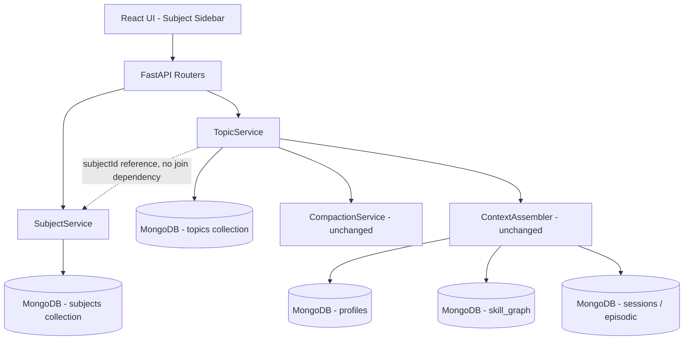
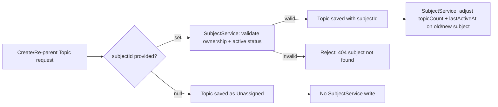
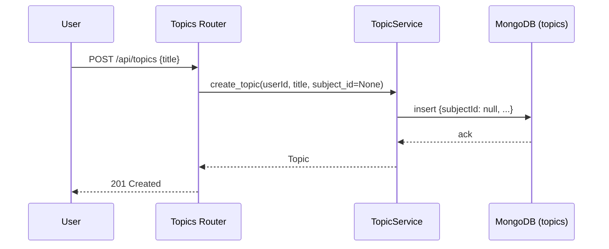
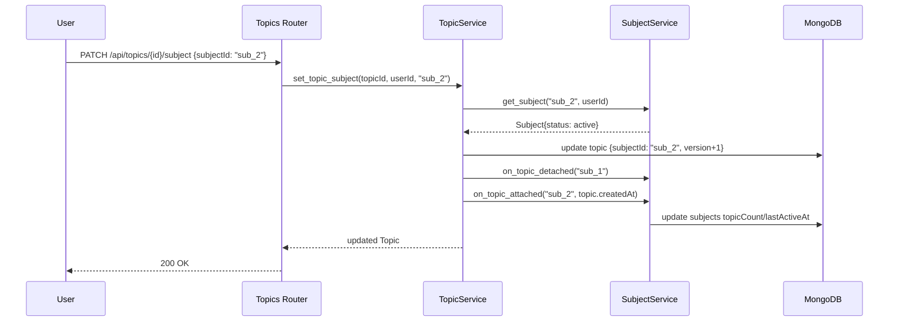

# Design Document: Subject Hierarchy

## Overview

This feature adds **Subject** as an optional organizational parent above **Topic**. A Subject is a lightweight, named grouping — it has no conversation content, no messages, and no independent memory scope. A Topic gains one new field, `subjectId: string | null`, which is mutable for the life of the topic (re-parenting is a first-class operation, not a one-time assignment). A topic with `subjectId: null` — "Unassigned" — is a fully supported terminal state, not a migration artifact awaiting cleanup.

This design deliberately keeps Subject decoupled from the memory architecture. L1 Core Profile, L2 Skill Graph, and L3 Episodic Memory continue to be scoped exactly as they are today (`userId` only, `(userId, topic)`, and `userId` with topic-biased ranking, respectively). No component in the `ContextAssembler`, `CompactionService`, or `SkillGraphService` needs to know that Subject exists.

## Architecture

### System-Level View



Subject sits entirely to the side of the existing memory-write/context-assembly pipeline. The only coupling to Topic is the `subjectId` field and the `topicCount`/`lastActiveAt` bookkeeping SubjectService performs in response to Topic lifecycle events.

### Topic ↔ Subject Association Flow



## Components and Interfaces

### Component 1: SubjectService (new)

**Purpose**: Manages Subject CRUD, listing, and the topicCount/lastActiveAt bookkeeping that keeps Subjects in sync with their Topics.

**Interface**:
```python
class SubjectService:
    async def create_subject(self, user_id: str, title: str) -> Subject: ...
    async def get_subject(self, subject_id: str, user_id: str) -> Subject: ...
    async def list_subjects(self, user_id: str) -> list[SubjectListItem]: ...
    async def rename_subject(self, subject_id: str, user_id: str, title: str) -> Subject: ...
    async def archive_subject(self, subject_id: str, user_id: str) -> None: ...
    async def on_topic_attached(self, subject_id: str, topic_created_at: datetime) -> None: ...
    async def on_topic_detached(self, subject_id: str) -> None: ...
```

**Responsibilities**:
- Create, rename, and archive subjects (with the same title validation as Topic: 1–100 chars trimmed)
- List active subjects for the sidebar, ordered by `lastActiveAt` descending
- Cascade archive to all topics referencing the subject
- Adjust `topicCount` and `lastActiveAt` when TopicService attaches/detaches a topic
- Enforce that only "active" subjects can receive new/re-parented topics

---

### Component 2: TopicService (extended)

**Purpose**: Existing service from `topic-conversations-compaction`, extended with subject association.

**Interface changes**:
```python
class TopicService:
    # existing methods unchanged...

    async def create_topic(self, user_id: str, title: str, subject_id: str | None = None) -> Topic: ...

    # New
    async def set_topic_subject(self, topic_id: str, user_id: str, subject_id: str | None) -> Topic: ...
```

**Responsibilities added**:
- Accept an optional `subject_id` at creation; validate via `SubjectService.get_subject` before persisting
- Implement `set_topic_subject` (re-parenting): validate the new subject (if not `null`), call `SubjectService.on_topic_detached` for the old subject (if any) and `on_topic_attached` for the new one (if any), then persist the topic's `subjectId` with a `version` bump using the existing optimistic-concurrency retry loop
- No changes to `appendMessage`, compaction, or any message-path logic — subject association is orthogonal to the conversation thread itself

---

### Component 3: ContextAssembler, CompactionService, SkillGraphService — unchanged

No interface or behavior changes. Included here only to make the non-interference explicit: none of these components accept or read `subjectId` anywhere in their call signatures or queries.

---

### Component 4: Subject_Sidebar (frontend, replaces flat Topic_Sidebar listing)

**Purpose**: Renders subjects as expandable groups with lazy-loaded topic lists, plus a trailing flat list of Unassigned topics.

**Behavior**:
- On mount, fetch `GET /api/subjects` (lightweight: id, title, topicCount, lastActiveAt) and `GET /api/topics?subjectId=null` (Unassigned topics) in parallel
- On expand, fetch `GET /api/subjects/{subjectId}/topics` and cache the result client-side until invalidated by a re-parent/create/archive action within that subject
- A "Move to Subject" action on each topic row (existing `TopicSidebar.tsx` row component, extended) opens a picker of active subjects plus an "Unassigned" option, calling `PATCH /api/topics/{topicId}/subject`
- "New Topic" remains available with no subject preselected; subject assignment is always a secondary, optional action, never a blocking step in the creation flow

## Sequence Diagrams

### Topic Created Without a Subject (Unassigned)



### Topic Re-parented to a Different Subject



## Data Models

### Subject Document (MongoDB)

```typescript
interface Subject {
  _id?: ObjectId;
  subjectId: string;       // UUID
  userId: string;
  title: string;            // 1-100 chars, trimmed
  status: 'active' | 'archived';
  createdAt: Date;
  lastActiveAt: Date;       // bumped when a topic under it is created/re-parented in/active
  topicCount: number;       // denormalized, non-archived topics referencing this subject
  version: number;          // optimistic concurrency, default 0
}
```

### Topic Document (extended)

```typescript
interface Topic {
  // ...all existing fields from topic-conversations-compaction unchanged...
  subjectId: string | null;   // NEW — nullable FK to Subject.subjectId
}
```

### SubjectListItem (sidebar display)

```typescript
interface SubjectListItem {
  subjectId: string;
  title: string;
  lastActiveAt: Date;
  topicCount: number;
}
```

## Error Handling

### Error Scenario 1: subjectId Provided at Topic Creation Does Not Resolve

Topic creation is rejected with a 404-equivalent error before any write occurs; no partial Topic document is created. Matches Requirement 2.3.

### Error Scenario 2: Re-parenting to an Archived Subject

`set_topic_subject` rejects the operation if the target subject's status is not "active" — an archived subject is a valid read target (for history) but not a valid attach target. Matches Requirement 7.3.

### Error Scenario 3: Concurrent Re-parent and Message Append on the Same Topic

Both operations use the existing `version`-based optimistic concurrency with up to 3 retries; whichever write loses the race refetches and retries, consistent with the concurrency handling already specified for Topic writes in `topic-conversations-compaction`.

### Error Scenario 4: Subject Archived While a Client Has It Expanded in the Sidebar

The sidebar's next fetch of `GET /api/subjects` simply omits the archived subject; the client removes the now-stale expanded group. No special-case error handling needed — this is the same pattern already used for archived Topics disappearing from the default Topic_Sidebar listing.

## Testing Strategy

### Unit Testing Approach
- `SubjectService`: title validation boundaries (0, 1, 100, 101 chars), archive cascade to topics, topicCount increment/decrement correctness across create/re-parent/archive.
- `TopicService.set_topic_subject`: null→set, set→different, set→null transitions; rejection when target subject is archived or not owned by the caller.

### Property-Based Testing Approach
- **Property: topicCount Invariant** — after any sequence of create/re-parent/archive operations, a subject's `topicCount` equals the count of its non-archived topics queried directly.
- **Property: No Orphaned References** — every topic's non-null `subjectId` resolves to a subject with the same `userId`, for any random sequence of operations.

### Integration Testing Approach
- End-to-end: create subject → create topic under it → re-parent to a new subject → verify old subject's topicCount decremented and new subject's incremented → archive new subject → verify topic status cascades to archived and topic disappears from default sidebar listing.
- Regression: run the full existing `topic-conversations-compaction` test suite unmodified against topics with and without a `subjectId` to confirm zero behavioral drift in compaction, context assembly, or skill graph writes.

## Performance Considerations

- `GET /api/subjects` returns only lightweight `SubjectListItem` projections (no topic content), matching the existing Topic_Sidebar projection pattern.
- Per-subject topic lists are lazy-loaded on expand, not eagerly fetched for all subjects on initial load, to bound sidebar initial-load cost as subject/topic counts grow.
- `topicCount` is denormalized on Subject specifically to avoid a `COUNT` aggregation query on every sidebar render.

## Security Considerations

- Every Subject query and write filters on the authenticated `userId`, identical to the existing Topic access-control model (Requirement 8).
- "Subject not found" and "subject belongs to another user" return identical responses to prevent enumeration, mirroring the existing Topic error-handling convention.

## Dependencies

- Builds directly on top of `topic-conversations-compaction` (Topic model, optimistic concurrency pattern, sidebar projection conventions). No dependency on `session-persistence` or the legacy sessions architecture.
- No new external dependencies (no new database, no new LLM call, no new embedding provider).

## Correctness Properties

### Property 1: Subject Title Validation
Generate random strings → verify acceptance iff trimmed length is between 1 and 100 characters inclusive. **Validates: Requirement 1.1, 1.2, 5.1**

### Property 2: topicCount Consistency
For any random sequence of topic create/re-parent/archive operations, a subject's stored `topicCount` always equals a live count of non-archived topics referencing it. **Validates: Requirement 7.1**

### Property 3: Unassigned Is Terminal, Not Transient
A topic created without a `subjectId`, or re-parented to `null`, remains queryable and fully functional (messages, compaction, skill updates) indistinguishably from a subject-attached topic. **Validates: Requirement 2.1, Requirement 9.1**

### Property 4: Memory Scoping Non-Interference
For any topic, regardless of its `subjectId` value or re-parenting history, the set of L1/L2/L3 records read and written by `ContextAssembler`, `CompactionService`, and `SkillGraphService` is identical to what it would be if `subjectId` did not exist. **Validates: Requirement 6.1, 6.2, 6.3, 6.4**

### Property 5: Archive Cascade Completeness
When a subject is archived, every topic that referenced it at the moment of archival transitions to `status: "archived"`, and no topic created or re-parented afterward can attach to it. **Validates: Requirement 5.2, Requirement 7.3**

### Property 6: Access Control Enforcement
For any subject or topic operation, a request authenticated as a different user than the resource owner receives a 403/404 response indistinguishable from a not-found response, and no data is returned or mutated. **Validates: Requirement 8.1, 8.2, 8.3**
