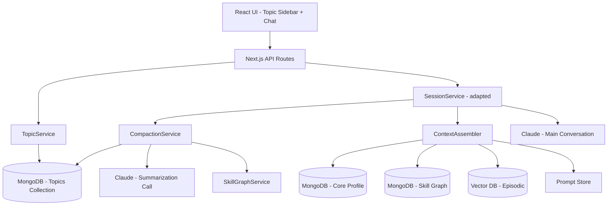
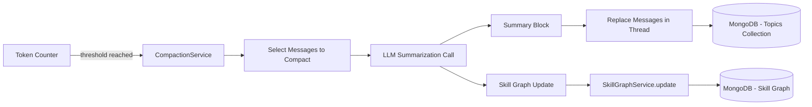
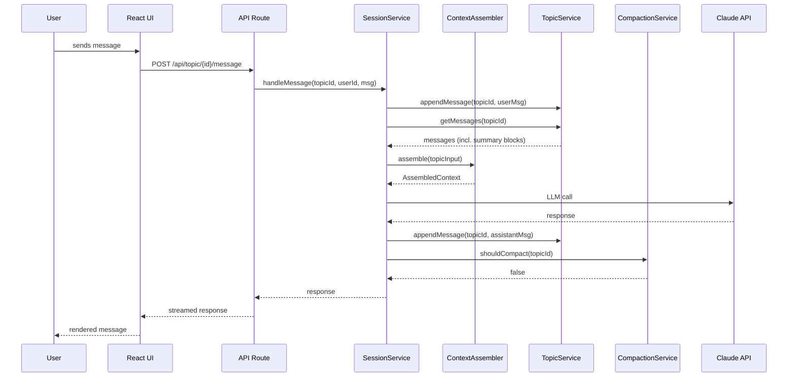
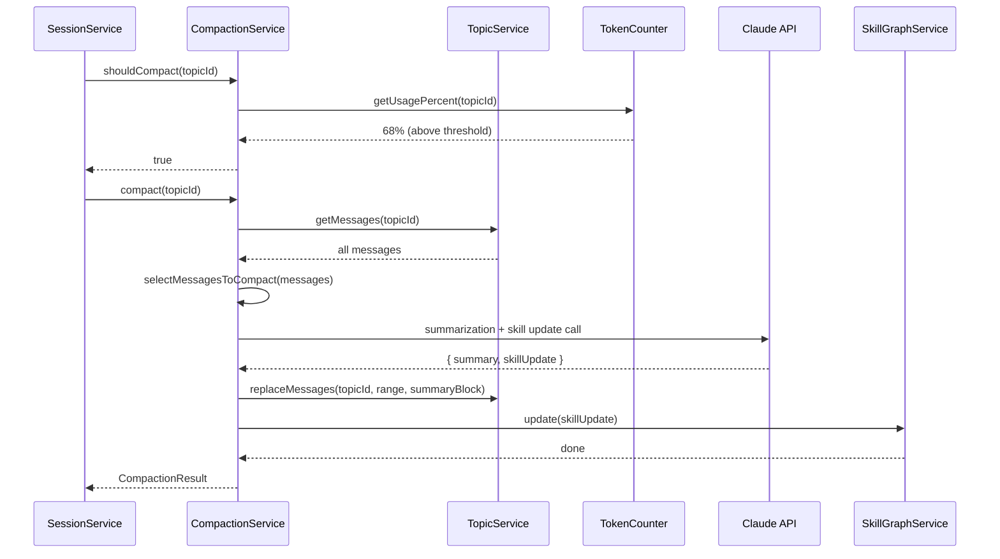
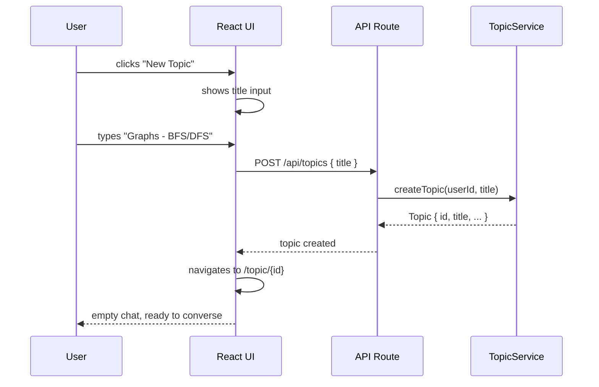

# Design Document: Topic-Based Conversations with Compaction

## Overview

This feature replaces the standalone session model with persistent topic threads. Instead of creating a new session each time, users create named topics (e.g., "Graphs - BFS/DFS") and return to the same thread across multiple days and sessions. The conversation within a topic thread grows over time, and a token-based compaction mechanism summarizes older messages in-place when the context window hits 50–70% capacity. Skill graph updates fire at each compaction point rather than only at session end, ensuring learning progress is captured incrementally.

The core architectural shift is: sessions become *continuations within a topic thread* rather than isolated units. The session lifecycle (start → conversation → end → summary) is replaced by a topic lifecycle (create → converse → compact → converse → archive). The context assembler, session service, and data layer all evolve to support this model.

This design preserves all existing structured data layers (L1 Core Profile, L2 Skill Graph, L3 Episodic RAG) unchanged. Compaction only ever touches the raw conversation messages within a topic thread — structured data is assembled separately by the ContextAssembler and is never subject to compaction.

## Architecture

### System-Level View



### Compaction Data Flow



## Components and Interfaces

### Component 1: TopicService

**Purpose**: Manages topic thread CRUD operations, topic listing, and topic state transitions.

**Interface**:
```typescript
interface TopicService {
  createTopic(userId: string, title: string): Promise<Topic>
  getTopic(topicId: string): Promise<Topic>
  listTopics(userId: string): Promise<TopicListItem[]>
  archiveTopic(topicId: string): Promise<void>
  getMessages(topicId: string, options?: { limit?: number, before?: string }): Promise<Message[]>
  appendMessage(topicId: string, message: Message): Promise<void>
  getTokenCount(topicId: string): Promise<number>
}
```

**Responsibilities**:
- Create and retrieve topic threads
- List topics for sidebar display (ordered by last activity)
- Manage topic lifecycle states (active, archived)
- Provide message-level access to topic threads
- Track cumulative token count for the active conversation window

---

### Component 2: CompactionService

**Purpose**: Monitors token usage within a topic thread and triggers compaction when thresholds are reached. Orchestrates the summarization LLM call and skill graph update at each compaction point.

**Interface**:
```typescript
interface CompactionService {
  shouldCompact(topicId: string): Promise<boolean>
  compact(topicId: string): Promise<CompactionResult>
  getCompactionHistory(topicId: string): Promise<CompactionEvent[]>
}

interface CompactionResult {
  summaryBlock: SummaryBlock
  skillUpdate: SkillUpdate | null
  messagesCompacted: number
  tokensReclaimed: number
}
```

**Responsibilities**:
- Evaluate whether the conversation window has crossed the compaction threshold (50–70% of context window capacity)
- Select which messages to compact (oldest messages first, up to the target reclaim amount)
- Call Claude with a summarization prompt to produce a narrative summary
- Extract skill graph updates from the same summarization call
- Replace compacted messages with the summary block in the topic thread
- Write skill graph updates via SkillGraphService
- Maintain a compaction history log for observability

---

### Component 3: SessionService (adapted)

**Purpose**: Continues to handle per-turn LLM calls and mode detection. Now operates within the context of a topic thread instead of a standalone session.

**Interface changes**:
```typescript
interface SessionService {
  // Changed: sessionId → topicId
  handleMessage(topicId: string, userId: string, message: string): Promise<LLMResponse>
  
  // New: check compaction after each turn
  postTurnHook(topicId: string): Promise<void>
}
```

**Responsibilities**:
- Detects mode from conversation context (unchanged logic)
- Assembles context via ContextAssembler (unchanged)
- After each turn, calls CompactionService.shouldCompact() and triggers compaction if needed
- Manages the conversation flow within a topic thread

---

### Component 4: ContextAssembler (unchanged interface, adapted internals)

**Purpose**: Assembles the full LLM context per call. Now reads from topic thread messages (which may include summary blocks from prior compactions) instead of a flat session transcript.

**Interface** (unchanged):
```typescript
interface ContextAssembler {
  assemble(input: TopicInput): Promise<AssembledContext>
}

type TopicInput = {
  userId: string
  topicId: string          // was: sessionId
  currentTopic: string
  conversationWindow: (Message | SummaryBlock)[]  // may include summaries
}
```

**Responsibilities**:
- Inject L1 Core Profile (always, unchanged)
- Inject L2 Skill Graph nodes (by topic, unchanged)
- Inject L3 Episodic RAG (semantic retrieval, unchanged)
- Pass through conversation window which now includes both raw messages and summary blocks
- Zod-validate the assembled context (unchanged)

---

### Component 5: TokenCounter

**Purpose**: Utility that estimates token counts for messages and the overall conversation window. Used by CompactionService to determine when compaction is needed.

**Interface**:
```typescript
interface TokenCounter {
  countMessage(message: Message): number
  countWindow(messages: (Message | SummaryBlock)[]): number
  getCapacity(): number              // total context window budget for conversation
  getUsagePercent(topicId: string): Promise<number>
}
```

**Responsibilities**:
- Estimate token counts using tiktoken or Claude's tokenizer
- Calculate the conversation window's share of the total context budget
- Account for the fixed overhead (system prompt + L1 + L2 + L3 + goal anchor) when calculating available capacity
- Expose usage percentage for compaction threshold checks

## Sequence Diagrams

### Normal Turn (No Compaction Needed)



### Turn That Triggers Compaction



### Topic Creation



## Data Models

### Topic Document (MongoDB)

```typescript
interface Topic {
  _id: ObjectId
  topicId: string                    // UUID
  userId: string
  title: string                      // user-provided, e.g. "Graphs - BFS/DFS"
  status: 'active' | 'archived'
  mode: string | null                // auto-detected, same as before
  createdAt: Date
  lastActiveAt: Date                 // updated on every message
  messages: (Message | SummaryBlock)[]
  compactionCount: number            // how many times compaction has run
  metadata: {
    totalMessageCount: number        // includes compacted messages (for stats)
    currentTokenEstimate: number     // cached, updated on append/compact
  }
}
```

### Message (within Topic)

```typescript
interface Message {
  type: 'message'
  id: string                         // UUID
  role: 'user' | 'assistant'
  content: string
  timestamp: Date
  tokenCount: number                 // estimated at write time
}
```

### SummaryBlock (replaces compacted messages)

```typescript
interface SummaryBlock {
  type: 'summary'
  id: string                         // UUID
  summary: string                    // narrative summary of compacted messages
  compactedMessageIds: string[]      // IDs of messages that were replaced
  compactedRange: {
    from: Date                       // timestamp of first compacted message
    to: Date                         // timestamp of last compacted message
  }
  messageCount: number               // how many messages were compacted
  tokenCount: number                 // token count of the summary itself
  createdAt: Date                    // when compaction occurred
  compactionEventId: string          // links to CompactionEvent
}
```

### CompactionEvent (audit log)

```typescript
interface CompactionEvent {
  _id: ObjectId
  eventId: string
  topicId: string
  userId: string
  timestamp: Date
  messagesCompacted: number
  tokensBeforeCompaction: number
  tokensAfterCompaction: number
  tokensReclaimed: number
  skillUpdateGenerated: boolean
  skillUpdate: SkillUpdate | null
  summaryBlockId: string
}
```

### TopicListItem (sidebar display)

```typescript
interface TopicListItem {
  topicId: string
  title: string
  status: 'active' | 'archived'
  lastActiveAt: Date
  mode: string | null
  messagePreview: string             // last message snippet for sidebar
}
```

**Validation Rules**:
- `title` must be 1–100 characters, non-empty after trim
- `status` transitions: active → archived (one-way for now)
- `messages` array ordering is strictly chronological
- `SummaryBlock` can only appear where its `compactedRange` would place it chronologically
- `compactedMessageIds` must reference messages that previously existed in the thread
- `currentTokenEstimate` must be recalculated on every append and compact operation

## Error Handling

### Error Scenario 1: Compaction LLM Call Fails

**Condition**: Claude returns an error or malformed response during the summarization call.
**Response**: Log the failure, skip compaction for this turn, retry on the next turn that crosses the threshold. Never lose messages — compaction is only applied after a successful summary is generated.
**Recovery**: Exponential backoff on retries. If compaction fails 3 consecutive times, alert the user that the thread is getting long and suggest starting a new topic.

### Error Scenario 2: Token Estimate Drift

**Condition**: Cached `currentTokenEstimate` diverges from actual token count (e.g., after a failed partial write).
**Response**: On each `shouldCompact` call, if the cached estimate seems stale (last updated > 10 messages ago), recalculate from scratch.
**Recovery**: Full recount of the messages array. This is O(n) but only triggered on suspected drift, not every turn.

### Error Scenario 3: Concurrent Access to Same Topic

**Condition**: User opens the same topic in multiple tabs or devices.
**Response**: Use MongoDB's optimistic concurrency (version field). If a write conflicts, refetch and retry.
**Recovery**: The UI shows the latest state on refetch. No data loss — append operations are idempotent with message IDs.

### Error Scenario 4: Skill Graph Update Fails at Compaction

**Condition**: CompactionService generates a summary but the skill graph write fails.
**Response**: The summary block is still written (messages are still compacted — the summary is the critical output). Skill update is queued for retry.
**Recovery**: A retry queue processes failed skill updates. The compaction event log records `skillUpdateGenerated: true` with a pending status.

### Error Scenario 5: Topic Thread Becomes Very Large (Pathological Case)

**Condition**: User never triggers compaction threshold in a single sitting but accumulates messages over many short visits.
**Response**: On topic load, if `currentTokenEstimate` exceeds 40% of capacity before any new message, trigger pre-emptive compaction.
**Recovery**: This ensures the thread is always in a usable state when the user returns.

## Testing Strategy

### Unit Testing Approach

- **TokenCounter**: Test against known Claude tokenizer outputs. Verify accuracy within 5% for typical message lengths.
- **CompactionService.selectMessagesToCompact**: Test message selection logic — oldest first, respects message boundaries (never splits a user/assistant pair), stops when target token reclamation is met.
- **TopicService CRUD**: Standard repository tests for create, read, update, archive.
- **SummaryBlock placement**: Verify summary blocks maintain chronological ordering after insertion.

### Property-Based Testing Approach

**Property Test Library**: fast-check

See the **Correctness Properties** section below for the full set of formally specified properties with requirement traceability.

### Integration Testing Approach

- **Full compaction cycle**: Send enough messages to trigger compaction, verify summary block appears and skill graph is updated.
- **Multi-compaction topic**: Simulate a long-lived topic with 3–4 compaction events, verify the thread remains coherent and context assembly works correctly with multiple summary blocks interspersed.
- **Context assembly with summary blocks**: Verify the ContextAssembler correctly includes summary blocks in the conversation window sent to Claude.

## Performance Considerations

- **Token counting**: Use a fast tokenizer (tiktoken) rather than making API calls for estimation. Cache counts at write time to avoid recalculation.
- **Compaction timing**: Run compaction asynchronously after the main response is streamed to the user. The user sees their response immediately; compaction happens in the background before the next turn.
- **MongoDB document size**: A topic thread with many messages could grow large. Once a topic accumulates more than ~500 messages (after compaction), consider moving older summary blocks to a separate collection and loading them lazily.
- **Sidebar listing**: Use a projection query that only fetches `topicId`, `title`, `status`, `lastActiveAt`, and a truncated last message — never the full messages array for listing.

## Security Considerations

- **Topic access control**: Topics are scoped to `userId`. All API routes validate that the authenticated user owns the topic before any read/write.
- **Compaction audit trail**: CompactionEvents provide a full audit log of what was compacted and when. This supports debugging and potential future "undo compaction" features.
- **No PII in compaction logs**: Summary blocks should not introduce PII not already present in the conversation. The summarization prompt explicitly instructs the LLM to summarize learning content, not personal details.

## Dependencies

- **Existing services**: SessionService (adapted), ContextAssembler (minor input type change), SkillGraphService (unchanged, called at compaction points)
- **MongoDB**: New `topics` collection, new `compaction_events` collection
- **Claude API**: One additional LLM call per compaction event (summarization prompt)
- **tiktoken**: For fast client-side token estimation (already available in the Node.js ecosystem)
- **No new external services**: This feature operates entirely within the existing infrastructure boundary


## Correctness Properties

*A property is a characteristic or behavior that should hold true across all valid executions of a system — essentially, a formal statement about what the system should do. Properties serve as the bridge between human-readable specifications and machine-verifiable correctness guarantees.*

### Property 1: Topic Title Validation

*For any* input string, the TopicService SHALL accept the string as a valid title if and only if the trimmed string length is between 1 and 100 characters (inclusive).

**Validates: Requirement 1.4**

### Property 2: Topic Listing Correctness

*For any* set of topics belonging to a user, the sidebar listing SHALL contain only topics with status "active", and those topics SHALL be ordered by lastActiveAt in descending order.

**Validates: Requirements 2.1, 2.3, 3.3**

### Property 3: Archive Data Preservation

*For any* active topic, after archiving, the topic's status SHALL be "archived" and all messages, summary blocks, and metadata SHALL remain unchanged and queryable.

**Validates: Requirements 3.1, 3.4**

### Property 4: Chronological Ordering Invariant

*For any* topic thread and any sequence of append and compaction operations, the resulting messages array (including both raw messages and SummaryBlocks) SHALL maintain strict chronological ordering, where each SummaryBlock's position corresponds to its compactedRange timestamps.

**Validates: Requirements 4.1, 7.5, 13.1, 13.2**

### Property 5: Message Pair Integrity During Compaction Selection

*For any* messages array, the CompactionService's message selection SHALL choose the oldest messages first, and SHALL never include a user message without its immediately following assistant response (or vice versa).

**Validates: Requirements 7.1, 7.2**

### Property 6: Token Arithmetic Correctness

*For any* total context capacity and fixed overhead values, the available conversation capacity SHALL equal (total - overhead), and the usage percentage SHALL equal (current tokens / available capacity × 100).

**Validates: Requirements 5.2, 5.3**

### Property 7: Compaction Threshold Triggering

*For any* topic with a given token usage and configured threshold, shouldCompact SHALL return true if and only if the usage percentage exceeds the Compaction_Threshold (default 60%), or upon topic load when the usage exceeds 40%.

**Validates: Requirements 6.1, 6.2, 6.3**

### Property 8: Message Conservation (No Loss)

*For any* topic with one or more compaction events, the union of all compactedMessageIds across all SummaryBlocks plus the IDs of all remaining raw messages SHALL equal the complete set of all message IDs ever appended to the topic.

**Validates: Requirement 13.3**

### Property 9: Compaction Safety on Failure

*For any* compaction attempt that fails (LLM error, timeout, malformed response), the topic's messages array SHALL remain completely unchanged — no messages removed, no SummaryBlock inserted.

**Validates: Requirements 10.1, 10.3**

### Property 10: Compaction Reduces Token Count

*For any* successful compaction, the topic's currentTokenEstimate after compaction SHALL be strictly less than the currentTokenEstimate before compaction, and tokensReclaimed SHALL equal (tokensBefore - tokensAfter).

**Validates: Requirement 7.6**

### Property 11: Migration Data Preservation

*For any* existing session, after migration to a topic, the topic SHALL contain all messages from the original session in the same order with the same timestamps, the status SHALL be "active", and lastActiveAt SHALL equal the session's last message timestamp.

**Validates: Requirements 12.2, 12.3**

### Property 12: Migration Idempotency

*For any* set of existing sessions, running the migration process multiple times SHALL produce the same set of topics as running it once — no duplicate topics are created.

**Validates: Requirement 12.4**

### Property 13: Access Control Enforcement

*For any* topic operation and any userId, the operation SHALL succeed only if the userId matches the topic's owning userId; all other requests SHALL be rejected.

**Validates: Requirements 15.1, 15.2**
