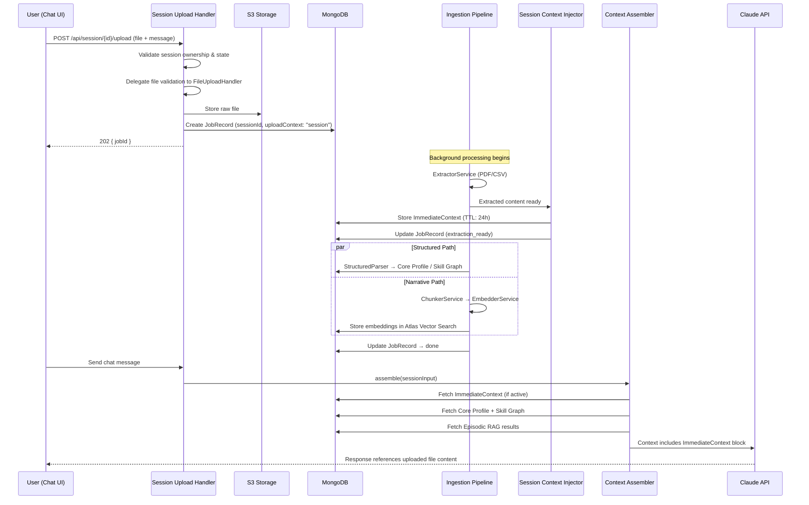

# Design Document: Chat File Upload

## Overview

This design extends MentorMan's file upload capability from onboarding-only to active chat sessions. The core challenge is providing immediate conversational context from uploaded files while the full ingestion pipeline (extraction → chunking → embedding) runs asynchronously in the background.

The architecture introduces a **dual-path context strategy**: an ephemeral `ImmediateContext` document provides fast access to extracted content (available within seconds), while the existing ingestion pipeline stores permanent embeddings for long-term retrieval. The `ContextAssembler` is extended to include `ImmediateContext` blocks in LLM calls, bridging the gap between upload and full ingestion completion.

Key design decisions:
- **Reuse over duplication**: The existing `IngestionPipeline`, `FileUploadHandler`, `ExtractorService`, `ChunkerService`, and `EmbedderService` are reused with metadata extensions — no new extraction or embedding logic.
- **Session-scoped ephemeral context**: `ImmediateContext` documents are TTL-indexed (24h) and session-bound. They serve as a temporary bridge until embeddings are available via normal RAG.
- **Non-blocking UX**: File processing never blocks the chat. Users can continue messaging while ingestion proceeds. The UI polls for status updates independently.
- **Single concurrent upload per session**: Simplifies state management and avoids context assembly race conditions.

## Architecture



### System Boundaries

| Layer | Responsibilities |
|---|---|
| **UI Layer** | File selection, validation (client-side), upload progress, status polling, Upload_Message rendering |
| **Session Upload Handler** | Session validation, file validation delegation, JobRecord creation, upload enqueueing |
| **Session Context Injector** | ImmediateContext creation from extracted content, token truncation, CSV summarization |
| **Context Assembler** (extended) | Include ImmediateContext in LLM calls, manage priority/budget, deactivate on ingestion completion |
| **Ingestion Pipeline** (reused) | Extraction, routing, structured parsing, chunking, embedding — with session metadata tags |

## Components and Interfaces

### 1. Chat Upload UI Component (`ChatUploadButton` + `UploadMessage`)

**Location**: `mentorman-app/app/components/mentorman/chat/`

```typescript
// ChatUploadButton props
interface ChatUploadButtonProps {
  sessionId: string
  disabled: boolean           // true while upload in progress
  onFileSelected: (file: File) => void
  onFileRemoved: () => void
}

// UploadMessage — rendered in conversation timeline
interface UploadMessageProps {
  jobId: string
  filename: string
  fileType: 'resume' | 'leetcode'
  status: UploadStatus
  summary?: string            // extraction summary (max 80 chars)
  error?: string
  onRetry?: () => void
}

type UploadStatus =
  | 'uploading'
  | 'pending'
  | 'processing'
  | 'ready'         // ImmediateContext available
  | 'done'          // full ingestion complete
  | 'partial'
  | 'failed'
  | 'timeout'
  | 'connection_lost'
```

**Behavior**:
- File picker filtered to `.pdf`, `.csv`
- Client-side validation: type check + 10 MB size limit
- Preview chip shows truncated filename (30 chars) + formatted size
- Single file per message; attachment button disabled during active upload
- Polling: 3s interval for initial status, 2s after jobId received, stops at terminal state or 5-min timeout

### 2. Session Upload Handler

**Location**: `mentorman-app/app/api/session/[sessionId]/upload/route.ts`

```typescript
// POST /api/session/{sessionId}/upload
interface SessionUploadRequest {
  file: File                              // multipart form data
  accompanyingMessage?: string            // max 2000 chars
}

interface SessionUploadResponse {
  jobId: string
}

// Extended JobRecord fields for session uploads
interface SessionJobRecord extends JobRecord {
  sessionId: string
  uploadContext: 'session'
  accompanyingMessage: string             // empty string if not provided
}
```

**Validation sequence**:
1. Authenticate via Clerk JWT
2. Verify session exists and belongs to user (403 if not)
3. Verify session is active (400 if ended)
4. Check no other upload is `pending`/`processing` for this session (409 if concurrent)
5. Delegate to `FileUploadHandler` for type/size validation (400 on failure)
6. Create `JobRecord` with session metadata
7. Return 202 with `jobId`

### 3. Session Context Injector

**Location**: `mentorman-app/lib/ingestion/session-context-injector.ts`

```typescript
interface ImmediateContext {
  _id: string
  sessionId: string
  userId: string
  jobId: string
  filename: string
  fileType: 'resume' | 'leetcode'
  content: string                         // extracted text or CSV summary
  tokenCount: number                      // measured by tiktoken
  accompanyingMessage: string
  active: boolean                         // false when full ingestion completes
  createdAt: Date                         // TTL index: expires after 24h
  updatedAt: Date
}

interface SessionContextInjector {
  /**
   * Called after extraction completes for a session-uploaded file.
   * Stores ImmediateContext within 5 seconds of extraction completion.
   */
  createImmediateContext(params: {
    sessionId: string
    userId: string
    jobId: string
    filename: string
    fileType: 'resume' | 'leetcode'
    extractedContent: string | LeetCodeTopicStats[]
  }): Promise<void>

  /**
   * Marks ImmediateContext as inactive when full ingestion completes.
   */
  deactivateImmediateContext(jobId: string): Promise<void>
}
```

**Token truncation logic**:
- Uses the same tokenizer as `ContextAssembler` (tiktoken, `cl100k_base`)
- If extracted content exceeds 4000 tokens, truncate at sentence boundaries
- Sentence boundary detection: split on `.`, `!`, `?` followed by whitespace or end of string
- No partial sentences included

**CSV summarization**:
- Converts `LeetCodeTopicStats[]` into human-readable summary:
  ```
  LeetCode Summary:
  - Arrays: 12 easy, 5 medium, 1 hard (18 total)
  - Graphs: 4 easy, 2 medium, 0 hard (6 total)
  ...
  ```

### 4. Context Assembler Extension

**Location**: `mentorman-app/lib/context-assembler/assemblers/` (all assembler implementations)

```typescript
// Extended AssembledContext (backward-compatible addition)
interface AssembledContext {
  // ... existing fields unchanged ...
  immediateContextBlocks: ImmediateContextBlock[]  // NEW
}

interface ImmediateContextBlock {
  filename: string
  uploadTimestamp: string
  content: string
  accompanyingMessage: string
}
```

**Assembly rules**:
1. Query `ImmediateContext` collection for `{ sessionId, active: true }`
2. Order by `createdAt` ascending (oldest first)
3. Insert between Skill Graph nodes and Episodic RAG results
4. Label each block: `[File: {filename}, uploaded {relative time}]`
5. If combined context exceeds token budget: drop ImmediateContext blocks oldest-first (Core Profile and Skill Graph always take priority)
6. Include system instruction listing active uploaded files when any ImmediateContext is present
7. When `active` becomes `false` (ingestion done or TTL expired), exclude from assembly

### 5. Ingestion Pipeline Extensions

**No new services** — only metadata additions to existing components.

```python
# Extended JobRecord fields (ingestion-pipeline/app/models/schemas.py)
class JobRecord(BaseModel):
    # ... existing fields ...
    session_id: Optional[str] = None          # NEW: present for session uploads
    upload_context: Optional[str] = None      # NEW: "session" or None (onboarding)
    accompanying_message: Optional[str] = None # NEW: user text with upload

# Extended ChunkMetadata
class ChunkMetadata(BaseModel):
    # ... existing fields ...
    upload_context: Optional[str] = None      # NEW: "session" tag
```

**Re-ingestion behavior for session uploads**:
- Same source category as prior **onboarding** upload: delete old onboarding chunks/facts, store new session data. Preserves other session-upload data.
- Same source category as prior **session** upload: replace prior session-upload data for that category. Preserves onboarding data and other category session data.

### 6. Job Status Endpoint Extension

**Location**: `mentorman-app/app/api/session/[sessionId]/upload/[jobId]/status/route.ts`

```typescript
// GET /api/session/{sessionId}/upload/{jobId}/status
interface JobStatusResponse {
  jobId: string
  status: IngestionStatus
  extractionReady: boolean          // true when ImmediateContext is stored
  summary?: string                  // e.g. "Resume: 3 sections extracted"
  error?: string
}
```

## Data Models

### ImmediateContext Collection (MongoDB)

```typescript
// Collection: immediate_contexts
// TTL Index: createdAt, expireAfterSeconds: 86400 (24 hours)
{
  _id: ObjectId,
  sessionId: string,              // indexed
  userId: string,                 // indexed
  jobId: string,                  // unique
  filename: string,
  fileType: "resume" | "leetcode",
  content: string,                // truncated to 4000 tokens max
  tokenCount: number,
  accompanyingMessage: string,
  active: boolean,                // indexed (compound with sessionId)
  createdAt: Date,                // TTL index
  updatedAt: Date
}

// Indexes:
// { sessionId: 1, active: 1 }  — used by ContextAssembler on every LLM call
// { jobId: 1 }                 — used by deactivation
// { createdAt: 1 }             — TTL index (24h expiry)
```

### Extended JobRecord (for session uploads)

```typescript
// Collection: ingestion_jobs (existing, extended)
{
  // ... all existing fields ...
  sessionId: string | null,           // NEW: present for session uploads
  uploadContext: "session" | null,    // NEW: distinguishes from onboarding
  accompanyingMessage: string | null, // NEW: user text (max 2000 chars)
  extractionReady: boolean            // NEW: true when ImmediateContext stored
}
```

### Extended ChunkMetadata (Atlas Vector Search)

```typescript
// Chunks stored with additional metadata for session uploads
{
  // ... existing fields (userId, source, section, chunkIndex, topic) ...
  sessionId: string,                  // NEW
  upload_context: "session"           // NEW: enables filtering session vs onboarding chunks
}
```

## Correctness Properties

*A property is a characteristic or behavior that should hold true across all valid executions of a system — essentially, a formal statement about what the system should do. Properties serve as the bridge between human-readable specifications and machine-verifiable correctness guarantees.*

### Property 1: File validation accepts only valid type and size combinations

*For any* file, the client-side validator SHALL accept the file if and only if its extension is `.pdf` or `.csv` AND its size is ≤ 10 MB (10,485,760 bytes). All other combinations SHALL be rejected with the appropriate error message (type error for wrong extension, size error for oversized files).

**Validates: Requirements 1.7, 1.8**

### Property 2: Filename truncation preserves short names and truncates long ones

*For any* filename string, the display function SHALL return the original string if its length is ≤ 30 characters, or the first 27 characters followed by "..." if longer than 30 characters. The output length SHALL never exceed 30 characters.

**Validates: Requirements 1.3**

### Property 3: File size formatting uses correct unit thresholds

*For any* file size in bytes, the formatting function SHALL display the value in KB (no decimal) for sizes under 1 MB (1,048,576 bytes), or in MB with exactly one decimal place for sizes ≥ 1 MB. The formatted string SHALL always be a valid human-readable size representation.

**Validates: Requirements 1.3**

### Property 4: Accompanying message truncation at 2000 characters

*For any* input string, the accompanyingMessage stored in the JobRecord SHALL be identical to the input if its length is ≤ 2000 characters, or SHALL be the first 2000 characters of the input if longer. The stored value SHALL never exceed 2000 characters.

**Validates: Requirements 2.5**

### Property 5: Session metadata tagging on all ingestion artifacts

*For any* session-uploaded file that is processed through the ingestion pipeline, every generated artifact (JobRecord, chunks, embeddings) SHALL carry `source_context: "session"` and the correct `sessionId` in its metadata.

**Validates: Requirements 2.7, 5.4**

### Property 6: Token truncation preserves sentence boundaries

*For any* extracted text content, if the content exceeds 4000 tokens (measured by the cl100k_base tokenizer), the truncated output SHALL: (a) contain at most 4000 tokens, (b) end at a sentence boundary (terminating with `.`, `!`, or `?`), and (c) never contain a partial sentence. If the content is ≤ 4000 tokens, it SHALL be returned unchanged.

**Validates: Requirements 3.5**

### Property 7: CSV summarization includes all topics with correct counts

*For any* valid array of LeetCodeTopicStats, the generated summary string SHALL contain every topic name present in the input, and for each topic, the easy/medium/hard counts and total SHALL match the input values. No topics from the input SHALL be omitted from the summary.

**Validates: Requirements 3.6**

### Property 8: ImmediateContext assembly ordering and labeling

*For any* session with active ImmediateContext documents, the assembled LLM context SHALL: (a) place ImmediateContext blocks after Skill Graph nodes and before Episodic RAG results, (b) label each block with its source filename and upload timestamp, and (c) order multiple ImmediateContext blocks by upload timestamp ascending (oldest first).

**Validates: Requirements 4.1, 4.2, 4.3**

### Property 9: Token budget priority drops ImmediateContext before core context

*For any* context assembly where the combined token count exceeds the configured budget, the assembler SHALL: (a) never drop Core Profile or Skill Graph nodes, (b) drop ImmediateContext blocks starting from the oldest, and (c) ensure the final assembled context fits within the token budget.

**Validates: Requirements 4.4**

### Property 10: ImmediateContext lifecycle governs system instruction inclusion

*For any* session, the mid-session upload system instruction SHALL be present in the assembled context if and only if the session has at least one ImmediateContext document with `active: true`. When all ImmediateContext documents become inactive (via ingestion completion or TTL expiry), the instruction SHALL be absent.

**Validates: Requirements 4.5, 4.6, 4.7**

### Property 11: Structured facts merge overwrites only non-null new values

*For any* existing Core Profile and new extracted values from a session-uploaded PDF, the merge function SHALL: (a) overwrite existing field values only where the new extraction provides a non-null value, (b) preserve existing values for any field where the new extraction yields null, and (c) not modify any fields not present in the extraction output.

**Validates: Requirements 5.2**

### Property 12: LeetCode aggregates merge sums counts and creates new topics

*For any* existing Skill Graph data and new LeetCode stats from a session-uploaded CSV, the merge function SHALL: (a) sum solved counts per topic per difficulty level for topics that already exist, (b) create new Skill Graph topic documents for topics present in the new CSV but not in existing data, and (c) never remove or reduce counts for existing topics.

**Validates: Requirements 5.3**

### Property 13: Re-ingestion data isolation by source context

*For any* re-ingestion scenario where a session upload has the same source category as existing data: (a) if prior data is from onboarding, only onboarding-tagged chunks/facts for that category SHALL be deleted while all session-tagged data is preserved; (b) if prior data is from a previous session upload of the same category, only that prior session-category data SHALL be replaced while onboarding data and other-category session data are preserved.

**Validates: Requirements 5.6, 5.7**

### Property 14: Extraction summary respects 80-character maximum

*For any* extraction result (resume sections or LeetCode topics), the generated summary string displayed in the Upload_Message status SHALL never exceed 80 characters in length.

**Validates: Requirements 6.2**

### Property 15: Failed jobs never produce ImmediateContext

*For any* ingestion job with status "failed", there SHALL be no ImmediateContext document in MongoDB associated with that job's `jobId`. If extraction fails, the Session_Context_Injector SHALL not create an ImmediateContext document.

**Validates: Requirements 7.4**

### Property 16: Concurrent upload rejection for active sessions

*For any* session that has an existing ingestion job in `pending` or `processing` state, a new upload request to that session SHALL be rejected with HTTP 409 status. Upload requests SHALL only be accepted when the session has no active (non-terminal) ingestion jobs.

**Validates: Requirements 7.8**


## Error Handling

### Client-Side Errors (Chat Upload UI)

| Error Condition | Handling | User Experience |
|---|---|---|
| Invalid file type selected | Block upload, show inline error | "Only .pdf and .csv files are supported" |
| File exceeds 10 MB | Block upload, show inline error | "File must be under 10 MB" |
| Network failure during upload | Show error on Upload_Message, enable Retry button | Retry up to 3 times without re-selecting file |
| All 3 upload retries exhausted | Disable Retry, re-enable attachment button | "Upload could not be completed. Please try again." |
| Poll request network failure | Retry poll up to 3 times at 4s intervals | Show "Connection Lost" with manual refresh button after exhaustion |
| Polling timeout (5 minutes) | Stop polling, show "Timeout" badge | "Processing is taking longer than expected. You may continue chatting." |

### Server-Side Errors (Session Upload Handler)

| Error Condition | HTTP Response | Behavior |
|---|---|---|
| Session not found / not owned by user | 403 Forbidden | No side effects |
| Session is inactive (ended) | 400 Bad Request | Message: "Uploads not permitted on inactive sessions" |
| Another upload pending/processing | 409 Conflict | Message: "A previous upload is still being processed" |
| File validation failure (type/size) | 400 Bad Request | Delegated error from FileUploadHandler |
| S3 upload failure | 500 Internal Server Error | No JobRecord created, client can retry |

### Pipeline Processing Errors

| Error Condition | Handling | Job Status |
|---|---|---|
| PDF extraction fails | No ImmediateContext created | `failed` with user-facing error |
| CSV extraction fails (invalid format) | No ImmediateContext created | `failed` with specific column error |
| ImmediateContext MongoDB write fails | Retry once | `failed` if retry also fails |
| Structured parsing fails | Log error, continue embedding path | `partial` |
| Embedding API failure | Retry 3× with exponential backoff | `partial` if all retries fail |
| Zod validation failure on write | Log + alert, do not write | `failed` |

### Recovery Guarantees

1. **Session never blocks**: Upload processing errors never prevent the user from sending messages or receiving mentor responses. The `ContextAssembler` continues operating with available context.
2. **Ingestion survives session end**: If the user ends the session before ingestion completes, the pipeline continues to completion. Results are stored permanently regardless of session state.
3. **TTL expiry graceful fallback**: If `ImmediateContext` expires before full ingestion completes, the `ContextAssembler` falls back to the conversation window (which contains the Upload_Message summary) until embeddings become available via normal RAG.
4. **Idempotent re-upload**: After a failure, the user can re-select and upload the same file. The pipeline handles re-ingestion correctly via source category matching.

## Testing Strategy

### Dual Testing Approach

This feature uses a combination of:
- **Property-based tests** (via `fast-check`): Verify universal properties across randomized inputs for pure logic functions
- **Example-based unit tests** (via `vitest`): Verify specific scenarios, UI states, and integration points
- **Integration tests**: Verify end-to-end flows and component wiring

### Property-Based Tests (fast-check)

Each property test runs a minimum of **100 iterations** with randomized inputs.

| Property | Target Function | Generators |
|---|---|---|
| P1: File validation | `validateUploadFile()` | Random file extensions + sizes (0 to 50MB) |
| P2: Filename truncation | `truncateFilename()` | Random strings (0 to 200 chars) |
| P3: File size formatting | `formatFileSize()` | Random integers (0 to 100MB in bytes) |
| P4: Message truncation | `truncateMessage()` | Random strings (0 to 10000 chars) |
| P5: Session metadata tagging | `tagSessionArtifacts()` | Random sessionIds + artifact arrays |
| P6: Token truncation | `truncateToTokenLimit()` | Random multi-sentence text (0 to 20000 tokens) |
| P7: CSV summarization | `summarizeLeetCodeStats()` | Random LeetCodeTopicStats arrays (1-50 topics) |
| P8: Context assembly ordering | `assembleWithImmediateContext()` | Random SessionInput + ImmediateContext arrays |
| P9: Token budget priority | `applyBudgetPriority()` | Random context blocks exceeding budget |
| P10: Lifecycle/instruction | `shouldIncludeInstruction()` | Random ImmediateContext active/inactive states |
| P11: Structured facts merge | `mergeStructuredFacts()` | Random CoreProfile + partial extraction results |
| P12: LeetCode merge | `mergeLeetCodeAggregates()` | Random existing + new topic stats |
| P13: Re-ingestion isolation | `handleReingestion()` | Random mixed onboarding/session data scenarios |
| P14: Summary length | `generateExtractionSummary()` | Random extraction results (various sizes) |
| P15: Failed job no context | `verifyNoImmediateContext()` | Random failed job scenarios |
| P16: Concurrent upload guard | `checkConcurrentUpload()` | Random session states with active/inactive jobs |

**Tag format**: Each property test includes a comment:
```typescript
// Feature: chat-file-upload, Property {N}: {property text}
```

### Example-Based Unit Tests (vitest)

| Area | Tests |
|---|---|
| Chat Upload UI | Button rendering, file picker filter, preview chip, progress indicator, status badge transitions |
| Session Upload Handler | Auth validation (403), inactive session (400), concurrent upload (409), happy path (202) |
| Polling logic | 2s/3s intervals, terminal state stop, timeout at 5 min, network retry (3×) |
| Error states | Upload failure + retry, extraction failure display, retry exhaustion |
| ImmediateContext | Creation on extraction, deactivation on ingestion completion |

### Integration Tests

| Flow | What's Verified |
|---|---|
| Upload → Extraction → ImmediateContext | File uploaded via API, extracted, ImmediateContext stored within 5s |
| ImmediateContext → Context Assembly → LLM | Context includes file content in correct position |
| Full pipeline completion → Deactivation | Job reaches `done`, ImmediateContext marked inactive |
| Session end during processing | Ingestion continues and completes after session ends |
| Re-upload same category | Prior data correctly replaced, other data preserved |

### Test File Structure

```
mentorman-app/test/
  chat-upload/
    file-validation.property.test.ts     ← P1-P3
    message-truncation.property.test.ts  ← P4
    token-truncation.property.test.ts    ← P6
    csv-summarization.property.test.ts   ← P7
    context-assembly.property.test.ts    ← P8-P10
    structured-merge.property.test.ts    ← P11-P12
    reingestion.property.test.ts         ← P13
    summary-length.property.test.ts      ← P14
    lifecycle-guards.property.test.ts    ← P15-P16
    metadata-tagging.property.test.ts    ← P5
    upload-ui.test.tsx                   ← UI unit tests
    session-upload-handler.test.ts       ← API unit tests
    polling.test.ts                      ← Polling logic tests
    integration/
      upload-flow.integration.test.ts
      context-assembly.integration.test.ts
```
