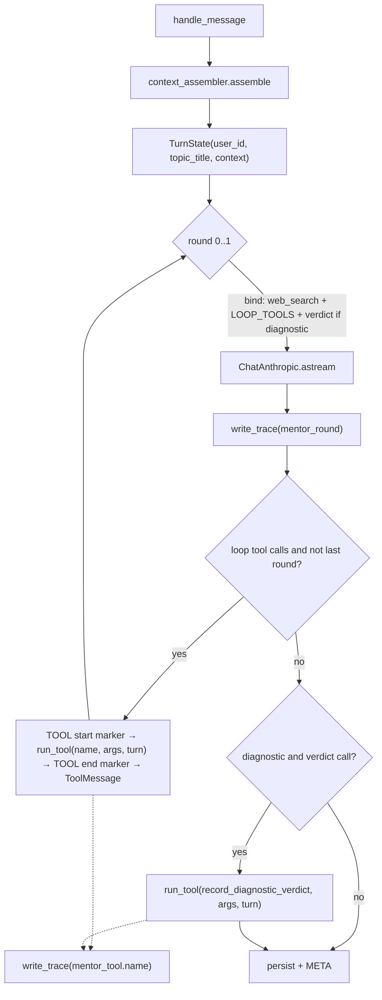

# Design Document: Mentor LangChain Tools

## Overview

The six locally executed mentor tools move out of `TopicChatService` into a
new module, `app/services/mentor_tools.py`, as LangChain tools. Per-turn state
(`user_id`, `topic_title`, assembled `context`) reaches every tool through one
injected, model-invisible `TurnState` argument. One generic executor,
`run_tool`, looks up a tool by name, injects state, fails open, and writes a
trace. `TopicChatService` keeps its hand-rolled 2-round streaming loop and
only changes how it binds and runs tools, plus one trace write per model round.
`llm_trace._write_trace` becomes public `write_trace` so both files can share it.

No new dependency, no new collection, no API or stream-format change.

### Verified against the installed versions

Probed in the project venv (`langchain-core` 1.5.4, `langchain-anthropic`
1.5.5) before designing. These results are load-bearing:

| Behavior | Result |
|---|---|
| `@tool("name", description=CONST)` | `description` used verbatim, docstring ignored |
| `Annotated[TurnState, InjectedToolArg]` param | Absent from the Anthropic `input_schema`; the same object instance reaches the function (no copy) |
| `ainvoke({**model_args, "turn": turn})` | Injected value wins over a model-supplied `turn` key |
| Inferred-schema tool given extra keys | Extras ignored |
| Pydantic `args_schema` with nested constraints | Flattened to the same shape as today's hand-written dict (no `title`, no `$ref`) |
| Pydantic `args_schema`, one item with `mastery: 150` | **Whole call raises `ValidationError`** |
| Dict (JSON-schema) `args_schema` | No validation; schema passed to the model as-is; extra keys forwarded to the function |
| `bind_tools([server_tool_dict, BaseTool, ...])` | Server dict passed through untouched, tools converted, order preserved |

The `mastery: 150` row decides the verdict tool's schema style. Today
`validate_subtopic_updates` drops invalid items one at a time and writes the
rest. A Pydantic schema would reject the whole verdict because of one bad
item, which breaks Requirement 6.3. So the verdict tool uses a dict
`args_schema` (exact schema, no framework validation) and takes `**_model_extras`
so an unexpected key from the model can't raise `TypeError`.

## Architecture

### Per-turn flow



The final round binds `[web_search, verdict?]` only, so the model has to
answer. This is the same list today's name filter produces.

### Why one `TurnState` instead of separate injected params

Tools need different subsets of state (search: `user_id`; context tools:
`context`; verdict: `user_id` + `topic_title`). With separate injected
params, the generic executor would have to know each tool's signature to
pass only what it accepts, because dict-schema tools raise on unexpected
keys. With one `turn` parameter on every tool, `run_tool` injects the same
key every time and needs no per-tool knowledge. It is still one object, and
another agent builds one `TurnState` to reuse the whole toolkit.

## Components and Interfaces

### Component 1: `app/services/mentor_tools.py` (new)

```python
@dataclass(frozen=True)
class TurnState:
    user_id: str
    topic_title: str
    context: dict[str, Any] = field(default_factory=dict)

# Descriptions: module constants copied verbatim from topic_chat_service.py.

@tool("search_documents", description=_SEARCH_DOCUMENTS_DESCRIPTION)
async def search_documents(query: str, turn: Annotated[TurnState, InjectedToolArg]) -> str:
    results = await vector_search(query, turn.user_id, source="ingestion", limit=5)
    return _format_search_results(results, "No matching documents found.")

@tool("search_other_topics", description=...)      # source="summary_block", limit=5
@tool("get_user_profile", description=...)         # format_learning_context + format_style_notes
@tool("get_skill_state", description=...)          # format_subtopic_mastery + format_taught_concepts
@tool("get_past_sessions", description=...)        # format_summary_blocks

@tool("record_diagnostic_verdict", description=..., args_schema=_VERDICT_INPUT_SCHEMA)
async def record_diagnostic_verdict(
    turn: Annotated[TurnState, InjectedToolArg],
    subtopic_updates: list | None = None,
    **_model_extras: Any,
) -> str:
    validated = await validate_subtopic_updates(turn.topic_title, subtopic_updates or [])
    await skill_graph_repo.apply_update(turn.user_id, turn.topic_title, validated)
    return f"Recorded mastery for {len(validated)} subtopic(s)."

LOOP_TOOLS: list[BaseTool] = [search_documents, search_other_topics,
                              get_user_profile, get_skill_state, get_past_sessions]
LOOP_TOOL_NAMES: frozenset[str]
DIAGNOSTIC_VERDICT_TOOL: BaseTool = record_diagnostic_verdict

async def run_tool(name: str, args: dict, turn: TurnState) -> str:
    """Look up, inject `turn`, fail open, trace."""
```

`run_tool` contract:
- Unknown name → returns `"Unknown tool: {name}"`, no trace (nothing ran).
- Invokes `tool.ainvoke({**args, "turn": turn})`. The injected key goes last,
  so a model can't override it (Req 3.3).
- On exception → logs a warning, traces with `error`, returns
  `"Lookup failed for {name} — proceed without this information."` (Req 4.4).
- Always traces an execution: `call_site=f"mentor_tool.{name}"`, `model=""`,
  `user_id=turn.user_id`, `prompt=json.dumps(args)` (model args only, never
  `turn`/context), `response`=result text (Req 7.2, 7.3).

Search and context tool bodies are moved as-is from `_execute_loop_tool`, so
their output strings are unchanged (Req 4.1-4.3). The module holds no mutable
state; everything per-turn arrives in `turn` (Req 3.4).

### Component 2: `TopicChatService` (modified)

Removed: the six tool dicts, `_LOOP_TOOL_NAMES`, `_execute_loop_tool`,
`_format_search_results`, `_apply_diagnostic_verdict`, and the now-unused
imports (`prompt_store` module import, `skill_graph_repo`,
`validate_subtopic_updates`, `vector_search`).

Kept: `_WEB_SEARCH_TOOL` dict, `_MAX_LOOP_ROUNDS`, markers, streaming,
holdback, persistence. `_execute_loop_tool`'s formatting and
`_apply_diagnostic_verdict`'s write path both move into Component 1.

Changes inside `_stream_turn`:

```python
turn = mentor_tools.TurnState(user_id, topic_title, context)
final_round_tools = [_WEB_SEARCH_TOOL]
if include_diagnostic_tool:
    final_round_tools.append(mentor_tools.DIAGNOSTIC_VERDICT_TOOL)
loop_round_tools = [_WEB_SEARCH_TOOL, *mentor_tools.LOOP_TOOLS, *final_round_tools[1:]]
```

This preserves today's bind order (`web_search`, the five loop tools,
verdict), which matters for prompt-cache prefix stability.

Each round wraps its `astream` loop: collect `round_text` (visible text only),
then `await self._trace_round(turn.user_id, lc_messages, round_text, error, start)`
on success or before re-raising on failure. `_trace_round` builds `prompt` from
the messages after (and including) the last `HumanMessage`, meaning the
latest user message plus any `ToolMessage` results fed into this round
(requirements Open question 2). It reads text from either a string or a list
of content blocks.

Loop tool execution becomes `await mentor_tools.run_tool(tc["name"], tc.get("args") or {}, turn)`.
The markers and `ToolMessage` construction around it are unchanged. Which
calls count as loop calls is still decided by name membership
(`mentor_tools.LOOP_TOOL_NAMES`).

The deferred verdict runs after the stream, same point as today:

```python
if include_diagnostic_tool:
    verdict = next((tc for tc in final_tool_calls
                    if tc["name"] == mentor_tools.DIAGNOSTIC_VERDICT_TOOL.name), None)
    if verdict:
        await mentor_tools.run_tool(verdict["name"], verdict.get("args") or {}, turn)
```

`_MENTOR_MODEL = "claude-sonnet-5"` becomes a constant shared by the
`ChatAnthropic(...)` call and the round trace.

### Component 3: `app/services/llm_trace.py` (modified)

- `_write_trace` → public `write_trace`. It is now shared by two modules, and
  the same rule applies as the private-function fix in `prompt_store`.
- Truncation moves inside `write_trace` (applied to `prompt` and to a
  non-`None` `response`). `_extract_prompt_text` and `_extract_response_text`
  stop truncating, so no text gets truncated twice. `traced_messages_create`
  output is unchanged.

### Component 4: `design_decisions/15_llm_orchestration.md` (modified)

Add a dated "Update" section. The "Mentor turns become agentic" trigger has
fired. The mentor loop uses `langchain-anthropic` for streaming and
`bind_tools` plus a LangChain `@tool` toolkit (`mentor_tools.py`), with a
hand-rolled 2-round loop instead of LangGraph. `l1_scope` and `fact_quality`
use `with_structured_output`. Every other single-shot call stays on the raw
SDK. Correct the "No LangChain" statement accordingly.

### Stale references updated

`prompt_store.py:221`, `tests/unit/test_prompt_store.py:172`, and
`tests/unit/test_subtopic_weights.py:309` mention `_execute_loop_tool` or
`_apply_diagnostic_verdict`; repoint them to `mentor_tools`.

## Data Models

### `TurnState` (in-memory only)

| Field | Source |
|---|---|
| `user_id` | authenticated request |
| `topic_title` | `topic["title"]` |
| `context` | `context_assembler.assemble(...)` output |

### Trace documents (existing `llm_traces_col`, no schema change)

| call_site | model | prompt | response |
|---|---|---|---|
| `topic_chat_service.mentor_round` | `claude-sonnet-5` | latest user msg + this round's tool results | round's visible text |
| `mentor_tool.<name>` | `""` | model args as JSON | tool result text |

Both kinds set `user_id`, `error`, `duration_ms`, and `created_at`, and are
truncated at `TEXT_CHAR_LIMIT`. They expire through the existing 14-day TTL
index.

## Error Handling

1. **Tool raises** (vector search down, embedding failure): `run_tool` logs,
   traces the error, and returns the fail-open text. The model continues
   (unchanged behavior).
2. **Verdict validation/write raises**: the same `run_tool` path. The error
   is logged and traced, and the turn completes. The periodic skill
   checkpoint is still the backstop, as documented today.
3. **Model round raises** (API error, time budget): traced with `error`,
   then re-raised into the existing handler, which yields the in-band error
   marker (unchanged).
4. **Trace write fails** (DB unavailable): `write_trace` already swallows
   and logs. Never surfaces.
5. **Model supplies `turn`/`user_id`/`context` in args**: overwritten by the
   injected `turn` (inferred-schema tools ignore unknown keys; the verdict
   tool absorbs them in `**_model_extras`).

## Testing Strategy

New `tests/unit/test_mentor_tools.py`:
- **Schema golden (Req 2):** a frozen copy of today's six tool dicts (name,
  description, input_schema), compared for equality against
  `convert_to_anthropic_tool(t)` for every tool. Also asserts no schema
  contains `turn`, `user_id`, or `context`.
- **Injection (Req 3):** a model-supplied `user_id`/`turn` key can't change
  the user passed to `vector_search`; two concurrent `run_tool` calls with
  different `TurnState`s each see their own user.
- **Execution parity (Req 4):** search tools call `vector_search` with the
  right `source`/`limit`, joined output, empty messages; the three context
  tools' strings (moved from `TestContextTools`), including placeholders;
  fail-open text on exception; unknown-tool text.
- **Verdict (Req 6):** raw updates, including an out-of-range item, reach
  `validate_subtopic_updates` unfiltered; `apply_update` gets the validated
  list; an extra model key doesn't raise.
- **Tracing (Req 7.2-7.3):** `write_trace` called with
  `mentor_tool.<name>`, `model=""`, JSON args, result; `error` set on failure;
  context text never in `prompt`.

New `tests/unit/test_llm_trace.py`:
- `write_trace` truncates `prompt`/`response` and swallows a DB error.
- `traced_messages_create` still writes a trace with truncated text.

`tests/unit/test_topic_chat_service.py` (updated, Req 8.2):
- Verdict tests patch `app.services.mentor_tools.skill_graph_repo` and
  `...mentor_tools.validate_subtopic_updates`.
- The bound-tool name assertion reads names from dicts or `BaseTool`s.
- `TestContextTools` moves to `test_mentor_tools.py` (same assertions,
  invoked through `run_tool`).
- New: the final round binds only `web_search` (+ verdict in diagnostic),
  with `web_search` present every round (Req 5.1-5.2).
- New: one `mentor_round` trace per round; round 1's `prompt` includes the
  tool result; a raising round is traced with `error` (Req 7.1).

## Performance Considerations

- Tool execution cost is unchanged: context tools do no I/O, search tools do
  one embed plus one `$vectorSearch`.
- New cost: one awaited Mongo insert per model round and per tool call. They
  sit between rounds and after the final round, never between chunks, so
  time-to-first-token is unaffected. The final round's trace delays the held
  back tail by one insert. Move to background tasks if measured latency says
  so.
- The tool JSON sent to the model is identical to today's (the golden test
  enforces this), so the prompt-cache prefix isn't invalidated beyond one
  deploy.

## Dependencies

None added. `langchain_core.tools` (`tool`, `InjectedToolArg`, `BaseTool`)
comes with `langchain-anthropic>=1.5.5`. `convert_to_anthropic_tool` (used
only in tests) is in `langchain_anthropic.chat_models`.

## Correctness Properties

### Property 1: Model-visible surface is frozen
For every tool `t`, `convert_to_anthropic_tool(t)` equals the pre-change dict
byte for byte, up to key order.

### Property 2: Injected state is never model-controlled
For any model args `a`, `run_tool(name, a, turn)` executes with
`turn.user_id`, whatever `a` contains.

### Property 3: Verdict leniency preserved
The set of updates written equals `validate_subtopic_updates(topic, raw)`
for the model's raw list. Nothing is rejected before that function sees it.

### Property 4: Tracing never changes a turn's outcome
With `llm_traces_col()` raising, every existing `TopicChatService` test still
passes. The unit suite runs without a DB, so the suite itself checks this.

### Property 5: Stream shape unchanged
Marker format, marker order relative to round text, the META trailer, and
error markers are identical for the same mocked model output.
