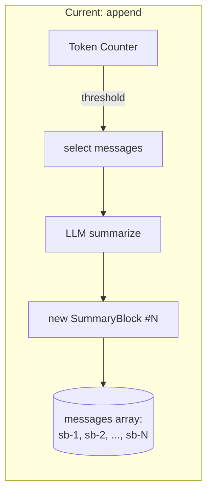
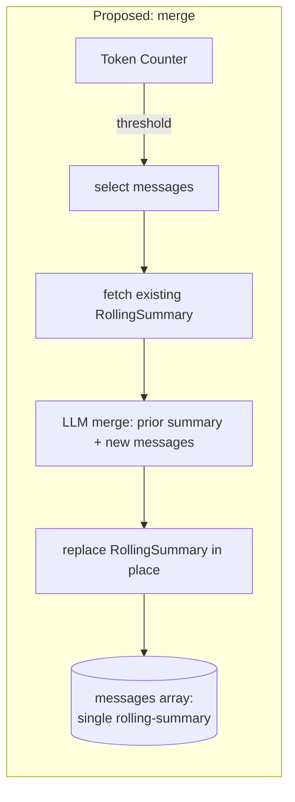
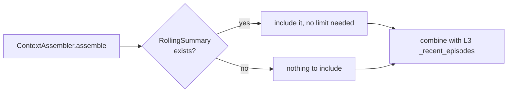

# Design Document: Rolling Topic Summary

## Overview

This feature replaces `CompactionService`'s "append a new SummaryBlock every compaction" behavior with "merge into one rolling summary every compaction." Today, `_execute_compaction` (`unified-backend/app/services/compaction_service.py:550`) inserts an independent SummaryBlock at each compaction point and never revisits it — `select_messages_to_compact` explicitly filters out `type == "summary"` entries, so old blocks are permanently frozen and simply accumulate. `ContextAssembler._recent_topic_summaries` (`context_assembler.py:162`) then reads back only the 3 most recent, meaning storage grows without bound while the LLM's visibility into a topic's own history is capped and effectively random with respect to which blocks make the cut.

This design keeps the compaction *trigger* logic (token thresholds, message-pair selection, error handling) entirely unchanged — it only changes what happens after messages are selected: instead of creating a new block, the service fetches the topic's existing rolling summary (if any), asks the LLM to fold the new messages into it, and replaces the old block in place. A topic then holds at most one summary entry at any time.

## Architecture

### Compaction Data Flow (Before → After)





### Read Path Simplification



## Components and Interfaces

### Component 1: CompactionService (modified)

**File**: `unified-backend/app/services/compaction_service.py`

**Changed method**: `_execute_compaction(topic_id, user_id)`

```python
async def _execute_compaction(self, topic_id: str, user_id: str) -> dict | None:
    # Steps 1-3 unchanged: fetch topic, calculate target reclamation, select messages

    # NEW Step 4a: locate existing rolling summary (if any)
    existing_summary = _find_rolling_summary(messages)  # first (only) type=="summary" entry

    # Step 4b: call LLM with BOTH existing_summary.summary (if present) and `selected`
    llm_result = await self._call_merge_summarization_llm(existing_summary, selected)

    # Step 5: build/replace the RollingSummary
    #   - id: reuse existing_summary["id"] if present, else new uuid
    #   - compactedRange.from: existing_summary's from, else selected[0].timestamp
    #   - compactedRange.to: selected[-1].timestamp (always advances)
    #   - compactedMessageIds: union(existing.compactedMessageIds, [m.id for m in selected])
    #   - tokenCount: recount of merged summary text

    # Step 6: new_messages = replace-in-place (drop existing summary entry AND
    #   selected raw messages, insert the one updated RollingSummary at the
    #   position of the first compacted item in this pass)
```

**New method**: `_call_merge_summarization_llm(existing_summary, selected_messages)`
- If `existing_summary` is `None`: identical prompt/behavior to today's `_call_summarization_llm(selected)`.
- If present: prompt includes the existing summary text as prior context and instructs the LLM to produce one updated summary covering both, not two.
- Reuses the existing `_COMPACTION_TOOL_SCHEMA` tool-call contract unchanged — same `summary` + `skill_updates` output shape.

**New helper**: `_find_rolling_summary(messages) -> dict | None`
- Returns the single `type == "summary"` entry in the messages array, or `None`.
- Used both by `_execute_compaction` and by the one-time migration path (Component 3).

**Unchanged**: `should_compact`, `select_messages_to_compact` (still filters `type != "summary"` — correct, since raw messages are still what gets newly compacted each pass), threshold config, failure-counting, `compaction_events_col` logging.

---

### Component 2: ContextAssembler (simplified)

**File**: `unified-backend/app/services/context_assembler.py`

**Changed method**: `_recent_topic_summaries(user_id, topic, limit)` → simplified, no longer needs a `limit` parameter for correctness (kept optionally for the L3 blend in Requirement 3.3, but the topic side is inherently ≤ 1).

```python
async def _recent_topic_summaries(user_id: str, topic: str | None) -> list:
    """Return the topic's single RollingSummary (if any) as a one-item list."""
    pipeline = [
        {"$match": {"userId": user_id, "title": topic}},
        {"$project": {
            "_id": 0, "title": 1,
            "summaryBlocks": {"$filter": {
                "input": "$messages", "as": "m",
                "cond": {"$eq": ["$$m.type", "summary"]},
            }},
        }},
    ]
    # at most one topic doc matches `topic`, and at most one summaryBlock exists in it
```

**Unchanged**: `_recent_episodes` (cross-topic L3), `assemble()`'s overall shape — `episodes = topic_summary_list + cross_topic_episodes`, still sliced to whatever the L3 budget allows (Requirement 3.3/3.4), just no longer needing the `[:3]` hack on the topic-summary half specifically.

---

### Component 3: One-Time Migration (new, small script)

**Purpose**: Collapse any topic that already has multiple SummaryBlocks (from before this change shipped) into one RollingSummary, so Requirement 2.1's invariant holds for every topic going forward, not just newly-compacting ones.

**Interface**:
```python
async def migrate_topic_to_rolling_summary(topic_id: str, user_id: str) -> bool:
    """Merge all existing SummaryBlocks in a topic into one, oldest-to-newest.
    Returns True on success, False on LLM failure (leaves topic untouched)."""
```

- Runs lazily: `CompactionService.compact()` checks `_find_rolling_summary`-style logic — if it finds **more than one** summary entry, it runs this migration first, then proceeds with the normal merge-on-compact flow in the same turn.
- No separate background job or cron needed — this is a "fix it the next time this topic is touched" migration, consistent with the low-traffic, single-user nature of the app (ponytail: lazy migration, not a batch backfill job).

## Data Models

### RollingSummary (supersedes multiple SummaryBlocks)

Same shape as the existing `SummaryBlock` — no schema migration needed, just a cardinality change:

```python
{
    "type": "summary",
    "id": str,                       # stable across merges once created
    "summary": str,                  # replaced wholesale each merge, not appended to
    "compactedMessageIds": list[str],# union across all merges
    "compactedRange": {
        "from": datetime,            # fixed at first compaction, never changes
        "to": datetime,              # advances forward on every merge
    },
    "messageCount": int,             # total across all merges
    "tokenCount": int,               # recounted from the new merged summary text
    "createdAt": datetime,           # first-created timestamp, unchanged
    "updatedAt": datetime,           # NEW field — last-merged timestamp
    "compactionEventId": str,        # points at the most recent CompactionEvent
}
```

Only new field: `updatedAt`. Everything else reuses the existing SummaryBlock shape so `_validate_thread_entry` in `context_assembler.py` needs no changes.

## Error Handling

### Error Scenario 1: Merge LLM Call Fails

**Condition**: `_call_merge_summarization_llm` times out or returns malformed output.
**Response**: Identical to today's compaction failure path — `_execute_compaction` raises, `compact()`'s try/except catches it, increments `_consecutive_failures[topic_id]`, leaves `messages` completely untouched (existing RollingSummary AND newly-selected raw messages both stay in place).
**Recovery**: Retried on the next turn that crosses the threshold, same 3-consecutive-failure user notification as today (Requirement 4.1, 4.2).

### Error Scenario 2: Migration Runs on a Topic Mid-Compaction

**Condition**: A topic with 5 legacy SummaryBlocks is opened and immediately crosses the compaction threshold.
**Response**: The migration merge (Component 3) and the new-messages merge (Component 1) happen as two sequential LLM calls within the same `_execute_compaction` invocation, both inside the existing per-topic `_compaction_in_progress` guard — no new concurrency surface.
**Recovery**: If the migration call succeeds but the subsequent new-content merge call fails, the migrated single-summary state is still persisted (it's a strict improvement and safe to keep), and the new-content merge simply retries next threshold crossing.

## Testing Strategy

- **Unit**: `_find_rolling_summary` returns `None` on empty/no-summary messages arrays, returns the single entry when one exists.
- **Unit**: `_call_merge_summarization_llm` prompt construction — with and without an existing summary, verify the correct prompt variant and that the tool schema output is parsed identically to today's `_parse_tool_use_response`.
- **Integration**: Simulate 3 consecutive compactions on one topic — assert the messages array contains exactly one `type == "summary"` entry after each, with `compactedRange.to` advancing and `compactedMessageIds` growing (union, not replacement).
- **Integration**: Migration path — seed a topic with 3 legacy SummaryBlocks, trigger compaction, assert it collapses to 1 before the new merge runs.
- **Regression**: `context_assembler.assemble()` for a topic with one RollingSummary returns the same `episodes` shape consumers already expect (no breaking change to the dict returned).

## Performance Considerations

- One additional LLM input (the prior summary text, typically a few hundred tokens) is added to the existing compaction call — negligible cost/latency change versus today's summarization call.
- Net storage per topic decreases relative to the current unbounded-growth behavior — a topic that would have accumulated 20 SummaryBlocks now holds 1.
- Migration is amortized: it only runs (once) for topics that still carry legacy multi-block state, and only when that topic is next actively compacting — no upfront backfill pass across all topics.

## Dependencies

- **No new external services.** Reuses the existing Anthropic client, `_COMPACTION_TOOL_SCHEMA`, `compaction_events_col`, and `topics_col`.
- **No schema migration required** for MongoDB — `updatedAt` is an additive optional field; old documents without it degrade gracefully (treat missing as equal to `createdAt`).

## Correctness Properties

### Property 1: Single-Block Invariant
*For any* topic and any sequence of compaction operations (post-migration), the topic's `messages` array SHALL contain at most one entry with `type == "summary"` at any point in time.
**Validates: Requirement 2.1**

### Property 2: Compacted-ID Conservation Across Merges
*For any* topic with N compaction events, the final RollingSummary's `compactedMessageIds` SHALL equal the union of every `selected` message ID across all N compactions, with no ID lost or duplicated.
**Validates: Requirements 1.6, 2.4**

### Property 3: Range Monotonicity
*For any* topic with multiple compactions, `compactedRange.from` SHALL remain constant from the first compaction onward, and `compactedRange.to` SHALL be non-decreasing across successive merges.
**Validates: Requirement 1.5**

### Property 4: Merge Failure Safety
*For any* failed merge-summarization call, the topic's `messages` array (both the pre-existing RollingSummary and the newly-selected raw messages) SHALL remain byte-for-byte unchanged from its pre-attempt state.
**Validates: Requirements 4.1, 4.3**
