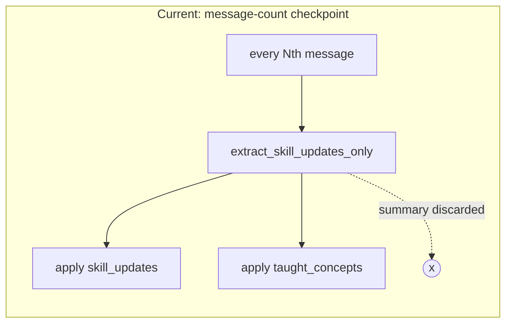
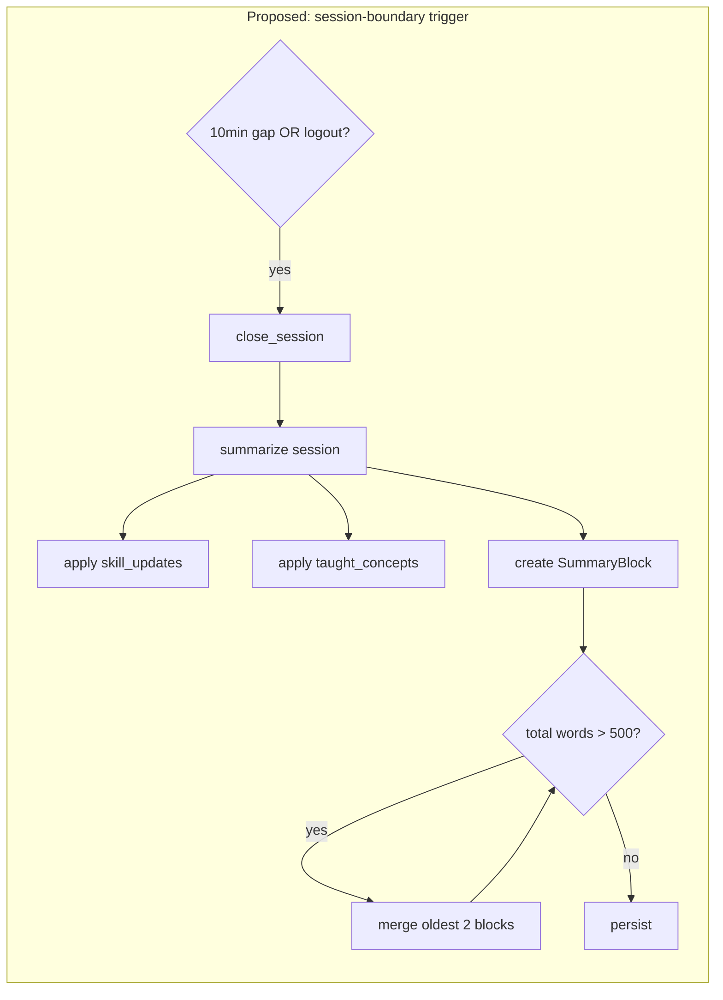
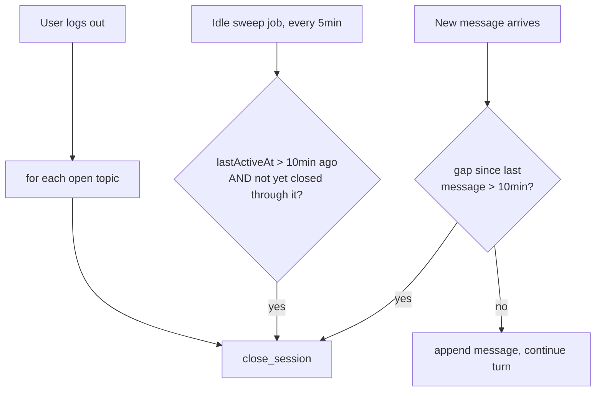

# Design Document: Session Narrative Summary

## Overview

This design replaces the message-count-triggered checkpoint (`extract_skill_updates_only`,
fired every `SKILL_CHECK_EVERY_N_MESSAGES` messages) with a session-boundary trigger:
a session is a run of messages bounded by a 10-minute inactivity gap or a logout. Each
closed session gets its own narrative-summary block (`SummaryBlock`), stored in a new
array field on the topic document. Because a long-lived topic accumulates one block
per session, blocks are merged (oldest-pair-first) whenever the combined word count
exceeds a fixed cap, bounding storage while guaranteeing no session's content is ever
silently dropped below a floor.

This is deliberately independent of `CompactionService`'s existing token-threshold
RollingSummary merge (rolling-topic-summary spec) — that mechanism keeps raw message
storage bounded and continues unmodified. This spec only changes what happens to the
narrative-summary and skill-update/taught-concept extraction that today rides on the
message-count checkpoint.

## Architecture

### Trigger Flow (Before → After)





### Detection Paths



## Components and Interfaces

### Component 1: Session Boundary Detector

**New module**: `unified-backend/app/services/session_boundary.py`

```python
SESSION_IDLE_GAP_MINUTES = 10

async def check_and_close_on_new_message(topic_id: str, user_id: str, new_message_ts: datetime) -> None:
    """Called from topic_chat_service before appending a new message.
    Compares new_message_ts to the topic's last message timestamp; if the
    gap exceeds SESSION_IDLE_GAP_MINUTES, closes the session up to the last
    message before returning (does not block the new message's own turn)."""

async def idle_sweep() -> int:
    """Scheduled job (default every 5 minutes). Finds topics whose lastActiveAt
    is older than SESSION_IDLE_GAP_MINUTES and not yet closed through that
    point, and closes them. Returns count of topics closed."""

async def close_all_sessions_for_user(user_id: str) -> None:
    """Called from the logout handler. Closes every topic the user has an
    open (unclosed) session in, using each topic's last message timestamp."""
```

**Wiring**:
- `check_and_close_on_new_message` is called from `topic_chat_service.py`'s message-handling
  path, replacing the `elif total_messages % SKILL_CHECK_EVERY_N_MESSAGES == 0` branch
  in `_post_turn_hook` (Requirement 4.3 retires that branch)
- `idle_sweep` needs a scheduler — this codebase has no existing cron/job runner found
  during design; simplest option is a background `asyncio` task started at app boot
  (`asyncio.create_task(periodic_sweep_loop())`), consistent with this app's
  single-process deployment (see `ec2-deployment-guide.md`). A dedicated job queue is
  not justified at current scale.
- `close_all_sessions_for_user` is called from the logout endpoint in `auth/router.py`

### Component 2: Session Summarizer

**New module**: `unified-backend/app/services/session_summarizer.py`

```python
BLOCK_WORD_CAP = 500
BLOCK_WORD_FLOOR = 50
MAX_MERGE_PASSES_PER_CLOSE = 3

async def close_session(topic_id: str, user_id: str, upto_timestamp: datetime) -> None:
    """
    1. Fetch topic, determine session_messages = messages after the last
       already-covered sourceSessionIds, up to upto_timestamp
    2. If session_messages is empty: no-op (Requirement 1.5)
    3. Call the existing _call_summarization_llm(session_messages) (reused
       from compaction_service, unchanged signature)
    4. Build a fresh SummaryBlock (mergeDepth=0) from the result
    5. Apply skill_updates and taught_concepts exactly as
       extract_skill_updates_only does today
    6. Append the new block, then call enforce_word_cap
    7. Persist topic.summaryBlocks via optimistic-concurrency update_one,
       same pattern as CompactionService._execute_compaction
    """

async def enforce_word_cap(blocks: list[dict]) -> list[dict]:
    """
    Repeatedly merges the two oldest blocks (by createdAt) while
    sum(wordCount) > BLOCK_WORD_CAP, up to MAX_MERGE_PASSES_PER_CLOSE times
    or until fewer than 2 blocks remain. Each merge calls a new
    _call_merge_two_blocks_llm(text_a, text_b) -> str, targeting
    max(BLOCK_WORD_FLOOR, ...) words, and never asks for less than the floor.
    """
```

**Reuse from `compaction_service.py`** (imported, not duplicated):
- `_call_summarization_llm` — unchanged, used as-is for fresh session summaries
- `_apply_skill_updates`, `_apply_taught_concepts` — unchanged, called identically to
  how `extract_skill_updates_only` calls them today

**New**: `_call_merge_two_blocks_llm(text_a: str, text_b: str) -> str` — a prompt
variant of the existing compaction merge prompt, adapted to combine two already-
summarized blocks into one (rather than a prior summary + raw messages), respecting
the word floor.

### Component 3: Storage Shape

**New field on the topic document**: `topic.summaryBlocks: list[SummaryBlock]`

```python
SummaryBlock = {
    "blockId": str,                  # uuid4
    "sourceSessionIds": list[str],   # message IDs covered; union on merge
    "text": str,
    "wordCount": int,                # cached, recomputed on every write to this block
    "mergeDepth": int,               # 0 = never merged
    "createdAt": datetime,           # earliest source session's first-message timestamp
    "lastMergedAt": datetime,
}
```

This is a **separate field** from the existing `type == "summary"` RollingSummary
entry inside `topic.messages` (rolling-topic-summary spec) — Requirement 4.2. The two
coexist: `topic.messages` still holds at most one RollingSummary block among its
entries (raw-message-count/token-bounded), while `topic.summaryBlocks` is this spec's
independent, session-bounded array.

### Component 4: ContextAssembler Integration

**File**: `unified-backend/app/services/context_assembler.py`

**Changed**: `_format_episodes` (in `prompt_store.py`) gains a parameter or branch to
skip its 300-character truncation specifically for entries sourced from
`topic.summaryBlocks` (Requirement 7.1). Cross-topic `_recent_episodes` entries keep
the existing 300-char truncation unchanged.

**New read helper**: `_format_summary_blocks(blocks: list[dict]) -> str` — joins
`topic.summaryBlocks` in `createdAt` order (Requirement 7.2), analogous to but
separate from `_format_episodes`.

## Data Flow: Full Example

1. User sends message in topic T at 10:00. `check_and_close_on_new_message` compares
   to last message (09:45 the previous day) — gap > 10min → `close_session` runs for
   the run of messages up to 09:45, producing `SummaryBlock[0]` (mergeDepth 0).
2. New message appended, turn proceeds normally (LLM response uses the now-updated
   `topic.summaryBlocks` in its assembled context).
3. User continues chatting for 20 minutes, then goes idle.
4. `idle_sweep` (running every 5 min) notices T's `lastActiveAt` is >10min old and not
   yet closed through — closes the session, producing `SummaryBlock[1]`.
5. `sum(wordCount)` across `[SummaryBlock[0], SummaryBlock[1]]` is checked; if over
   500, they merge into one `mergeDepth=1` block.
6. Days later, user logs out mid-conversation without going idle first —
   `close_all_sessions_for_user` closes T's session immediately at logout,
   producing the next fresh block.

## Error Handling

### Error Scenario 1: Summarization LLM Call Fails During Session Close

**Response**: Same pattern as `extract_skill_updates_only` today — log and return
without persisting a block. The unsummarized messages remain uncovered by any
`sourceSessionIds`, so the *next* close attempt (next gap, sweep, or logout) will
naturally include them in its `session_messages` range (Requirement 2.4's "not yet
covered" check handles this without extra retry logic).

### Error Scenario 2: Merge LLM Call Fails Mid-`enforce_word_cap`

**Response**: Keep the blocks as they were before the failed merge attempt; stop the
loop early (counts toward `MAX_MERGE_PASSES_PER_CLOSE`); persist whatever merges did
succeed plus the newly-added fresh block. Never lose a block's content on a failed
merge, consistent with the rolling-topic-summary spec's Requirement 4.1 precedent.

### Error Scenario 3: Concurrent Session Close and Token-Threshold Compaction

**Condition**: A session closes (this spec) at the same time `CompactionService`'s
token threshold fires (rolling-topic-summary spec) for the same topic.

**Response**: These operate on different fields (`topic.summaryBlocks` vs.
`topic.messages`), so they do not directly conflict — but both use optimistic
concurrency on `topic.version`. Whichever writes second retries against the refetched
document, same as any other concurrent-write case already handled by the existing
`update_one({"version": current_version}, ...)` pattern.

## Testing Strategy

- **Unit**: `check_and_close_on_new_message` — gap under/over threshold, role-agnostic
  gap measurement (Requirement 1.4)
- **Unit**: `close_session` — empty `session_messages` is a no-op (Requirement 1.5);
  skill_updates/taught_concepts applied identically to today's checkpoint behavior
- **Unit**: `enforce_word_cap` — merges stop at cap, at floor, and at
  `MAX_MERGE_PASSES_PER_CLOSE`; odd-block-count leaves one block unpaired
  (Requirement 3.6)
- **Integration**: idle sweep closes a topic with no next message; logout closes
  every open topic for a user, not just one
- **Integration**: a topic that never goes idle still receives its RollingSummary
  merge via the existing unmodified `CompactionService` path (Requirement 4.4)
- **Regression**: existing `test_topic_service_l1_scope.py`,
  `test_topic_chat_service.py` suites pass with `SKILL_CHECK_EVERY_N_MESSAGES`
  branch removed

## Performance Considerations

- Session-close summarization is one LLM call per closed session, same cost shape as
  today's per-16-messages checkpoint, but now event-driven by actual idle gaps rather
  than a fixed cadence — for a topic with long sessions, this fires less often; for a
  topic with many short bursts separated by gaps, it could fire more often. No hard
  cap on close frequency is set in this design; if abuse/cost becomes a concern, a
  minimum-messages-per-session floor could be added later.
- `enforce_word_cap`'s merges add at most 3 extra LLM calls per close in the worst
  case (Requirement 3.2's cap) — bounded, not unbounded cascading.
- The idle sweep is a single periodic query (`lastActiveAt < cutoff`), same shape and
  cost class as the existing `SessionManager.timeout_sweep()`.

## Dependencies

- Reuses `_call_summarization_llm`, `_apply_skill_updates`, `_apply_taught_concepts`
  from `compaction_service.py` — no new LLM client setup
- No dependency on `sessions_col`, `SessionManager`, or `SessionSaveHandler`
  (Requirement 6.1)
- New: a background sweep loop needs a place to start at app boot — smallest viable
  addition to the existing FastAPI startup, no new infra service

## Correctness Properties

### Property 1: No Message Summarized Twice
*For any* topic, the union of `sourceSessionIds` across all of its SummaryBlocks
SHALL never contain a message ID more than once, before or after any merge.
**Validates: Requirement 2.4, 3.3**

### Property 2: Floor Invariant
*For any* SummaryBlock at any point in time, its `wordCount` SHALL be either the
result of an uncompressed fresh session summary, or at least `BLOCK_WORD_FLOOR`.
**Validates: Requirement 3.4**

### Property 3: Merge Termination
*For any* single `enforce_word_cap` invocation, the number of merge operations
performed SHALL be at most `MAX_MERGE_PASSES_PER_CLOSE`.
**Validates: Requirement 3.2**

### Property 4: RollingSummary Independence
*For any* sequence of session closes on a topic, `CompactionService`'s RollingSummary
merge behavior (rolling-topic-summary spec) SHALL be unaffected — no test of that
spec's properties should regress under this spec's changes.
**Validates: Requirement 4.1**
