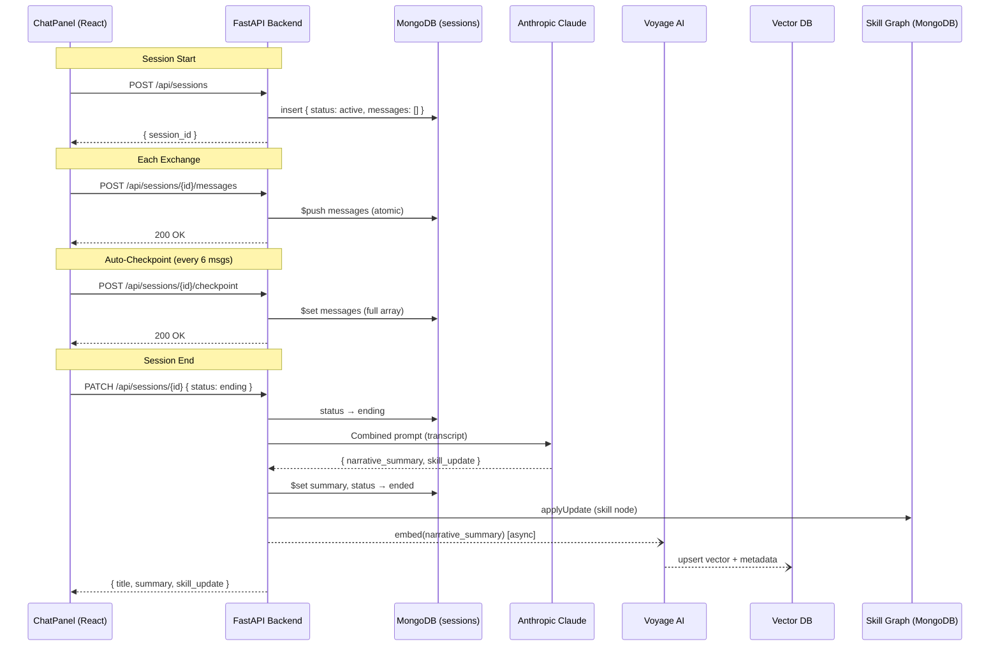

# Design Document: Session Persistence

## Overview

Session Persistence implements the end-to-end pipeline that writes conversation data to MongoDB throughout the session lifecycle and triggers post-session processing (narrative summaries, skill graph updates, vector embeddings). Currently the backend has partial session CRUD (`/api/sessions`) and a separate session-end endpoint (`POST /api/session/end`), but the client never calls the persistence endpoints during live chat — sessions appear in the sidebar but contain no messages, summaries never generate, and the layered-memory architecture (L1+L2+L3) is effectively L1-only.

This design unifies the existing fragments into a coherent pipeline:

1. **Lifecycle state machine** (`active → ending → ended`) with timeout guards
2. **Incremental message persistence** via atomic `$push` after each exchange
3. **Auto-checkpoint** every 6 messages + `beforeunload` fallback to localStorage
4. **Combined session-end LLM call** producing narrative summary + skill update in one Anthropic tool_use invocation
5. **Skill graph upsert** via validated `applyUpdate`
6. **Vector embedding** of the narrative summary via Voyage AI → Vector DB
7. **Client-side wiring** connecting the existing `ChatPanel` to the new persistence APIs

### Key Design Decisions

| Decision | Rationale |
|---|---|
| Single LLM call for summary + skill update | Cost and latency — two calls doubles both |
| `$push` for messages, not `$set` | Atomic append avoids overwriting concurrent checkpoint writes |
| Lifecycle enforced server-side | Prevents client bugs from corrupting session state |
| 60-second timeout on `ending` state | Prevents orphaned sessions blocking new ones |
| localStorage as crash recovery buffer | `beforeunload` has ~50ms budget — can't wait for network |
| Embedding runs async (fire-and-forget) | Session-end response shouldn't block on Voyage AI latency |

---

## Architecture



### Layer Boundaries

- **Client (React)**: Manages `session_id` in state + localStorage. Sends messages after each exchange. Triggers session-end.
- **API (FastAPI routers)**: Validates lifecycle transitions. Coordinates persistence and LLM calls. Returns structured responses.
- **Service Layer**: `SessionManager` (lifecycle), `MessageStore` (persistence), `SessionSaveHandler` (LLM + post-processing), `EmbeddingService` (vector storage).
- **Data Layer**: MongoDB `sessions` collection, `skill_graph` collection, Vector DB (embeddings + metadata).

---

## Components and Interfaces

### 1. SessionManager (`app/services/session_manager.py`)

Owns lifecycle state transitions. Enforces the state machine.

```python
class SessionManager:
    async def create_session(user_id: str, mode: str, topic: str | None) -> SessionDoc:
        """Create a new active session. Closes any stale active/ending sessions for the user."""

    async def transition_status(session_id: str, user_id: str, new_status: SessionStatus) -> SessionDoc:
        """Validate and apply a status transition. Raises InvalidTransition if illegal."""

    async def cleanup_stale_sessions(user_id: str) -> int:
        """Force-end any sessions stuck in 'active' or 'ending' for this user."""

    async def recover_orphaned_messages(user_id: str, session_id: str, messages: list[Message]) -> None:
        """Deduplicate and append recovered localStorage messages to the session."""
```

**Valid transitions**: `active → ending`, `ending → ended`. All others rejected with HTTP 409.

### 2. MessageStore (`app/services/message_store.py`)

Handles incremental message persistence with atomic operations.

```python
class MessageStore:
    async def append_messages(session_id: str, messages: list[Message]) -> None:
        """Atomic $push of messages. Rejects if session status != active."""

    async def checkpoint(session_id: str, messages: list[Message]) -> None:
        """Full $set of messages array (for periodic checkpoint). Idempotent."""

    async def get_messages(session_id: str) -> list[Message]:
        """Return messages in chronological order."""
```

Uses `$push` with `$each` for appends. Uses `$set` for full checkpoint writes. Both include `updated_at` timestamp.

### 3. SessionSaveHandler (`app/services/session_save_handler.py`)

Orchestrates end-of-session processing. Replaces the existing `session_end.py` service.

```python
class SessionSaveHandler:
    async def process_end(session_id: str, user_id: str, topic: str, mode: str) -> SessionEndResult:
        """
        1. Read transcript from the session document
        2. Call LLM with combined prompt (summary + skill_update)
        3. Parse and validate response
        4. Persist summary to session doc
        5. Upsert skill graph (non-blocking on failure)
        6. Fire async embedding task
        7. Transition status to 'ended'
        """
```

**Retry policy**: 3 total attempts for the LLM call (1 initial + 2 retries, 2-second delay). On total failure, uses fallback summary.

### 4. EmbeddingService (`app/services/embedding_service.py`)

Extends the existing `embedder.py` to handle async vector storage with metadata.

```python
class EmbeddingService:
    async def embed_and_store(
        summary: str,
        user_id: str,
        session_id: str,
        topic: str,
        mode: str,
        ended_at: str,
    ) -> None:
        """Generate embedding via Voyage AI and upsert to Vector DB with metadata."""
```

**Retry policy**: 3 attempts with exponential backoff (1s, 2s, 4s max 8s). On failure, enqueues for delayed retry.

### 5. API Routes

| Method | Path | Handler | Purpose |
|---|---|---|---|
| POST | `/api/sessions` | `create_session` | Create active session (existing, enhanced) |
| POST | `/api/sessions/{id}/messages` | `append_messages` | Append user+mentor message pair |
| POST | `/api/sessions/{id}/checkpoint` | `checkpoint` | Full array checkpoint |
| PATCH | `/api/sessions/{id}` | `update_session` | Trigger lifecycle transitions + session end |
| POST | `/api/sessions/{id}/recover` | `recover_messages` | Recover localStorage orphans |
| GET | `/api/sessions/{id}` | `get_session` | Existing — unchanged |
| GET | `/api/sessions` | `list_sessions` | Existing — unchanged |

### 6. Client-Side Session Hook (`useSessionPersistence.ts`)

Custom React hook encapsulating all persistence logic for the ChatPanel.

```typescript
interface UseSessionPersistence {
  sessionId: string | null;
  isEnding: boolean;
  error: string | null;

  createSession(mode: string, topic: string): Promise<string>;
  persistMessages(userMsg: Message, mentorMsg: Message): Promise<void>;
  endSession(): Promise<SessionEndResult>;
  recoverOrphanedMessages(): Promise<void>;
}
```

Manages:
- Session creation (with retry)
- Message persistence after each exchange (with retry + localStorage queue)
- Auto-checkpoint counter (every 6 messages)
- `beforeunload` handler for crash recovery
- End-session call with loading state

---

## Data Models

### SessionDocument (MongoDB `sessions` collection)

```typescript
interface SessionDocument {
  session_id: string;        // UUID v4
  user_id: string;           // Clerk user ID
  title: string;             // LLM-generated or derived from first message
  mode: string;              // topic | planning | doubt | evaluation
  topic: string | null;      // Session topic
  topic_category: string | null;
  status: "active" | "ending" | "ended";
  messages: Message[];       // Ordered by timestamp
  summary: string | null;    // Narrative summary (3-5 sentences)
  skill_update: SkillUpdate | null;
  tags: string[];
  created_at: string;        // ISO-8601 UTC
  updated_at: string;        // ISO-8601 UTC
  ended_at: string | null;   // ISO-8601 UTC, set on transition to 'ended'
  failure_reason: string | null; // Set if end-processing failed or timed out
}
```

### Message

```typescript
interface Message {
  role: "user" | "mentor";
  content: string;           // Max 50,000 chars
  timestamp: string;         // ISO-8601 UTC
}
```

### SkillUpdate (LLM output, Zod-validated)

```typescript
interface SkillUpdate {
  topic: string;
  new_level: "novice" | "easy" | "medium" | "medium+" | "hard" | "expert";
  gap: number;               // 0-100
  weak_areas: string[];      // Max 10 items
  strong_areas: string[];    // Max 10 items
  eval_score?: string;       // Optional
}
```

### SessionEndResult (API response)

```typescript
interface SessionEndResult {
  session_id: string;
  title: string;
  summary: string;
  skill_update: SkillUpdate | null;
  status: "ended";
}
```

### Vector DB Entry (Episodic Memory)

```typescript
interface EpisodicVector {
  vector: number[];          // Voyage AI embedding
  text: string;              // The narrative summary
  metadata: {
    user_id: string;
    session_id: string;
    topic: string;
    mode: string;
    ended_at: string;        // ISO-8601 date
  };
}
```

### MongoDB Indexes (additions)

```python
# On sessions collection
{ "user_id": 1, "status": 1 }  # For cleanup_stale_sessions queries
{ "status": 1, "updated_at": 1 }  # For timeout sweep (ending > 60s)
```

---


## Correctness Properties

*A property is a characteristic or behavior that should hold true across all valid executions of a system — essentially, a formal statement about what the system should do. Properties serve as the bridge between human-readable specifications and machine-verifiable correctness guarantees.*

### Property 1: State Machine Transition Validity

*For any* session document with a given status and *for any* requested status transition, the transition should succeed if and only if it follows the sequence `active → ending → ending → ended`. All other transitions (e.g., `active → ended`, `ending → active`, `ended → *`) must be rejected with an error.

**Validates: Requirements 1.3, 1.4, 1.6**

### Property 2: Session Creation Produces Valid Document

*For any* valid user_id, mode, and topic, creating a session should produce a document with: `status = "active"`, an empty messages array, a valid UUID v4 `session_id`, the provided `user_id`, and a valid ISO-8601 `created_at` timestamp. No field may be missing or null.

**Validates: Requirements 1.1**

### Property 3: Stale Session Cleanup on New Session Creation

*For any* user who has one or more sessions with status `active` or `ending`, creating a new session should first transition all stale sessions to `ended` with a `failure_reason` set, and then create the new session with status `active`. After creation, the user should have exactly one session with status `active`.

**Validates: Requirements 1.8**

### Property 4: Failed End-Processing Still Completes Session

*For any* session in status `ending` where end-of-session processing fails (LLM error, timeout, validation failure), the session should still transition to `ended` with an `ended_at` timestamp and a non-null `failure_reason`. The pipeline should never leave a session stuck in `ending` status.

**Validates: Requirements 1.5**

### Property 5: Message Append Correctness

*For any* session with status `active` and *for any* pair of messages (user, mentor) with valid role, content (≤50,000 chars), and ISO-8601 timestamp, appending them should increase the messages array length by exactly 2 and the appended messages should appear at the end of the array with all fields preserved.

**Validates: Requirements 2.1, 2.2**

### Property 6: Message Chronological Ordering Invariant

*For any* session document, the messages array should always be ordered by timestamp ascending. This holds after any sequence of append or checkpoint operations.

**Validates: Requirements 2.3, 2.7**

### Property 7: Idempotent Message Writes

*For any* message with a given (session_id, timestamp, role) tuple, writing it to the session document multiple times should result in exactly one copy of that message in the messages array. No duplicates are ever created.

**Validates: Requirements 2.4**

### Property 8: Message Persistence Rejects Non-Active Sessions

*For any* session with status `ending` or `ended`, and *for any* valid message, attempting to append the message should be rejected with an error and the messages array should remain unchanged.

**Validates: Requirements 2.5, 2.6**

### Property 9: Orphaned Message Recovery Deduplication

*For any* session document with existing messages and *for any* set of recovery messages from localStorage, after recovery the session should contain the union of both sets (deduplicated by timestamp + role), in chronological order, with no duplicate messages.

**Validates: Requirements 3.5**

### Property 10: Fallback Summary Generation

*For any* set of session messages where the LLM call fails 3 times, the generated fallback summary should equal `"Session covered:"` concatenated with the first user message content and the last user message content, with the combined text truncated to 300 characters maximum. If the session has fewer than 2 messages, the fallback should be `"Session ended before meaningful interaction occurred."`.

**Validates: Requirements 4.4, 4.6**

### Property 11: SkillUpdate Schema Validation

*For any* JSON object, the SkillUpdate Zod validator should accept it if and only if it contains: `topic` (string), `new_level` (one of the 6 valid enum values), `gap` (number 0–100), `weak_areas` (string array, ≤10 items), and `strong_areas` (string array, ≤10 items). Objects missing required fields, with out-of-range values, or with invalid enum values must be rejected.

**Validates: Requirements 5.2**

### Property 12: Skill Graph applyUpdate Correctness

*For any* valid SkillUpdate and *for any* existing skill graph node state (including no prior node), after `applyUpdate` the node should reflect the new `new_level`, `gap`, `weak_areas`, and `strong_areas` values from the update, and `last_studied` should be set to a valid ISO-8601 timestamp within 5 seconds of the current time.

**Validates: Requirements 5.3, 5.6**

### Property 13: Invalid Skill Update Does Not Block Pipeline

*For any* LLM response where the `skill_update` portion is invalid (fails Zod validation) or missing, the session-end pipeline should still complete: the narrative summary (or fallback) should be persisted, the session should transition to `ended`, and no skill graph modification should occur.

**Validates: Requirements 5.4, 7.4**

### Property 14: Embedding Storage Preconditions

*For any* call to `embed_and_store`, if the summary text has fewer than 10 characters OR any of the required metadata fields (user_id, session_id, topic, mode, ended_at) is None or empty, then vector storage should be skipped entirely. If all preconditions are met, storage should proceed.

**Validates: Requirements 6.6, 6.8**

### Property 15: Embedding Idempotency

*For any* session_id, if `embed_and_store` is called multiple times with the same session_id, the Vector DB should contain exactly one entry for that session_id (the latest one), never duplicates.

**Validates: Requirements 6.7**

### Property 16: LLM Response JSON Parsing

*For any* valid JSON string containing keys `"narrative_summary"` (string value) and `"skill_update"` (object value), the parser should extract both values correctly and independently. A valid `narrative_summary` should always be extractable regardless of `skill_update` validity, and vice versa.

**Validates: Requirements 7.2, 7.4, 7.5**

### Property 17: Regex Fallback Extraction

*For any* string that is not valid JSON but contains a substring matching the pattern `"narrative_summary": "..."` (with the value between quotes), the regex fallback should extract the narrative text correctly. If no match is found, the fallback summary strategy should be used.

**Validates: Requirements 7.3**

### Property 18: Client localStorage Safety Invariant

*For any* sequence of message persistence operations, localStorage message drafts should only be cleared after the backend returns an HTTP 2xx response confirming successful persistence. If no 2xx is received, localStorage must retain the draft data.

**Validates: Requirements 8.7**

---

## Error Handling

### Backend Error Handling

| Component | Failure | Behaviour | Recovery |
|---|---|---|---|
| SessionManager | MongoDB write fails on create | Return 500, no session created | Client retries once after 2s |
| SessionManager | Invalid status transition | Return 409 Conflict with error detail | Client shows error |
| MessageStore | Append fails | Retry once after 1s (idempotent write) | On 2nd failure, return 500, client queues to localStorage |
| MessageStore | Session not active | Return 409 with "session not accepting messages" | Client stops sending |
| SessionSaveHandler | LLM call fails | Retry 2 more times (2s delay each) | On total failure, use fallback summary |
| SessionSaveHandler | LLM returns invalid JSON | Attempt regex extraction | If regex fails too, use fallback summary |
| SessionSaveHandler | Skill update fails Zod | Log warning, skip skill graph update | Pipeline continues |
| Skill_Graph_Repo | MongoDB upsert fails | Log error | Pipeline continues — non-critical |
| EmbeddingService | Voyage AI API fails | Retry 3x with exponential backoff (1s, 2s, 4s) | Enqueue for delayed retry (5 min) |
| EmbeddingService | Vector DB write fails | Log error | Enqueue for delayed retry |
| Timeout sweep | Session stuck in `ending` > 60s | Force transition to `ended` | Log timeout failure_reason |

### Client Error Handling

| Operation | Failure | Behaviour |
|---|---|---|
| Session creation | POST fails | Retry once after 2s. On 2nd failure: show error, disable input, show retry button |
| Message persistence | POST fails | Retry once after 1s. On 2nd failure: queue in localStorage |
| Checkpoint | POST fails | Retry once after 1s. On 2nd failure: store in localStorage |
| End session | PATCH times out (30s) | Show timeout error, allow retry |
| End session | Non-2xx response | Show error message, allow retry |
| beforeunload | Request fails/times out (2s) | Store unsaved messages in localStorage |

### Graceful Degradation Principles

1. **Summary failure doesn't block session end**: A session always transitions to `ended`, even with a fallback summary.
2. **Skill graph failure doesn't block anything**: It's logged but never prevents pipeline completion.
3. **Embedding is async and non-blocking**: Session-end response returns immediately; embedding failures are background-retried.
4. **localStorage is the last-resort buffer**: If all network persistence fails, data survives in the browser for recovery on next load.

---

## Testing Strategy

### Property-Based Testing (Hypothesis — Python)

This feature is well-suited for property-based testing because the core logic involves:
- State machine transitions (finite set of valid/invalid combinations)
- Data transformations (message append, deduplication, fallback generation)
- Schema validation (SkillUpdate against Zod-equivalent Pydantic schema)
- Idempotency guarantees (message writes, embedding upserts)

**Library**: [Hypothesis](https://hypothesis.readthedocs.io/) (already used in the project — see `ingestion-pipeline/.hypothesis/`)

**Configuration**: Minimum 100 examples per property test.

**Tag format**: `# Feature: session-persistence, Property {N}: {title}`

Each correctness property (1–18) maps to one property-based test. Key generators:
- `SessionStatus` — one of `active`, `ending`, `ended`
- `TransitionPair` — `(current_status, requested_status)` combinations
- `Message` — random role, content (1–50,000 chars), ISO timestamp
- `SkillUpdate` — random valid/invalid combinations of fields
- `NarrativeSummary` — random strings (0–5000 chars)
- `LLMResponse` — valid JSON, malformed JSON, partial responses

### Unit Tests (pytest)

Example-based tests for:
- Specific edge cases (empty messages, session with exactly 1 message, 0-character summary)
- Auto-checkpoint trigger at message 6, 12, 18
- `beforeunload` event handling
- Retry timing (1s, 2s delays)
- Timeout sweep behavior (sessions stuck > 60s)
- Client-side localStorage serialization/deserialization

### Integration Tests

- Full session lifecycle: create → send messages → checkpoint → end → verify summary + skill update + embedding
- Recovery flow: create orphaned localStorage data → start new session → verify recovery
- Concurrent writes: two clients appending to the same session (verify atomicity)
- LLM mock integration: verify tool_use prompt format and response parsing with realistic mock responses

### Client-Side Tests (Vitest + React Testing Library)

- `useSessionPersistence` hook: creation, message sending, retry logic, localStorage management
- `beforeunload` handler registration and checkpoint behavior
- End session button disabling during processing
- Error states and retry buttons

### Test File Structure

```
unified-backend/
  tests/
    property/
      test_session_state_machine.py     # Properties 1, 3, 4
      test_message_store.py             # Properties 5, 6, 7, 8, 9
      test_session_save_handler.py      # Properties 10, 11, 13, 16, 17
      test_skill_graph_update.py        # Property 12
      test_embedding_service.py         # Properties 14, 15
    unit/
      test_session_manager.py
      test_message_store.py
      test_session_save_handler.py
      test_embedding_service.py
    integration/
      test_session_lifecycle.py
      test_recovery_flow.py

mentorman-web/
  src/
    lib/
      __tests__/
        useSessionPersistence.test.ts   # Property 18 + unit tests
```
