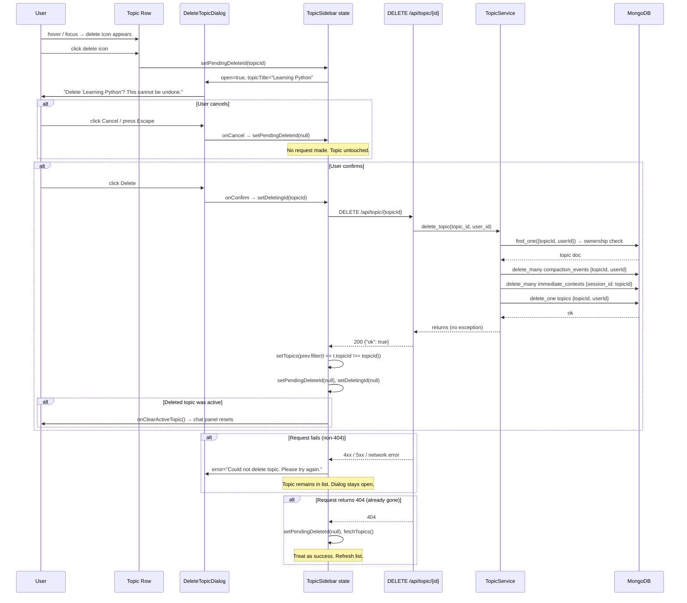

# Design Document: topic-delete

## Overview

This feature adds permanent, per-topic deletion to the MentorMan sidebar. A user
hovers or tabs to any topic row in `TopicSidebar` or `ArchivedTopics`, clicks the
delete icon, confirms in a dialog, and the topic disappears — backend and all
cascade collections cleaned up in one request.

The design is deliberately narrow: hard delete only (no soft-delete tier on top of
the existing `archived` status), cascade cleanup of the three collections that are
genuinely scoped to a topic, and `weight_nudges` retained as model-tuning
telemetry. The row-action mechanism introduced here is the foundation that a future
archive-from-sidebar action can reuse without any structural change.

## Architecture

```
mentorman-web/src/
  components/mentorman/
    DeleteTopicDialog.tsx          NEW — confirmation dialog, mirrors SkipConfirmationDialog
    TopicSidebar.tsx               MODIFIED — delete button in renderRow, delete state management
    ArchivedTopics.tsx             MODIFIED — same delete button + local state management

unified-backend/
  app/
    routers/topics.py              MODIFIED — DELETE /api/topic/{topic_id} endpoint
    services/topic_service.py      MODIFIED — delete_topic() method with cascade
    config/database.py             NO CHANGE — all needed collection accessors already present

  tests/unit/
    test_topics_router.py          MODIFIED — TestDeleteTopic class added
```

No new collections, no new indexes, no schema migrations — deletion removes
documents, it does not add structure.

## Components and Interfaces

### `TopicService.delete_topic(topic_id, user_id)`

New async method on the existing `TopicService` class. Sits alongside
`archive_topic` and follows the same ownership-check-first pattern.

```pascal
PROCEDURE delete_topic(topic_id, user_id)
  INPUT:  topic_id: str, user_id: str
  OUTPUT: None

  // 1. Ownership check — same query as get_topic, same 404-for-both-cases rule
  topic ← topics_col().find_one({topicId: topic_id, userId: user_id})
  IF topic IS NULL THEN
    RAISE HTTPException(404, "Topic not found")
  END IF

  // 2. Cascade deletes — run first so the topic doc survives for retry if one fails
  TRY
    compaction_events_col().delete_many({topicId: topic_id, userId: user_id})
  EXCEPT Exception AS e
    LOG warning "cascade: compaction_events delete failed for topic_id={topic_id}: {e}"
  END TRY

  TRY
    immediate_contexts_col().delete_many({session_id: topic_id})
  EXCEPT Exception AS e
    LOG warning "cascade: immediate_contexts delete failed for topic_id={topic_id}: {e}"
  END TRY

  // 3. Delete the topic document LAST — messages are embedded, go with it
  topics_col().delete_one({topicId: topic_id, userId: user_id})
END PROCEDURE
```

**Why topics doc is deleted last:** if a cascade step throws (e.g. transient
network blip to MongoDB), the topic document still exists. The user can retry and
the endpoint will re-attempt the full cascade. If the topic doc were deleted first
and a cascade step then failed, the orphaned rows would be permanent — there is no
recovery path because the 404 on retry would return before reaching the cascade.
Cascade failures are logged as warnings but do not surface as errors to the caller;
orphaned `compaction_events` or `immediate_contexts` rows are operationally
harmless and will be caught on the next manual sweep.

**`weight_nudges` — explicit retention decision:** rows in `weight_nudges` are
keyed by `(user_id, topic_id)` and record where the user disagreed with the
computed subtopic weights. Per the router docstring (`topics.py:230–233`), "this
is the only place that signal gets kept" and it is model-tuning telemetry rather
than user content. No existing endpoint reads these rows back to the user. They
are **not deleted** as part of this cascade. This is consistent with
`skill_graph` rows surviving deletion for the same reason (learning signal outlives
the conversation).

**`skill_graph`, `subtopic_lists`, `uploads/` — not touched.** Already documented
in the requirements; confirmed via codebase trace:
- `skill_graph` keyed by `(user_id, topic-name)` — shared across topics
- `subtopic_lists` keyed by topic title, no `user_id`, global cache
- `uploads/` keyed by `user_id/job_id`, TTL-swept by `file_cleanup.py`

### `DELETE /api/topic/{topic_id}` endpoint

Added to `topics.py`, consistent with router conventions.

```python
@router.delete("/topic/{topic_id}")
async def delete_topic(topic_id: str, user_id: str = Depends(require_auth)):
    await _topic_service.delete_topic(topic_id, user_id)
    return {"ok": True}
```

Response shape `{"ok": true}` matches `memory.py:127` (existing delete precedent).
Returns 404 for both not-found and non-owner (enumeration-prevention rule).
Accepts topics in both `active` and `archived` status — no status check, unlike
`archive_topic`.

### `DeleteTopicDialog` — new component

New file at `mentorman-web/src/components/mentorman/DeleteTopicDialog.tsx`.
Structurally identical to `SkipConfirmationDialog` — same props shape, same
keyboard trap, same focus-cancel-on-open behaviour, same CSS class namespace.
It is a separate component (not a modified `SkipConfirmationDialog`) because its
title, body text, and button labels are topic-specific and configurable via props.

```typescript
interface DeleteTopicDialogProps {
  open: boolean;
  topicTitle: string;       // shown in the dialog body: "Delete 'Learning Python'?"
  onConfirm: () => void;
  onCancel: () => void;
  loading?: boolean;
  error?: string | null;
}
```

Dialog content (static, not props):
- Title: `"Delete topic?"`
- Body: `"'<topicTitle>' and all its messages will be permanently deleted. This cannot be undone."`
- Cancel button: `"Cancel"` (focused on open, Escape triggers it)
- Confirm button: `"Delete"` (danger style, `aria-busy` during loading, disabled during loading)

CSS classes reuse the same `skip-dialog-overlay / skip-dialog / skip-dialog-title /
skip-dialog-desc / skip-dialog-actions` namespace — no new CSS needed, and the
danger variant can be expressed with an additional class on the confirm button
(`btn-danger` or `btn-accent` — match whichever is the destructive-action style in
the existing design system).

### `TopicSidebar` changes

**State additions** (top of component):

```typescript
const [pendingDeleteId, setPendingDeleteId] = useState<string | null>(null);
const [deletingId, setDeletingId] = useState<string | null>(null);
const [deleteError, setDeleteError] = useState<string | null>(null);
```

- `pendingDeleteId` — which topic's confirmation dialog is open (null = none)
- `deletingId` — which topic is currently mid-request (prevents double-submit)
- `deleteError` — error message to show in the dialog, cleared on each open/close

**`renderRow` changes** — add a delete button inside the `.session` div, following
the exact same `e.stopPropagation()` pattern as the existing subject-edit button:

```typescript
const renderRow = (topic: TopicListItem) => {
  // ... existing title/date/preview rows unchanged ...

  return (
    <div
      key={topic.topicId}
      className={`session ${isActive ? 'active' : ''}`}
      onClick={() => onSelectTopic(topic.topicId)}
    >
      {/* ... existing s-row1, s-row2 ... */}

      {/* NEW: delete action — hidden when sidebar collapsed via CSS */}
      {!collapsed && (
        <button
          className="session-delete-btn"
          title="Delete topic"
          aria-label={`Delete topic ${topic.title}`}
          onClick={(e) => {
            e.stopPropagation();
            setDeleteError(null);
            setPendingDeleteId(topic.topicId);
          }}
          disabled={deletingId === topic.topicId}
        >
          <Icon name="trash" size={12} />
        </button>
      )}

      {/* existing subject-edit input/button unchanged */}
    </div>
  );
};
```

**Delete handler** — called when the user clicks "Delete" in the dialog:

```typescript
const handleDeleteConfirm = async () => {
  if (!pendingDeleteId || deletingId) return;
  setDeletingId(pendingDeleteId);
  setDeleteError(null);

  const topicId = pendingDeleteId;

  try {
    const resp = await fetch(`/api/topic/${topicId}`, { method: 'DELETE' });

    if (resp.status === 404) {
      // Already gone — treat as success, refresh list
      setPendingDeleteId(null);
      setDeletingId(null);
      fetchTopics();
      return;
    }
    if (!resp.ok) {
      throw new Error('Delete failed');
    }

    // Success — remove from local state without reload
    setTopics((prev) => prev.filter((t) => t.topicId !== topicId));
    setPendingDeleteId(null);

    // Clear active topic if the deleted one was selected
    if (selectedTopicId === topicId) {
      onClearActiveTopic?.();
    }
  } catch {
    setDeleteError('Could not delete topic. Please try again.');
  } finally {
    setDeletingId(null);
  }
};
```

`TopicSidebar` needs a new optional prop `onClearActiveTopic?: () => void` — the
parent (`app.tsx` / the layout) passes a callback that sets `activeTopic` to null.
When the deleted topic is not the active one, this callback is never called and the
current view is undisturbed.

**`DeleteTopicDialog` render** — placed at the bottom of the component's return,
outside the `.sidebar` div so it renders as a full-viewport overlay:

```typescript
{pendingDeleteId && (
  <DeleteTopicDialog
    open={!!pendingDeleteId}
    topicTitle={topics.find(t => t.topicId === pendingDeleteId)?.title ?? ''}
    onConfirm={handleDeleteConfirm}
    onCancel={() => { setPendingDeleteId(null); setDeleteError(null); }}
    loading={deletingId === pendingDeleteId}
    error={deleteError}
  />
)}
```

### `ArchivedTopics` changes

Mirror of the `TopicSidebar` changes. `ArchivedTopics` manages its own local
`topics` state already, so the same three state variables and the same handler
apply. Key differences:
- No `selectedTopicId` or `onClearActiveTopic` — archived topics are never the
  active chat topic, so no active-selection clearing needed.
- `onDeleteSuccess` optional prop can be added if the parent needs to know (e.g.
  to update a count badge), but is not required for correctness.
- The delete handler on 200 calls `setTopics(prev => prev.filter(...))` directly,
  same as `TopicSidebar`.
- 404 response triggers `fetchArchivedTopics()` to refresh the list.

### CSS — row action visibility

The delete button (`.session-delete-btn`) uses the same visibility pattern as the
subject-edit button (`.session-tag-btn`): hidden by default, revealed on hover or
keyboard focus of the parent `.session` div.

```css
/* Hidden by default — revealed on row hover or focus-within */
.session-delete-btn {
  opacity: 0;
  pointer-events: none;
  transition: opacity 0.1s;
}
.session:hover .session-delete-btn,
.session:focus-within .session-delete-btn {
  opacity: 1;
  pointer-events: auto;
}

/* When sidebar is collapsed, no row context — button is not rendered (see JSX guard) */
```

The JSX `!collapsed` guard ensures the button is never rendered when the sidebar
is in the collapsed icon-only state, satisfying Req 1.4 without relying on CSS
alone.

## Data Models

### `topics` collection

Each document represents one topic and embeds its full message history. Deletion
removes the document and the embedded `messages` array in a single operation.

```
{
  topicId:   string,     // primary key, also used as session_id in chat uploads
  userId:    string,     // owner — all queries filter by both topicId + userId
  title:     string,
  status:    "active" | "archived",
  messages:  [...],      // embedded array — deleted with the document
  createdAt: ISODate,
  updatedAt: ISODate
}
```

Delete query: `delete_one({ topicId, userId })`

### `compaction_events` collection

Audit rows written by `compaction_service.py:652` each time the message history
for a topic is compacted. Keyed by `(topicId, userId)` — no meaning once the
topic is gone.

```
{
  topicId:     string,
  userId:      string,
  compactedAt: ISODate,
  ...           // additional compaction metadata
}
```

Delete query: `delete_many({ topicId, userId })`

### `immediate_contexts` collection

Temporary context rows written during chat uploads (`session_upload.py:58`).
The chat passes `sessionId={topicId}` (`chat.tsx:559`), so these rows are
topic-scoped. They have no TTL and would otherwise be permanently orphaned after
deletion.

```
{
  session_id: string,    // equals topicId — the join key for cascade delete
  ...           // context payload
}
```

Delete query: `delete_many({ session_id: topic_id })`

### Collections intentionally not touched

| Collection | Key | Reason not deleted |
|---|---|---|
| `weight_nudges` | `(user_id, topic_id)` | Model-tuning telemetry; retained per explicit decision above |
| `skill_graph` | `(user_id, topic-name)` | Shared across topics; learning signal outlives the thread |
| `subtopic_lists` | topic title | Global cross-user cache; no `user_id` field |
| `uploads/` (disk) | `user_id/job_id` | Not addressable by topic id; TTL-swept by `file_cleanup.py` |

## Correctness Properties

### Property 1: Cascade order invariant

**Validates: Requirements 4.7**

The `topics` document is always deleted **last**, after both cascade collections
have been attempted. Formally: for any execution of `delete_topic`, if
`delete_one(topics)` is called, then both `delete_many(compaction_events)` and
`delete_many(immediate_contexts)` have already been called (or their failures
logged). This ensures the topic document remains as a retry anchor if a cascade
step fails mid-flight.

### Property 2: No phantom rows after successful delete

**Validates: Requirements 4.1, 4.2, 4.3, 8.1**

After a successful `delete_topic` call (no exception raised), no documents with
the deleted `topic_id` SHALL exist in `topics`, `compaction_events`, or
`immediate_contexts`. The test `test_delete_cascade_verified` asserts this
property directly by checking all three collection mocks.

### Property 3: Non-owner isolation

**Validates: Requirements 3.2, 8.2**

A call to `delete_topic(topic_id, user_id)` where `user_id` does not own
`topic_id` SHALL raise `HTTPException(404)` and make no write operations to any
collection. The 404 response is identical whether the topic does not exist or is
owned by a different user (enumeration prevention). The test
`test_delete_non_owner_returns_404` asserts this invariant.

### Property 4: Retained collections are never written or deleted

**Validates: Requirements 4.4, 4.5, 4.6, 8.3**

`skill_graph` and `subtopic_lists` collection accessors SHALL NOT be called during
`delete_topic`. The test `test_delete_skill_graph_survives` asserts the mock for
`skill_graph_col` is never invoked.

## Data Flow



## Error Handling

| Scenario | Backend behaviour | Frontend behaviour |
|---|---|---|
| Topic not found or not owned | 404 | Dialog closes, list refreshes (treat as already gone) |
| Cascade step fails | Log warning, continue to topic-doc delete | 200 returned; orphaned rows cleaned up later |
| Topic doc delete fails | Propagates as 500 | Dialog shows inline error, topic stays in list |
| Double-submit | `deletingId` guard prevents second fetch | Delete button disabled while in-flight |
| Network error / timeout | — | Dialog shows inline error, topic stays in list |
| User cancels | No request | Dialog closes, no state change |

No optimistic removal: the topic is only removed from local state on a confirmed
200. This keeps the sidebar consistent with server state on any failure path.

## Testing Strategy

All new tests go in `unified-backend/tests/unit/test_topics_router.py`, added as a
new `TestDeleteTopic` class following the existing class-per-operation convention.
The existing mock pattern (`patch("app.routers.topics._topic_service", mock_service)`)
and `_sample_topic(**overrides)` helper are reused without modification.

### Test cases

**TestDeleteTopic**

| Test | Assertion |
|---|---|
| `test_delete_topic_success` | `DELETE /api/topic/topic-abc` with valid auth → 200 `{"ok": true}`, `mock_service.delete_topic` awaited with `("topic-abc", "user-123")` |
| `test_delete_non_owner_returns_404` | `delete_topic` raises `HTTPException(404)` → response is 404; topic doc untouched (mock raises before any DB call) |
| `test_delete_not_found_returns_404` | Same as non-owner — identical 404 for enumeration prevention |
| `test_delete_archived_topic_success` | `delete_topic` called with an archived-status topic → 200 (no status-gating) |
| `test_delete_cascade_verified` | Integration-style unit test using real `AsyncMock` for DB calls: after `delete_topic`, verify `delete_many` called for `compaction_events` and `immediate_contexts`, and `delete_one` called for `topics` — and that `topics` delete is the last call |
| `test_delete_skill_graph_survives` | Mock `skill_graph_col` is never called during `delete_topic` |
| `test_delete_no_auth_returns_401` | Request without auth headers → 401 |

### Cascade order verification

The cascade-order test matters because it guards the "topics doc deleted last"
invariant. It mocks the three collection accessors and asserts call order:

```python
async def test_delete_cascade_order(auth_headers):
    # Verify: compaction_events and immediate_contexts are deleted BEFORE
    # the topics document, so a cascade failure leaves the topic retryable.
    mock_service = AsyncMock()
    call_order = []
    mock_service.delete_topic = AsyncMock(side_effect=lambda *a: record_calls(call_order))
    ...
```

For the router-level test this is a mock-service call test (call order is a
service-level concern). A companion service-level unit test in
`tests/unit/test_topic_service.py` (or inline in the same file) mocks the three
collection callables and asserts `delete_one(topics)` is called after both
`delete_many` calls.

## Dependencies

- No new Python packages — uses existing `motor` async MongoDB driver
- No new npm packages — `DeleteTopicDialog` uses existing `Icon` component and CSS
- `Icon` component needs a `"trash"` icon name — verify it exists in
  `mentorman-web/src/components/mentorman/icons.tsx` before implementation; if
  absent, add it (single SVG path addition)
- `onClearActiveTopic` callback wired in `app.tsx` (or the layout component that
  owns `activeTopic` state) — confirmed that `activeTopic` / `setActiveTopic` already
  exists at `chat.tsx:454-455`
