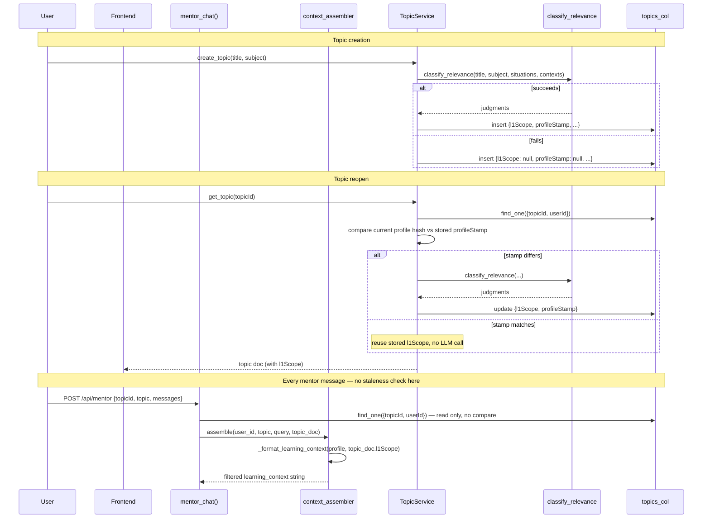

# Design Document: topic-scoping

## Overview

This feature stops `situations`/`contexts` (L1 profile, up to 20 entries each)
from being injected into every mentor message unfiltered. A new
`classify_relevance` Haiku call judges each entry against a topic once; the
result (`l1_scope`) is cached on the topic document and consumed by
`_format_learning_context()` instead of the raw lists.

It also introduces `subtopic_generator.py`, a `langgraph` graph that generates
and human-approves a topic's subtopic list — reusing the same `l1_scope`
judgment rather than re-deriving relevance — and makes `subtopic_weights.py`
depend on that approval having happened (Decision H, `requirements.md`).

Both halves write to the same place: **the topic document itself**
(`topics_col`), not a new collection. This keeps `{topicId, userId}` as the
single ownership boundary the rest of `topic_service.py` already enforces.

## Architecture

```
unified-backend/
  app/
    models/
      chat.py                      MODIFIED — MentorRequest gains topic_id
      profile.py                   MODIFIED (already shipped) — label removed
    routers/
      mentor.py                    MODIFIED — resolves topic doc by topicId, passes l1_scope through
      topics.py                    MODIFIED — get_topic() triggers staleness check;
                                    get_subtopic_weights() gated on subtopicGen.status
      agents/
        subtopic_generator.py      NEW — router: POST /agents/subtopic-generator/{start,resume}
    services/
      context_assembler.py         MODIFIED — assemble() takes topic doc (or l1_scope), not just title
      prompt_store.py              MODIFIED — _format_learning_context(l1_scope, profile) fallback signature
      topic_service.py             MODIFIED — create_topic() computes l1_scope;
                                    get_topic() does the profileStamp compare
      classify_relevance.py        NEW — the Haiku call + RelevanceJudgment model
      subtopic_generator.py        NEW — langgraph StateGraph module (agent logic, not the router)
      subtopic_weights.py          MODIFIED — get_subtopics() prefers topic.subtopicGen.approved
    config/
      database.py                 NO CHANGE — topics_col already exists; no new collection

  requirements.txt                 MODIFIED — add langgraph

  tests/unit/
    test_classify_relevance.py     NEW — eval-style correctness tests (Requirement 1.4)
    test_topic_service.py          MODIFIED — l1_scope compute/reuse/refresh tests
    test_prompt_store.py           MODIFIED — l1_scope-aware formatting tests
    test_subtopic_generator.py     NEW — graph node tests + ordering-gate tests
```

No new MongoDB collections. `l1_scope`, `profileStamp`, and `subtopicGen` are
new fields on the existing `topics` document.

## Data Models

### `topics` collection — new fields

```
{
  topicId:   string,
  userId:    string,
  title:     string,
  subject:   string | null,          // used as part of the classify_relevance topic signal (Decision B)
  status:    "active" | "archived",
  messages:  [...],

  // NEW — Requirement 2, 3
  l1Scope: [
    { situation: string, relevant: bool }   // one entry per situations[] + contexts[] item, in input order
  ] | null,                                  // null = never computed, or computation failed (Requirement 2.3 / 4.3)
  profileStamp: string | null,               // sha256 over situations + contexts (Decision F), null if l1Scope is null

  // NEW — Requirement 6 / SubtopicGeneratorAgent
  subtopicGen: {
    status: "classifying" | "generating" | "awaiting_review" | "done",
    generated: [string],
    approved: [string],
    updatedAt: ISODate
  } | null,                                  // null = generator never run for this topic

  createdAt: ISODate,
  lastActiveAt: ISODate
}
```

`l1Scope` entries deliberately drop `RelevanceJudgment.reason` before persisting
(Decision J) — only `situation` + `relevant` survive past the classification
call.

### `classify_relevance` contract

```python
class RelevanceJudgment(BaseModel):
    situation: str
    relevant: bool
    reason: str  # used for eval/debug visibility at call time, never persisted

async def classify_relevance(
    topic: str, subject: str | None, situations: list[str], contexts: list[str]
) -> list[RelevanceJudgment]:
    ...
```

- `topic` + `subject` together form the topic signal (Decision B) — subject is
  omitted from the prompt when the topic has none.
- `situations` and `contexts` are judged in one call, one judgment per entry,
  input order preserved (Decision C) — the prompt distinguishes the two lists
  so the model doesn't conflate "what I'm dealing with" (contexts) with
  "what's going on in my life" (situations), but both get the same relevance
  test.
- Raises (does not silently degrade) on Haiku failure — callers decide the
  fallback per Decision D. See `TopicService.create_topic` below.

## Components and Interfaces

### `TopicService.create_topic()` — compute `l1_scope` at creation

```pascal
PROCEDURE create_topic(user_id, title, subject)
  validated_title ← _validate_title(title)
  profile ← profiles_col().find_one({user_id})

  situations ← profile.learning_context_detail.situations OR []
  contexts   ← profile.learning_context_detail.contexts OR []

  TRY
    judgments ← classify_relevance(validated_title, subject, situations, contexts)
    l1_scope ← [{situation: j.situation, relevant: j.relevant} FOR j IN judgments]
    profile_stamp ← _hash_profile(situations, contexts)   // Decision F
  EXCEPT Exception AS e
    LOG warning "classify_relevance failed at topic creation for user={user_id}: {e}"
    l1_scope ← NULL          // Requirement 2.3 — fallback to unfiltered injection
    profile_stamp ← NULL
  END TRY

  doc ← { topicId: uuid4(), userId: user_id, title: validated_title,
          l1Scope: l1_scope, profileStamp: profile_stamp, subtopicGen: NULL, ... }
  topics_col().insert_one(doc)
  RETURN doc
END PROCEDURE
```

`classify_relevance` failure never blocks topic creation — matches
`embed_text`'s existing degrade-gracefully precedent in this codebase
(`services/embedder.py:38-43`).

### `TopicService.get_topic()` — staleness check on reopen

```pascal
PROCEDURE get_topic(topic_id, user_id)
  topic ← topics_col().find_one({topicId: topic_id, userId: user_id})
  IF topic IS NULL THEN RAISE HTTPException(404) END IF

  profile ← profiles_col().find_one({user_id})
  current_stamp ← _hash_profile(profile.situations, profile.contexts)

  IF current_stamp != topic.profileStamp THEN     // covers profileStamp == NULL too
    TRY
      judgments ← classify_relevance(topic.title, topic.subject, profile.situations, profile.contexts)
      new_scope ← [{situation: j.situation, relevant: j.relevant} FOR j IN judgments]
      topics_col().update_one({topicId: topic_id}, {$set: {l1Scope: new_scope, profileStamp: current_stamp}})
      topic.l1Scope ← new_scope
      topic.profileStamp ← current_stamp
    EXCEPT Exception AS e
      LOG warning "classify_relevance failed on reopen for topic={topic_id}: {e}"
      // leave stored l1Scope/profileStamp untouched — stale-but-present beats erroring the reopen
    END TRY
  END IF

  RETURN topic
END PROCEDURE
```

`_hash_profile` = `sha256(json.dumps({"situations": situations, "contexts":
contexts}, sort_keys=True))` — `situations`/`contexts` only, per Decision F as
resolved (the `label` field this originally accounted for has been removed
from the schema entirely, so there's no third input to hash).

**mentor_chat() does not call this check** (Decision G) — it trusts whatever
`l1Scope` is already on the topic document, fetched once via the new
`topicId`-keyed lookup below.

### `mentor_chat()` — resolves by `topicId`, not title

```python
# app/models/chat.py
class MentorRequest(BaseModel):
    topic_id: str = Field(..., alias="topicId")   # NEW — Decision A
    topic: str                                     # kept: still used for skill_graph lookup (by title)
    ...
```

```python
# app/routers/mentor.py — mentor_chat()
topic_doc = await topics_col().find_one({"topicId": body.topic_id, "userId": user_id}, {"_id": 0})
context = await context_assembler.assemble(user_id, body.topic, last_user_message, topic_doc)
```

`context_assembler.assemble()` gains a `topic_doc: dict | None` parameter and
threads `topic_doc.get("l1Scope")` through to `prompt_store.get_system_prompt`,
which passes it to `_format_learning_context`.

### `_format_learning_context()` — reads `l1_scope`, falls back to raw lists

```python
def _format_learning_context(profile: dict, l1_scope: list[dict] | None) -> str:
    detail = profile.get("learning_context_detail") or {}
    contexts = list(detail.get("contexts") or [])
    if not contexts and profile.get("learning_context"):
        contexts = [str(profile["learning_context"])]
    situations = list(detail.get("situations") or [])

    if l1_scope is not None:
        relevant_texts = {j["situation"] for j in l1_scope if j["relevant"]}
        contexts = [c for c in contexts if c in relevant_texts]
        situations = [s for s in situations if s in relevant_texts]
        # anything NOT in l1_scope at all (e.g. added after l1_scope was computed,
        # profile edited between get_topic() and this call) is dropped, not kept —
        # unknown is treated as unclassified, not as relevant-by-default

    parts = [p for p in (", ".join(contexts), "; ".join(situations)) if p]
    return " — ".join(parts) if parts else "Not specified"
```

`l1_scope is None` (Requirement 4.3, 5.1) reproduces exactly today's behavior —
this is the single fallback branch that covers three cases at once: topics
predating this feature, a `classify_relevance` failure at creation, and a
`classify_relevance` failure on reopen that left the stored value `NULL`.

### `subtopic_generator.py` (agent) — graph and endpoints

```
classify_relevance → generate_subtopics → human_review (interrupt) → finalize
```

`SubtopicGenState` is **not** a separate persisted model — it's read from and
written to `topics.subtopicGen` directly (Decision I), keyed by the `topicId`
the graph run operates on:

```python
class SubtopicGenState(TypedDict):
    topic_id: str
    user_id: str
    topic: str
    subject: str | None
    l1_scope: list[dict]        # reused from topic.l1Scope if already computed — no duplicate classify_relevance call
    generated: list[str]
    approved: list[str]
    status: Literal["classifying", "generating", "awaiting_review", "done"]
```

`POST /agents/subtopic-generator/start` — body `{topicId}`. Loads the topic
doc; if `l1Scope` is already set, skips straight to `generate_subtopics`
(reuses the judgment per the Notion doc's stated intent — "one judgment,
shared by both the mentor chat and the subtopic generator"). Writes
`subtopicGen: {status: "awaiting_review", generated: [...], approved: []}` to
the topic doc, returns the generated list for the review UI.

`POST /agents/subtopic-generator/resume` — body `{topicId, approved:
list[str]}`. Loads `topics.subtopicGen`, applies the human edit, calls
`finalize`, which:
1. Sets `subtopicGen.status = "done"`, `subtopicGen.approved = approved`.
2. Writes the approved list into `subtopic_lists_col` — see the cache
   conflict below for why this write needs a schema change first.

### `get_subtopic_weights()` — gated on generator completion (Decision H)

```pascal
PROCEDURE get_subtopic_weights(topic_id, user_id, body)
  topic ← _topic_service.get_topic(topic_id, user_id)

  IF topic.subtopicGen IS NULL OR topic.subtopicGen.status != "done" THEN
    RAISE HTTPException(409, "Subtopics not yet generated and approved for this topic — "
                              "call /agents/subtopic-generator/start first")
  END IF

  subtopics ← topic.subtopicGen.approved
  result ← derive_subtopic_weights(topic=topic.title, subtopics=subtopics, ...)
  RETURN result
END PROCEDURE
```

This is a **behavior change**, not additive: today `get_subtopic_weights()`
calls `get_subtopics(topic["title"])`, which silently auto-generates via
`_decompose_via_llm` on a cache miss — no human ever reviews that list. Once
this ships, weighting for a topic that hasn't been through
`subtopic_generator.py` returns 409 instead of quietly generating on the fly.

## Design Risk — two conflicts this spec must resolve, not defer

### Risk 1: `subtopic_lists_col` is a global, user-agnostic cache

`get_subtopics()` (`subtopic_weights.py:56`) caches by
`{topic: title.lower()}` with a **unique index on `topic` alone** — no
`user_id`. That was fine when the list was a stateless LLM decomposition of a
topic name. It is not fine once the list is the output of a per-user
`classify_relevance` judgment (this user's `l1_scope` influences what
`generate_subtopics` produces) — writing the approved list into that global
cache would leak one user's subtopic breakdown (shaped by their private
situations) to every other user with a same-titled topic.

**Resolution:** `subtopic_lists_col` stays as-is and continues to serve as the
fallback for topics that never go through the generator (if that fallback is
kept at all — see Risk 2). The generator's approved output is **not** written
there. It lives only on `topics.subtopicGen.approved`, scoped by `{topicId,
userId}` like everything else per-topic. `get_subtopic_weights()` reads from
the topic doc, never from `subtopic_lists_col`, once `subtopicGen.status ==
"done"`. This requires removing the `finalize` step's `subtopic_lists_col`
write described in an earlier draft of this design — approved subtopics do not
get promoted to the global cache.

### Risk 2: the pre-existing silent auto-generate path still exists

Even after gating `get_subtopic_weights()`, `get_subtopics()` itself is called
from nowhere else today, so it becomes dead code once the gate lands — but it
is not removed by this spec (out of scope: this feature does not touch
`subtopic_weights.py`'s internals beyond the one call-site swap above). Leave
`_decompose_via_llm` and the `subtopic_lists_col` fallback in place,
unreachable from the gated endpoint, rather than deleting them — a future spec
that decides what (if anything) still needs an ungated per-topic-title cache
can make that call with full context. Flag this explicitly in `tasks.md` so it
isn't mistaken for an oversight.

## Correctness Properties

### Property 1: `l1_scope` absence never blocks the user

**Validates: Requirements 2.3, 4.3, 5.1**

For any topic — pre-existing, `classify_relevance`-failed-at-creation, or
`classify_relevance`-failed-on-reopen — `l1Scope: null` on the topic document
SHALL cause `_format_learning_context` to fall back to unfiltered injection,
and SHALL NOT raise or degrade `mentor_chat()`'s response.

### Property 2: staleness recompute is idempotent under no change

**Validates: Requirement 3**

Calling `get_topic()` twice in a row with no profile mutation between calls
SHALL invoke `classify_relevance` at most once (the first call recomputes if
stale; the second finds `current_stamp == topic.profileStamp` and reuses).

### Property 3: weighting is unreachable without generator approval

**Validates: Decision H**

For any topic where `subtopicGen` is `null` or `subtopicGen.status !=
"done"`, `POST /topic/{topic_id}/subtopic-weights` SHALL return 409 and SHALL
NOT call `derive_subtopic_weights`.

### Property 4: no cross-user subtopic leakage

**Validates: Design Risk 1**

`subtopic_generator.py`'s `finalize` node SHALL NOT write to
`subtopic_lists_col`. The only write target for approved subtopics is
`topics_col`, filtered by `{topicId, userId}`.

## Data Flow



## Error Handling

| Scenario | Behavior |
|---|---|
| `classify_relevance` fails at `create_topic()` | Topic created with `l1Scope: null`; unfiltered fallback applies to that topic until a successful reopen recompute |
| `classify_relevance` fails on `get_topic()` reopen | Stored `l1Scope`/`profileStamp` left untouched (stale-but-present); warning logged; reopen still returns 200 |
| `mentor_chat()` called with a `topicId` that doesn't exist / isn't owned | 404, identical to `get_topic()`'s enumeration-prevention rule |
| `get_subtopic_weights()` called before generator has reached `done` | 409, with a message pointing at `/agents/subtopic-generator/start` |
| `subtopic-generator/resume` called with no matching `subtopicGen` in `awaiting_review` | 409 — nothing to resume |
| Profile has zero `situations`/`contexts` | `classify_relevance` is not called (nothing to judge); `l1Scope` stored as `[]`, not `null` — this is a real "no scope needed" result, distinct from a failure |

## Testing Strategy

- `tests/unit/test_classify_relevance.py` — the eval suite from Requirement
  1.4: hand-labeled `(topic, subject, situation, expected_relevant)` cases,
  including the doc's React/backend-interview case and the
  urgency/casualness confound pair. Per-category pass rate asserted, not one
  aggregate number.
- `tests/unit/test_topic_service.py` — `create_topic` with `classify_relevance`
  mocked to succeed/fail (Property 1); `get_topic` stamp-compare reuse vs.
  recompute (Property 2); recompute-failure leaves prior `l1Scope` intact.
- `tests/unit/test_prompt_store.py` — `_format_learning_context` with
  `l1_scope=None` (today's behavior, unchanged), with a populated `l1_scope`
  filtering correctly, and with an entry present in `situations` but absent
  from `l1_scope` (treated as excluded, not included).
- `tests/unit/test_subtopic_generator.py` — graph node unit tests
  (`classify_relevance` reuse when `l1Scope` pre-exists vs. fresh call when it
  doesn't); `get_subtopic_weights` 409 before `done`, 200 after (Property 3);
  assert `subtopic_lists_col` mock is never called from `finalize` (Property
  4).

## Dependencies

- Add `langgraph` to `requirements.txt` (Requirement 6.1) — not currently
  installed; only `langchain-anthropic>=1.5.5` is.
- No new MongoDB collections or indexes.
- No new npm packages — the subtopic-generator review UI is a new screen but
  reuses existing form/dialog primitives (exact component TBD in a follow-up
  frontend design pass; out of scope here per the Notion doc's UI-mockup-only
  treatment of that surface).
