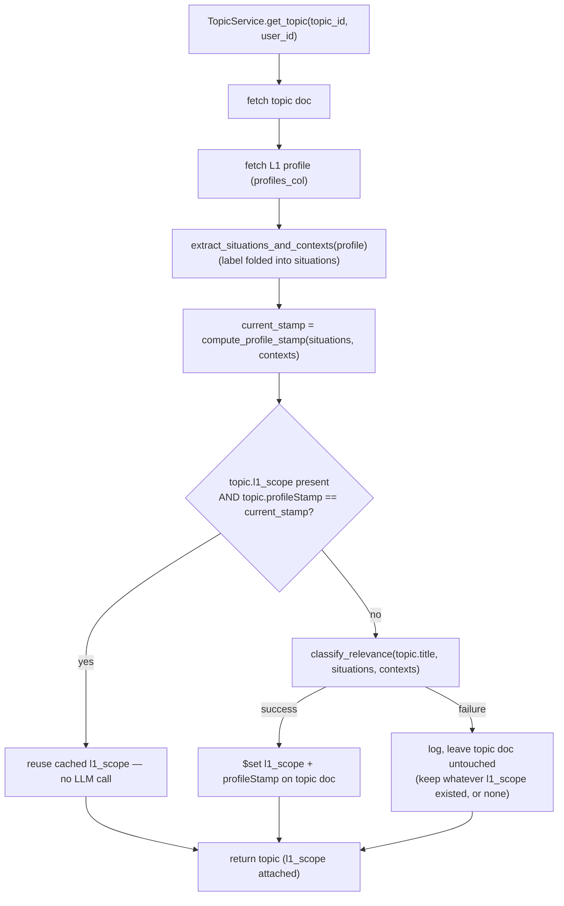
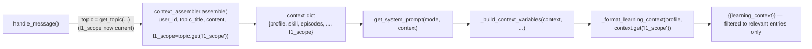

# Design Document: Topic Scoping (l1_scope filtering)

## Overview

`prompt_store.py::_format_learning_context()` flattens every entry in the
user's L1 `situations`/`contexts` lists (up to 40 combined) into
`{{learning_context}}` on every mentor turn, with no per-topic filter. This
design adds `classify_relevance` — a single structured-output LLM call that
judges each entry's topical relevance to the current topic — and caches the
result on the topic document as `l1_scope`. The cache is computed lazily and
refreshed only when the user's profile has actually changed, via a
stamp-comparison check placed at the one call site both read paths already
share: `TopicService.get_topic()`.

No new collection, no new background job, no new dependency. The entire
feature is one new small module, a handful of call-site edits, and one
additive field pair on an existing document.

**Known limitation — `/api/mentor` stays unfixed.** `app/routers/mentor.py`
is still mounted (`main.py:119`) and also calls `context_assembler.assemble()`
(`mentor.py:67`), but it takes `body.topic` as a free-text string with no
backing Topic document — there is nowhere to cache `l1_scope` for that flow.
Nothing in the current frontend calls it (`grep -r "/api/mentor"
mentorman-web/src` is empty), so this is accepted as a known gap rather than
extended to cover it. If that endpoint needs this fix later, it would need
its own per-request classify_relevance call (no caching possible without a
persistent document) or to be retired in favor of the topic-based path.

## Architecture

### Lazy compute, single choke point



**Why `get_topic()` and not a new hook:** both consumer paths already call
it — the router's `GET /topic/{topic_id}` (the sidebar's "open a topic"
moment, `chat.tsx:257`) and `TopicChatService.handle_message()`'s pre-turn
fetch (`topic_chat_service.py:198`). Putting the staleness check inside
`get_topic()` covers both for free; no new call site needs to remember to
invoke it.

**Cost note:** two other router endpoints also call `get_topic()` purely
for the ownership check (`subtopic-weights`, `subtopic-weights/nudge-log` —
`topics.py:219,259`) and don't use `l1_scope` at all. They now pay for an
extra `profiles_col` read on every call, and — rarely — a Haiku call if the
profile happens to be stale at that exact moment. This is a deliberate
simplification: one choke point is a smaller, easier-to-reason-about diff
than threading an `include_l1_scope: bool` flag through four call sites for
a cost that's one indexed `find_one` in the common case. Revisit only if
those two endpoints show up in latency profiling.

### Injection flow (per mentor turn)



## Components and Interfaces

### Component 1: `app/services/l1_scope.py` (new)

Owns everything specific to the relevance judgment — kept out of
`topic_service.py` and `prompt_store.py` so both can import it without a
circular dependency (today `prompt_store.py` doesn't import
`topic_service.py` or vice versa; this preserves that).

```python
from pydantic import BaseModel
from langchain_anthropic import ChatAnthropic
from app.config.settings import get_settings

HAIKU_MODEL = "claude-haiku-4-5-20251001"


class _Judgment(BaseModel):
    """One position's verdict — no text field. The model is never trusted to
    echo the original string back; see the note below for why."""
    relevant: bool
    reason: str


class _RelevanceJudgments(BaseModel):
    """One judgment per input item, position-aligned to the input lists —
    NOT keyed by re-echoed text (see note below)."""
    situation_judgments: list[_Judgment]  # same length/order as `situations`
    context_judgments: list[_Judgment]    # same length/order as `contexts`


def extract_situations_and_contexts(profile: dict) -> tuple[list[str], list[str]]:
    """Pull situations/contexts out of a profile doc, folding `label` into
    situations exactly as `_format_learning_context` already did — moved
    here so both the classifier input and the prompt-formatting fallback
    use one definition, not two that can drift apart.
    """
    detail = profile.get("learning_context_detail") or {}
    contexts = list(detail.get("contexts") or [])
    if not contexts and profile.get("learning_context"):
        contexts = [str(profile["learning_context"])]

    situations = list(detail.get("situations") or [])
    label = detail.get("label")
    if label and label not in situations:
        situations.insert(0, label)

    return situations, contexts


def compute_profile_stamp(situations: list[str], contexts: list[str]) -> str:
    """Stable hash of the two lists — cheap equality check for staleness,
    no TTL, no invalidation logic."""
    import hashlib, json
    payload = json.dumps({"situations": situations, "contexts": contexts}, sort_keys=True)
    return hashlib.sha256(payload.encode()).hexdigest()


async def classify_relevance(
    topic: str, situations: list[str], contexts: list[str]
) -> list[dict]:
    """One shared Haiku call judging every situation/context against `topic`.

    Returns [{"situation": str, "relevant": bool, "reason": str}, ...], one
    entry per input item, in `situations + contexts` order. Returns []
    immediately, no LLM call, if both lists are empty.

    Raises ValueError if the model returns a different number of judgments
    than items given — caught by the caller (`_ensure_l1_scope`) as any
    other classification failure: the topic doc is left untouched, retried
    next time it's opened.
    """
    if not situations and not contexts:
        return []

    llm = ChatAnthropic(
        model=HAIKU_MODEL, api_key=get_settings().ANTHROPIC_API_KEY,
    ).with_structured_output(_RelevanceJudgments)

    def _numbered(items: list[str]) -> str:
        return "\n".join(f"{i + 1}. {text}" for i, text in enumerate(items)) or "(none)"

    prompt = (
        f"Topic: {topic}\n\n"
        "For each numbered item below, judge whether it changes what matters "
        f"for discussing/teaching **{topic}** — topical connection only. "
        "Ignore how urgent or casual the phrasing sounds; that reflects the "
        "user's tone, not the item's relevance to this topic. "
        "When you are genuinely unsure whether an item is relevant, judge it "
        "relevant — a missed relevant item silently drops useful context "
        "from the mentor, while including a borderline item only costs a "
        "little extra noise. Only judge an item irrelevant when you're "
        "confident it doesn't matter for this topic.\n\n"
        f"Situations ({len(situations)} items):\n{_numbered(situations)}\n\n"
        f"Contexts ({len(contexts)} items):\n{_numbered(contexts)}\n\n"
        f"Return exactly {len(situations)} situation_judgments (one per "
        f"situation, same order) and exactly {len(contexts)} context_judgments "
        "(one per context, same order)."
    )
    result = await llm.ainvoke(prompt)

    if (len(result.situation_judgments) != len(situations)
            or len(result.context_judgments) != len(contexts)):
        raise ValueError(
            f"classify_relevance count mismatch for topic={topic!r}: "
            f"situations {len(result.situation_judgments)}/{len(situations)}, "
            f"contexts {len(result.context_judgments)}/{len(contexts)}"
        )

    # The original text is copied from OUR input list by position — never
    # taken from the model's output. See note below for why.
    return [
        {"situation": text, "relevant": j.relevant, "reason": j.reason}
        for text, j in zip(situations, result.situation_judgments)
    ] + [
        {"situation": text, "relevant": j.relevant, "reason": j.reason}
        for text, j in zip(contexts, result.context_judgments)
    ]
```

**Why position-based, not text-echoed (fixed after review):** the first
draft of this design asked the model to repeat each situation/context back
verbatim in its structured output, then filtered later by checking whether
that repeated string appeared in the original profile lists. That's fragile
— nothing guarantees the model reproduces whitespace, casing, or phrasing
byte-for-byte, and any drift makes a genuinely `relevant: true` item vanish
from `{{learning_context}}` silently, with no error anywhere. This is
exactly the kind of bug the feature itself is meant to prevent, just moved
one layer down. Fixed by never asking the model for the text at all — it
only returns `relevant`/`reason` per numbered position, and the real text is
substituted back in from the input list we already have, by index. A length
mismatch (the one way this can still go wrong) is treated as a hard failure,
not silently zipped — same degrade-to-unfiltered path as any other
`classify_relevance` error.

**Prompt note:** the "ignore urgency/casualness" instruction is the
load-bearing line from the source doc (Requirement 1.3) — it's what keeps
`"casually looking for frontend"` and `"urgently need frontend for a job I
start Monday"` from getting different `relevant` verdicts against the same
topic.

---

### Component 2: `TopicService.get_topic()` (modified)

**File**: `unified-backend/app/services/topic_service.py`

```python
from app.config.database import profiles_col  # new import
from app.services.l1_scope import (
    classify_relevance, compute_profile_stamp, extract_situations_and_contexts,
)

async def get_topic(self, topic_id: str, user_id: str) -> dict:
    topic = await topics_col().find_one(
        {"topicId": topic_id, "userId": user_id}, {"_id": 0},
    )
    if not topic:
        raise HTTPException(status_code=404, detail="Topic not found")
    return await self._ensure_l1_scope(topic, user_id)

async def _ensure_l1_scope(self, topic: dict, user_id: str) -> dict:
    profile = await profiles_col().find_one({"user_id": user_id}, {"_id": 0})
    if not profile:
        return topic  # no profile yet (mid-onboarding) — nothing to scope

    situations, contexts = extract_situations_and_contexts(profile)
    current_stamp = compute_profile_stamp(situations, contexts)

    if topic.get("profileStamp") == current_stamp and "l1_scope" in topic:
        return topic  # cache hit, no LLM call

    try:
        l1_scope = await classify_relevance(topic["title"], situations, contexts)
    except Exception:
        logger.exception(
            "classify_relevance failed for topic=%s user=%s",
            topic.get("topicId"), user_id,
        )
        return topic  # degrade: keep whatever l1_scope existed (or none)

    # l1_scope is already [{"situation": str, "relevant": bool, "reason": str}, ...]
    await topics_col().update_one(
        {"topicId": topic["topicId"], "userId": user_id},
        {"$set": {"l1_scope": l1_scope, "profileStamp": current_stamp}},
    )
    topic["l1_scope"] = l1_scope
    topic["profileStamp"] = current_stamp
    return topic
```

`create_topic()` is **unchanged** — no `l1_scope` write at creation, per
the scope decision. The first `get_topic()` call after creation (the
frontend fetches the topic immediately after creating it, `chat.tsx:443`)
computes it, same as any later reopen.

---

### Component 3: `context_assembler.assemble()` (modified — new parameter)

**File**: `unified-backend/app/services/context_assembler.py`

```python
async def assemble(
    user_id: str, topic: str, query: str, l1_scope: list[dict] | None = None,
) -> dict:
    ...  # unchanged body
    return {
        "profile": profile,
        "skill": skill or {},
        "episodes": episodes,
        "documents": documents,
        "skill_graph": skill_graph,
        "l1_scope": l1_scope,  # new — None if caller doesn't have one (or never computed)
    }
```

`l1_scope` is passed straight through, not fetched here — the caller
(`TopicChatService.handle_message`) already has the topic doc via
`get_topic()`, so `assemble()` doesn't need a second topic read.

---

### Component 4: `TopicChatService.handle_message()` (one-line change)

**File**: `unified-backend/app/services/topic_chat_service.py:227`

```python
context = await context_assembler.assemble(
    user_id, topic_title, content, l1_scope=topic.get("l1_scope"),
)
```

`topic` here is already the `get_topic()` result from line 198 — by the
time this line runs, `l1_scope` is guaranteed current (or `None`/absent if
computation has never succeeded for this topic).

---

### Component 5: `prompt_store.py::_format_learning_context()` (modified)

**File**: `unified-backend/app/services/prompt_store.py`

```python
from app.services.l1_scope import extract_situations_and_contexts

def _format_learning_context(profile: dict, l1_scope: list[dict] | None = None) -> str:
    situations, contexts = extract_situations_and_contexts(profile)

    if l1_scope is not None:
        relevant = {j["situation"] for j in l1_scope if j.get("relevant")}
        contexts = [c for c in contexts if c in relevant]
        situations = [s for s in situations if s in relevant]
    # else: l1_scope was never computed / last attempt failed — fall back
    # to today's fully-unfiltered behavior (Requirement 5.2)

    parts = [p for p in (", ".join(contexts), "; ".join(situations)) if p]
    return " — ".join(parts) if parts else "Not specified"
```

**The `None` vs. `[]` distinction is load-bearing:**
- `l1_scope is None` → never computed, or the last attempt failed → inject
  everything (today's behavior, degrade gracefully).
- `l1_scope == []` → `classify_relevance` ran and both input lists were
  empty → correctly renders `"Not specified"` (same as today's empty case).
- `l1_scope` is a non-empty list where every judgment has `relevant: False`
  → correctly renders `"Not specified"` — this is the feature working as
  intended, not a failure state, and must **not** fall back to unfiltered.

`_build_context_variables()` passes it through:
```python
"learning_context": _format_learning_context(profile, context.get("l1_scope")),
```

## Data Models

### Topic document — two new optional fields

```python
{
    # ...existing topic fields unchanged...
    "l1_scope": [                      # NEW, optional — absent on old/never-computed topics
        {"situation": str, "relevant": bool, "reason": str},
        ...
    ],
    "profileStamp": str,               # NEW, optional — sha256 hex digest
}
```

No migration: `get_topic()` treats a missing `l1_scope`/`profileStamp` pair
identically to a stale one (Requirement 2.2) — both fall into the
"recompute" branch of `_ensure_l1_scope`. The first read of any pre-existing
topic backfills it lazily.

## Error Handling

### Scenario 1: `classify_relevance` fails during lazy compute

**Condition**: Haiku call times out, returns malformed structured output,
or the API errors.
**Response**: `_ensure_l1_scope` catches, logs with `topic_id` + `user_id`,
returns the topic doc unchanged — no partial write, no `profileStamp`
update (Requirement 5.3: a failed attempt must not look "fresh").
**Downstream**: `_format_learning_context` sees `l1_scope is None` (if this
topic never succeeded before) and falls back to unfiltered injection —
correctness over completeness, matching the pre-feature behavior exactly.
**Recovery**: retried on the very next `get_topic()` call for this topic —
no backoff/retry logic needed, since the stamp mismatch (or missing field)
persists until a successful call clears it.

### Scenario 2: No profile yet (user mid-onboarding, topic created early)

**Condition**: `profiles_col().find_one()` returns `None`.
**Response**: `_ensure_l1_scope` returns the topic untouched immediately —
no classify call, no error logged (this is a normal state, not a failure).
**Downstream**: same as Scenario 1's fallback — unfiltered injection. In
practice `context_assembler.assemble()` already raises `HTTPException(400)`
for "no profile" before this would ever matter to prompt building, so this
path is really only exercised by the router's plain `GET /topic/{id}`.

### Scenario 3: Concurrent recomputation

**Condition**: Sidebar `GET /topic/{id}` and a `POST .../message` land
close together for the same topic, both finding a stale stamp.
**Response**: both compute independently (no lock) and both write via
`update_one($set)` — last write wins. Per Requirement 3.5, this is
accepted, not guarded against — a single-user-per-account app has no
realistic multi-writer race here, and the two computations should produce
the same judgments anyway (same inputs).

## Testing Strategy

- **Unit** (`tests/unit/test_l1_scope.py`, new):
  - `classify_relevance` returns `[]` without invoking the LLM when both
    lists are empty.
  - `classify_relevance` output's `situation` text is exactly the input
    list's text at that position, even when the mocked LLM response's
    judgment content differs — proves the text is substituted from our
    input, never taken from the model (regression test for the review
    finding this design was fixed for).
  - `classify_relevance` raises `ValueError` when the mocked LLM returns
    the wrong number of `situation_judgments` or `context_judgments` —
    this is now the one way a mismatch can surface, so it must be a loud
    failure, not a silent mis-zip.
  - `extract_situations_and_contexts` folds `label` into `situations` only
    when not already present (matches today's `_format_learning_context`
    behavior byte-for-byte — regression-tested against the pre-change
    function if feasible).
  - `compute_profile_stamp` is stable under list-order-preserving identical
    input, and changes when either list's contents change.
- **Unit** (`tests/unit/test_topic_service_messages.py` or a new
  `TestGetTopicL1Scope` class):
  - Cache hit: matching `profileStamp` → no `classify_relevance` call
    (mock assertion), topic returned as-is.
  - Cache miss (missing fields): `classify_relevance` called, topic
    updated with new `l1_scope` + `profileStamp`.
  - Cache miss (stamp mismatch): same, after profile situations change.
  - `classify_relevance` failure: topic returned unchanged, no `update_one`
    call, no exception propagated to the caller.
  - No profile: topic returned unchanged, `classify_relevance` never
    called.
- **Unit** (`tests/unit/test_prompt_store.py` if it exists, else inline in
  the relevant service test):
  - `_format_learning_context(profile, l1_scope=None)` — unchanged output
    vs. today (regression).
  - `_format_learning_context(profile, l1_scope=[...])` — only
    `relevant: True` entries appear in the output string.
  - `_format_learning_context(profile, l1_scope=[])` — `"Not specified"`.
  - All-irrelevant judgments — `"Not specified"`, not a fallback to
    unfiltered.
- **Integration** (`tests/unit/test_topic_chat_service.py`):
  - `handle_message` threads `topic.get("l1_scope")` into
    `context_assembler.assemble()` — mock assertion on the call args.
- **Eval** (deferred per Requirements' Out of Scope — noted here as a
  fast-follow, not blocking this spec): the source doc's
  `classify_relevance_cases.yaml` labeled set, covering the
  urgency/casualness confound and the React/backend-interview regression
  case specifically.

## Performance Considerations

- **Common case**: one extra indexed `profiles_col().find_one({"user_id"})`
  per `get_topic()` call, plus a cheap in-process hash compare. No LLM call
  on a cache hit.
- **Recompute case**: one Haiku call, only when the profile's
  situations/contexts actually changed since last computed for that topic
  — expected to be rare relative to topic-open frequency (profiles change
  far less often than topics are opened).
- **No new N+1**: `list_topics()`/`list_archived_topics()` (sidebar list
  views) are untouched — they use a separate projection-only query and
  never call `get_topic()`, so listing topics doesn't trigger classification
  for every row.

## Dependencies

- **No new external services or packages.** `langchain-anthropic` is
  already in `requirements.txt:19`; `.with_structured_output()` is a
  method on the `ChatAnthropic` client already imported elsewhere
  (`topic_chat_service.py:24`).
- **No schema migration.** `l1_scope`/`profileStamp` are additive-optional
  fields on an existing document, backfilled lazily on first read.

## Correctness Properties

### Property 1: Cache-hit purity
*For any* topic whose stored `profileStamp` equals the current profile's
computed stamp, `get_topic()` SHALL NOT invoke `classify_relevance`.
**Validates: Requirement 3.2**

### Property 2: Failure leaves no false-fresh state
*For any* failed `classify_relevance` call during `_ensure_l1_scope`, the
topic document's `l1_scope` and `profileStamp` fields SHALL be byte-for-byte
unchanged from their pre-attempt values.
**Validates: Requirement 5.3**

### Property 3: Filter is a subset, never an addition
*For any* profile and any `l1_scope`, the situations/contexts rendered by
`_format_learning_context(profile, l1_scope)` SHALL be a subset of
`extract_situations_and_contexts(profile)`'s output — filtering can only
remove entries, never introduce text not present in the source profile.
**Validates: Requirement 4.1**

### Property 4: Unfiltered fallback only on absence, never on empty result
*For any* `l1_scope` that is a list (including `[]` or all-`relevant: False`),
`_format_learning_context` SHALL use only that list's `relevant: True`
subset — it SHALL fall back to the full unfiltered profile lists only when
`l1_scope is None`.
**Validates: Requirement 5.2**

### Property 5: Judgment text is source-derived, never model-derived
*For any* successful `classify_relevance` call, every returned entry's
`situation` field SHALL be identical (by string equality) to the
corresponding entry in the `situations`/`contexts` list passed in — the
value SHALL come from position-pairing against that input, never from text
the model produced. A judgment-count mismatch between the model's output
and the input lists SHALL raise rather than pair mismatched items.
**Validates: correctness of Requirement 1.1 (fixed after design review —
see the note in Component 1)**
